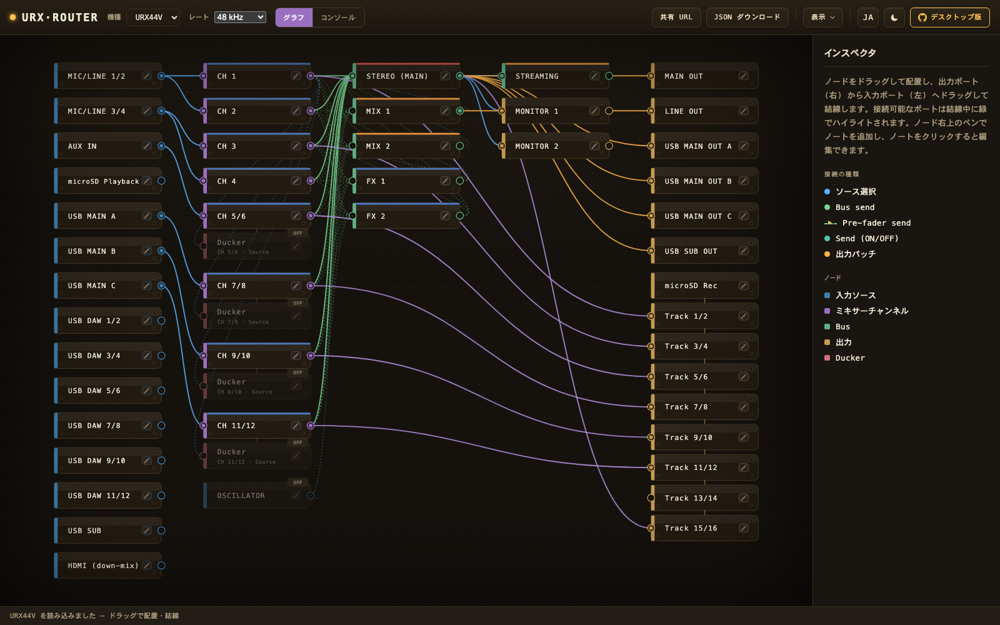

# URX Router

YAMAHA URX22 / URX44 / URX44V USB オーディオインターフェース用の **ルーティングプランニングツール**。

公式ブロックダイアグラムに基づき、入出力チャンネル・ミキサーバス・出力パッチをボックスとワイヤーで可視化し、
**接続可能な経路のみ** GUI から結線できるよう制約する。作成した計画は JSON で保存・読込でき、ダイアグラムを画像出力できる。

> For the English version, see [README.md](README.md).

## デモ

ブラウザだけで動作（インストール不要）: **<https://urx-router.semnil.com>**
（デモ版ではファイルの保存・読込と画像出力を無効化）。



## 技術スタック

- **Tauri 2** (デスクトップシェル / Windows 11・Apple silicon macOS)
- **TypeScript + Vite** (フロントエンド、ランタイム外部依存ゼロ)
- 描画は素の SVG (ノードグラフライブラリ非依存)
- 英語を基本とし日本語ローカライズに対応した UI。実行中に切り替え可能
- スタジオラック調 UI / ダーク・ライトの 2 テーマ切替 (OS のカラースキームに追従、既定はダーク)
  ([docs/ja/architecture.md](docs/ja/architecture.md#表示テーマ))

## 開発

```sh
pnpm install
pnpm dev            # ブラウザで http://localhost:5173 (Rust 不要)
pnpm tauri dev      # デスクトップアプリとして起動 (Rust ツールチェーン必須)
```

計画 UI は純フロントエンドのため、Rust 未導入でも `pnpm dev` でブラウザ動作確認できる。
デスクトップビルド (`pnpm tauri dev` / `pnpm tauri build`) には [Rust](https://rustup.rs/) が必要。

実機セルフテスト診断 (既定では非表示) を有効にするには `--experimental` を付けて起動する:

```sh
pnpm tauri dev -- -- --experimental          # 開発
open -a 'URX Router' --args --experimental    # ビルド済みアプリ (macOS)
urx-router.exe --experimental                 # ビルド済みアプリ (Windows)
```

## デバイス制御（URX44V のみ）

デスクトップ版は Device Center 稼働下で、接続中のインターフェースの現在のミキサー設定を計画に**読み込み**
（**デバイス → デバイスから取得**）、計画を実機へ**書き込める**（**デバイス → デバイスへ書き込み** / 編集を
逐次反映する **ライブ同期**）。パラメータの対応は **URX44V でのみ実機検証済み**で、**URX44** は同一と仮定、
**URX22** はそこからの推測 — いずれも実機未検証。書き込みは実機の現在の設定を上書きする（[免責事項](#免責事項)を参照）。
`--experimental` を付けると、これに加えて破壊・復元方式のセルフテスト診断が有効になる。

## 免責事項

URX Router は、公式ドキュメントではなく独立した解析で判明した制御プロトコルでハードウェアと通信する。
書き込む各パラメータは接続中の実機に対して検証済みだが、ハードウェアへのデータ送信には常に一定のリスクが伴う。
**計画を実機に書き込むと、その時点のミキサー設定が上書きされる** — 残したい設定はあらかじめ
本体のシーン保存機能で保存しておくこと。

URX Router を使用することで、このリスクを受諾したものとする。本ソフトウェアは「現状のまま」提供され、
いかなる保証も伴わず、作者はその使用により生じたハードウェアの損傷・設定の喪失その他の損害について
一切の責任を負わない。デスクトップ版インストーラーは、この注意書きを[ライセンス](LICENSE)とともに表示し、
インストール前に同意を求める。

## ドキュメント

英語ドキュメントは [docs/en/](docs/en/) に、日本語訳は [docs/ja/](docs/ja/) に配置する。

- [docs/ja/architecture.md](docs/ja/architecture.md) — アプリ構成と設計判断
- [docs/ja/device-model.md](docs/ja/device-model.md) — 装置のルーティングモデルと接続制約
- [docs/ja/known-issues.md](docs/ja/known-issues.md) — 現時点の制限事項

## ライセンス

[MIT](LICENSE) © semnil

配布するデスクトップビルドには Tauri ランタイムほかオープンソースコンポーネントが同梱され、
それらのライセンス表示はビルドに含める ([docs/ja/architecture.md](docs/ja/architecture.md#サードパーティライセンス) を参照)。

## 商標について

YAMAHA、URX22、URX44、URX44V は Yamaha Corporation の商標です。本ツールは非公式・独立の
ツールであり、Yamaha とは提携・スポンサー・公認のいずれの関係もありません。
