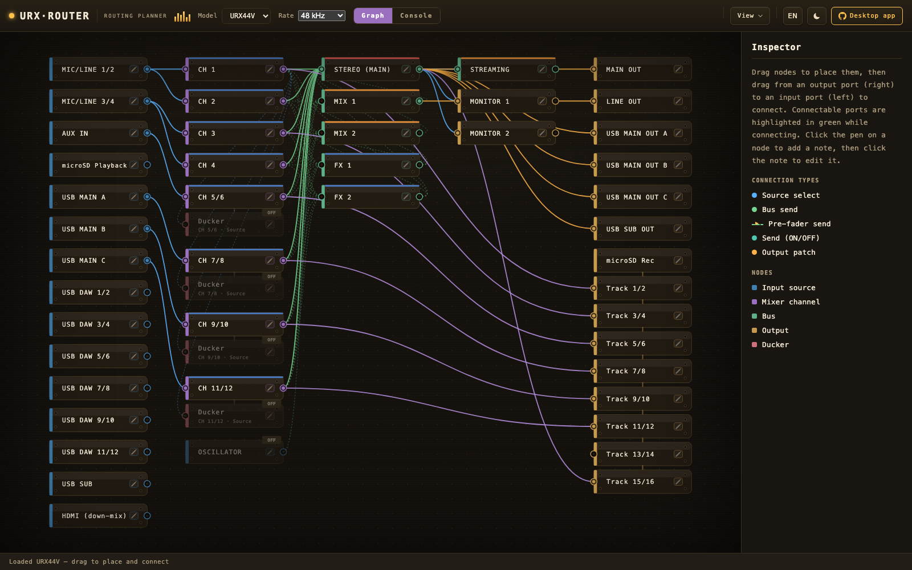
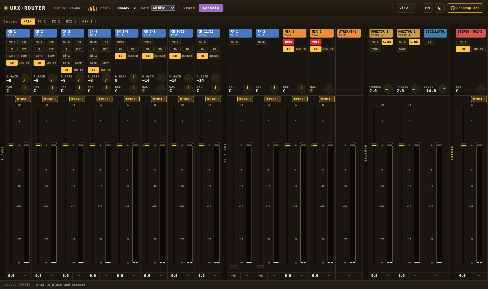

# URX Router

A **routing planner and unofficial mixer controller (read / write / live sync)** for the
YAMAHA URX22 / URX44 / URX44V USB audio interfaces.

Based on the official block diagram, it visualizes input/output channels, mixer buses, and
output patches as boxes and wires, and constrains the GUI so that **only physically routable
paths** can be wired. Plans are saved/loaded as JSON, and the diagram can be exported as an image.

The URX series has no dspMixFx-style mixer editor — dspMixFx supports the UR-C / URX-C lines,
not the URX22 / URX44 / URX44V. Out of the box, the full mixer is only editable on the unit's
touch screen: the official Stream Deck plugin covers basics like channel level, mute, and solo,
and the Cubase / Nuendo / MixKey integration screens work only while that software is running.
URX Router fills this gap: it reads, writes, and live-syncs the entire mixer from your computer,
with or without a DAW — see [Device control](#device-control).

> 日本語版は [README.ja.md](README.ja.md) を参照してください.

## Live demo

Runs entirely in your browser — no install required: **<https://urx-router.semnil.com>**
(file save/load and image export are disabled in the demo build).



## Device control

With the Device Center software (included in Yamaha's TOOLS for MGX / URX) running, desktop
builds can **read** the connected interface's current mixer settings into the plan
(**Device → Fetch from device**) and **write** a plan back to it (**Device → Write to device** /
**Live sync**, which mirrors each edit as you make it). The parameter mapping is verified on
hardware **only for URX44V**; **URX44** is assumed identical and **URX22** is inferred from it —
neither is verified on hardware yet. Writing overwrites the device's current settings; see the
[Disclaimer](#disclaimer). The `--experimental` flag adds a destructive-then-restored
self-test diagnostic on top.

The console view shows the same plan as a mixer surface — per-strip faders, mutes, EQ,
dynamics, and sends. Edits made here live-sync to the device the same way, and live meters
run while Live sync is active.



## Claude Code skill

This repo also publishes a [Claude Code](https://claude.com/claude-code) skill,
**urx-routing-planner**, that turns a plain-language request ("send mic 1 to the
stream mix and FX1 for reverb") into a validated URX Router plan plus a `?plan=`
deep link into the demo. It answers feasibility questions from a bundled per-model
route table and never needs any control-protocol detail.

Install it as a plugin from this repo's marketplace:

```text
/plugin marketplace add semnil/urx-router
/plugin install urx-routing-planner@urx-router
```

The skill's routing data is generated from the same device model the app uses
(`src/models/`), so it stays in lock-step with the app — see `UPDATE_SKILL` in
[CLAUDE.md](CLAUDE.md).

## Tech stack

- **Tauri 2** (desktop shell / Windows 11 and Apple silicon macOS)
- **TypeScript + Vite** (frontend, zero runtime third-party dependencies)
- Rendering is plain SVG (no node-graph library)
- English-first UI with Japanese localization, switchable at runtime
- Studio-rack aesthetic with dark and light themes (follows your OS color scheme, dark by default)
  ([docs/en/architecture.md](docs/en/architecture.md#display-themes))

## Development

```sh
pnpm install
pnpm dev            # browser at http://localhost:5173 (Rust not required)
pnpm tauri dev      # launch as a desktop app (Rust toolchain required)
```

Because the planning UI is pure frontend, you can verify behavior in a browser with `pnpm dev`
even without Rust installed. Desktop builds (`pnpm tauri dev` / `pnpm tauri build`) require
[Rust](https://rustup.rs/).

Pass `--experimental` to enable the on-device self-test diagnostic (hidden by default):

```sh
pnpm tauri dev -- -- --experimental          # dev
open -a 'URX Router' --args --experimental    # built app (macOS)
urx-router.exe --experimental                 # built app (Windows)
```

To clear the app's persisted UI state (theme, model, meter points, the consent gate,
recent files, inspector sections), open the browser app's reset URL or pass a launch flag:

```sh
pnpm reset:storage                            # browser: opens http://localhost:5173/?reset
pnpm tauri dev -- -- --reset-storage          # desktop: clears the webview's localStorage
```

## Disclaimer

URX Router talks to the hardware using a control protocol determined by independent
analysis, not from official documentation. Every parameter the tool writes has been checked
against a connected device, but sending data to hardware always carries some risk. **Writing
a plan to the device overwrites its current mixer settings** — save anything you want to
keep to a scene on the device first.

By using URX Router you accept this risk. The software is provided "as is", without warranty
of any kind, and the authors are not liable for any damage to hardware, loss of settings, or
other loss arising from its use. The desktop installer shows this notice together with the
[license](LICENSE) and asks you to accept it before installing.

## Documentation

English documentation lives under [docs/en/](docs/en/); the Japanese translation is under
[docs/ja/](docs/ja/).

- [docs/en/architecture.md](docs/en/architecture.md) — application structure and design decisions
- [docs/en/device-model.md](docs/en/device-model.md) — the device routing model and connection constraints
- [docs/en/known-issues.md](docs/en/known-issues.md) — current limitations

## License

[MIT](LICENSE) © semnil

Distributed desktop builds bundle the Tauri runtime and other open-source
components; their license notices are included in the build (see
[docs/en/architecture.md](docs/en/architecture.md#third-party-licenses)).

## Trademark notice

YAMAHA, URX22, URX44, and URX44V are trademarks of Yamaha Corporation. This is an
unofficial, independent tool and is not affiliated with, sponsored by, or endorsed
by Yamaha.
