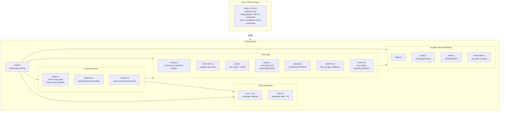

# Architecture

> 日本語版: [../ja/architecture.md](../ja/architecture.md)

## Purpose

Create and visualize routing plans for the YAMAHA URX22 / URX44 / URX44V in a GUI, constraining
the editor so that only paths the device physically allows can be wired. Plans persist as JSON and
can be exported as images. In the future the same plan data will be reflected onto real
hardware.

## Tech stack and rationale

| Layer | Choice | Rationale |
| --- | --- | --- |
| Desktop shell | Tauri 2 | Ship Windows 11 / Apple silicon macOS from one source. Small binary. Future hardware control can be implemented natively in Rust |
| Frontend | TypeScript + Vite | The planning UI is pure frontend. It can be verified in a browser even without Rust |
| Rendering | Plain SVG | Draws the node-graph wiring. Keeps the no-runtime-dependency policy |
| Persistence | JSON | Human-readable. Also serves as the input for future hardware reflection |

Hardware control is handled on the Tauri (Rust) side, and the UI and core (model / constraints /
plan) are kept shell-independent.

## Module structure



## Data model

- **DeviceModel** — an immutable per-model device definition. It holds `nodes` (inputs / channels /
  buses / outputs / duckers), `rules` (legal paths = `RoutingRule[]`), and `channelPairs` (the mono
  channels that share one input source — CH1/2, CH3/4). `models/build.ts` generates it from per-model
  parameters. A node may *ride on* a parent via `attachTo` (a ducker on its channel, the microSD Rec
  slots on their header), drawn hung just below it ([below](#hung-nodes-ducker-microsd-rec-slots)).
- **Plan** — the mutable state the user creates. It holds `modelId`, node positions (`positions`),
  connections (`connections`), per-connection parameters (level / pan / pre-post, etc.),
  node name overrides (`nodeNames`, the device's CH SETTING name — read and written over the string
  IPC for the same nodes that carry a color; an empty name falls back to the model's default label).
  The toolbar's labels toggle chooses whether the canvas shows the planner's fixed labels ("CH 1",
  the default) or these device names ("ch 1"); model mode ignores `nodeNames` entirely),
  node color overrides
  (`nodeColors`, the device CH SETTING color, drawn as a thin top accent cap; the picker offers the
  device's fixed palette so a chosen color is read and written 1:1 to hardware — input channels,
  MIX, STEREO, FX and STREAMING; the CH SETTING **Icon**, a sibling of name and color, is
  intentionally not modeled — mono channels CH1–4 do not expose it over the broker, so it would
  only work on stereo channels and buses), hidden nodes (`hidden`),
  and per-node notes (`notes`) with their minimized state (`noteCollapsed`). It serializes to JSON.
  A new plan comes from `defaultPlan(modelId)` in `models/initial-state.ts`, which seeds every model
  with a factory initial state (node parameters + routing + CH SETTING colors and names). Only URX44V is captured from real
  hardware; URX44 reuses that capture verbatim (it differs only by URX44V's HDMI input, which no
  default routes), and URX22 is an inferred remap of it (`models/initial-urx22.ts`, unverified until
  a real reset is captured). A device fetch instead starts from an empty plan (`emptyPlan` in
  `core/plan.ts`) and lets the readback (`core/control/`) fill in the live values.
  On startup the model selection is restored from the last choice (`localStorage("urx-model")`),
  falling back to URX44V when it is unset or invalid (the same "saved value → fallback" pattern as
  the theme and language).

The constraint core (`core/routing.ts`):

- `legalTargets(model, plan, fromRef)` — returns the set of input ports an output port can connect to.
- `legalSources(model, plan, toRef)` — the reverse: the output ports that can connect into an input
  port, so a wire can be dragged from the input side as well.
- `possibleTargets(model, fromRef)` / `possibleSources(model, toRef)` — supersets of
  `legalTargets` / `legalSources` that ignore the plan and return rule-defined partners only,
  occupied single-input ports included, so a "rule exists but already full" target can still be shown.
- `canConnect(model, plan, fromRef, toRef)` — checks rule existence and receiver multiplicity
  (`source` / `patch` / `key` accept one wire; `send` accepts many). A single-input port's occupancy
  counts any existing wire into it regardless of kind, so a hand-edited file carrying a malformed /
  mismatched kind cannot slip a second input past the guard.
- `partnerChannel(model, nodeId)` — returns the paired mono channel. A `source` wire is mirrored onto
  the partner (and removed together with it) so a channel pair always shares one input source (UI: `graph.ts`).
  A ducker key source is the `key` kind, not `source`, so it never enters this mirroring — guaranteed by the
  kind rather than by the incidental fact that duckers are not in `channelPairs`.
- `isBalLinkedPair(model, plan, id)` / `mirrorBalPair(model, plan, id)` — when a STEREO-linked MONO IN pair is in
  BAL mode, an edit to one channel is mirrored onto the partner (node params in general plus each send's
  LEVEL / PRE-POST / ON / pan — in BAL the pan is the pair's one shared balance; the Signal Type / PAN-BAL flags
  stay on the primary). Called from each edit funnel: `main.ts` `onUpdateParams` / `onUpdateNodeParams` for the
  graph / inspector, and `console.ts` `commit` for CONSOLE — both views share the one function so they behave
  identically. No mirroring in PAN mode. See [device-model.md](device-model.md).
- A STEREO-linked pair is tied on canvas by a heart connector and drags as one unit. Linking
  (`alignStereoPair`, called from `onUpdateNodeParams` when `stereoLink` turns on) first snaps the partner back
  beside the kept node — the selected member stays put, the other moves to its default-layout relative offset —
  so the tie is never stretched across a gap an earlier manual move opened. The pair keeps independent saved
  positions afterwards (unlike a ducker's parent-derived position), so it stays freely draggable.

The UI (`graph.ts`) uses these to let a wire be dragged from either an output or an input port,
highlighting the opposite-side ports in two layers: legal targets filled, rule-defined-but-occupied
ones outline-only. A drag from an output opens on any possible route; a drag from an input opens only
when a legal source exists. Clicking a single-input port that already holds a source selects that
wire, the same as clicking the wire itself.

**Path trace**: long-pressing a node (`LONG_PRESS_MS`, ~450ms, held without moving past
`LONG_PRESS_TOLERANCE`) highlights the signal path feeding it. `routing.ts`
`upstreamNodes` walks connections backwards through live wiring only (`isOffSend` false) to gather
the node's upstream closure (its inputs, channels, and buses) — OFF / -∞ sends are skipped, or the
always-wired send mesh would trace every node back to all inputs and the closure would be the whole
board. Nodes in the closure wear an accent frame; live wires with both endpoints in it light up. Both
wires and nodes off the path fade (the same lit / faded split a multi-selection uses); a node fades
by a factor of its resting opacity, derived from node state by `restingOpacity` (the same precedence
`makeNode` dims it: rate-disabled > inactive > unread > plain), so a muted / unread node keeps its own
dim instead of having it clobbered. The trace is a state (`pathNodes`)
independent of the selection, cleared by any selection change, Escape, or an empty-canvas click. A
node with no upstream (an input) just reports it on the status bar and lights nothing. The closure is
route-accurate, not per-node: a stereo input mirrors its source onto a channel pair, so muting one
half of the pair leaves the muted channel off the path while its shared input stays lit through the
still-live partner channel — the input is genuinely on the path until both halves are silenced.

**Uniform OFF display**: every state that silences a node — a muted channel / master / FX / MONITOR
(`params.on`), a bypassed ducker (`duckerOn`), the oscillator off (`osc.on`) — funnels through the
`isNodeInactive` predicate, dimming the node and tagging it (MUTE, or OFF for a ducker / the
oscillator). A node can be in several states at once, so only the highest-ranked one shows —
**rate-disabled > muted > unread** — to keep the badges from colliding. A fixed send bound to a
silenced node recedes through the `isOffSend` predicate (dimmed and finely dotted, behind the live
wires; an OSC → bus wire also when both its L/R assigns are off), and its jacks stop glowing (port
lighting follows the wires' off-state). A multi-selection lights every wire incident to the whole
selection, matching the node highlighting.

For the detailed routing rules, see [device-model.md](device-model.md) (derived from the official
block diagram).

## Localization (i18n)

The UI is English-first with Japanese localization. The implementation is a dependency-free,
in-house module `src/i18n/`:

- `en.ts` — the base language and the source of truth for the message shape (the `Messages` type).
  It contains strings and interpolation functions.
- `ja.ts` — the Japanese translation that satisfies `Messages`. Adding a key makes TypeScript
  require a translation in every language.
- `index.ts` — the current language state, `t()` (returns the active catalog), and
  `setLang()` / `onLangChange()`. On startup it reads `localStorage("urx-lang")`; if absent it
  detects from `navigator.language`, with English as the final fallback.

> **The core stays language-agnostic.** `canConnect` in `core/routing.ts` returns failures as
> `ConnectError` codes, and `deserialize` in `core/plan.ts` throws a `PlanError` (with a code). The
> UI maps them to text (`t().error[code]`). This keeps `core/` and `models/` free of i18n, so the
> Node smoke test runs without browser APIs.

The language button in the toolbar's right-hand cluster switches languages (its face shows the
current code, `EN` / `JA`); `setLang()` notifies listeners, which re-render the static labels and the
inspector.

> **Terminology.** Keep product / industry terms in English even in the Japanese UI: `Bus`,
> `Ducker`, `Bus send`, `Send (ON/OFF)`, `Pre-fader send`. The visible canvas element is a **node**;
> reserve "module" for software modules (`src/i18n/` etc.). The legend groups the wire kinds under
> "Connection types" and the node kinds under "Nodes".

## Display themes

The UI has a studio-rack aesthetic modeled on pro-audio gear, with two palettes (dark and light)
selected by a three-way theme **mode**: `light`, `dark`, or `auto`. The mode persists to
`localStorage("urx-theme")`; a fresh install defaults to `auto`, which resolves to a palette from the
OS color scheme (`prefers-color-scheme`) and re-resolves live when the OS scheme changes. The glyph
button at the right end of the toolbar cycles `light → dark → auto` (icons ☀ / ☾ / ◐ show the current
mode); `resolveTheme()` maps the mode to the applied palette and `applyThemeButton()` refreshes the face.

The palette is split into two layers, kept in correspondence per theme:

- HTML elements (toolbar / inspector / background) — CSS custom properties in `src/style.css`
  (`:root` is dark, `[data-theme="light"]` is light; the attribute is set on `document.documentElement`).
- SVG nodes / wires — `PALETTES.dark` / `PALETTES.light` in `src/ui/graph.ts`. `setTheme()` re-renders.
  Light-theme nodes also get a soft drop shadow (`#node-shadow` filter) for physical lift.

The connection and node colors live in both layers: wire colors as `--w-*` (CSS) / `PALETTES.wire`
(graph.ts), and node-rail colors as `--rail-*` (CSS) / `PALETTES.rail`. The inspector's empty-state
**legend** reads the CSS variables, so it labels exactly the colors the graph draws and follows the theme.

> As with model/rule consistency (device-model.md ↔ models/), **keep the theme palette in sync
> between the CSS variables in style.css and `PALETTES` in graph.ts** — wire (`--w-*` ↔ `PALETTES.wire`),
> node rail (`--rail-*` ↔ `PALETTES.rail`), and the surface colors.
> Exception: `key` (the ducker key source) shares `source`'s blue and has no separate legend row, so it
> carries only a `PALETTES.wire.key` entry for rendering and no `--w-key` CSS variable (the `--w-*`
> variables back the legend swatches only).

PNG and PDF export (`core/storage.ts`) read `--canvas-bg` to paint the background, so the exported
image follows the current theme too. The PDF is a hand-built single-page document embedding one
FlateDecode image (deflate via the platform `CompressionStream`), so no runtime dependency is added.

## CONSOLE view (mixer-style level overview)

Alongside the node graph (GRAPH), a second view surveys the same plan as mixer-style vertical strips.
The GRAPH / CONSOLE toolbar tabs switch between them; while CONSOLE is shown the graph and inspector are
hidden (`setView` in `main.ts`). `src/ui/console.ts` lays strips out in INPUTS / BUS · FX / MONITOR /
MASTER groups, scrolling horizontally (there is no shared left ruler). The fader zone is three columns —
a **fader** (a real-console thin slot + cap; the cap position is the value), a **dB scale**, and a **level
meter** — the meter shares that one scale: the signal ladder (signal only while Live sync streams)
maps each dBFS reading onto the same travel as the matching dB tick, its **top at the 0 dB mark** and its
bottom at the lowest tick (−∞). The ladder is split into **three color zones — green / yellow / red** keyed to
**absolute dBFS** (not the lit height): green ≤ -18 dBFS / yellow -18 to -9 dBFS / red -9 to 0 dBFS. The boundaries
match the EBU R68-2000 reference levels (alignment level -18 dBFS / permitted maximum level -9 dBFS); the threshold
constants live in `core/meters.ts` (`METER_GREEN_TOP_DB` / `METER_YELLOW_TOP_DB`). A separate **OVER box** sits just
above the 0 dB top (clipping ≠ the level ceiling); it lights red on a device clip (raw 32767) via the `sig.over` latch and decays over ~1 s. The scale
follows each strip's range and aligns its top/bottom to the fader travel, so one ruler reads both the fader
and the meter (a functional scale, 10/5/0/-5/-10/-20/-40/-∞); the 0 dB line crosses the fader cap centre.
Strips whose fader/meter top out at 0 dB (the meter-only STREAMING and OSCILLATOR strips) drop the
unreachable +5/+10 ticks. Each tick centres its digits with the minus sign hanging left, so `10` and
`-10` line up vertically. Above the zone the scribble shows two lines — **node name + device CH SETTING
name** (the monitor buses carry no CH SETTING name, so their second line names the linked PHONES output instead —
`Phone 1` / `Phone 2`). Below it sit two 2-column chip groups: (1) channel / input (HA) — MUTE (on channels, FX channels, the
master, the MIX buses and the MONITOR buses; an FX channel's is the device FX-channel ON, the master's is the
STEREO master ON, a **MIX bus's drives the MIX → STEREO TO ST switch** (`params.on`, muted = TO ST off), and a
**MONITOR bus's is the device MONITOR ON** (`np.on` → `MONITOR_ON`, the MONITOR-screen [ON] button)). A MONITOR
bus also carries **CUE Int** (`cueInterrupt` → `MONITOR_CUE_INTERRUPT`, ships ON) and **MONO** (`mono` →
`MONITOR_MONO`, ships OFF) chips. Then +48 / φ /
HPF on mono MIC channels (Hi-Z on CH3/4) or φL / φR on stereo channels (gated by `channelControl`); (2) the processing
chain GATE → COMP → EQ → INS FX, plus EQ + DUCKER on stereo channels (toggling the `duckerOn` of the ducker
node hung under them). An odd group gets an invisible spacer so its last chip never stretches to
full width. At the bottom (knobs bottom-aligned) are rotary knobs (`addKnob`/`wireKnob`, drag / arrow keys)
— channel **Gain and PAN/BAL** (the CH→STEREO send's pan, L63–C–R63), or the **PHONES level** (a 0–10 non-dB
scale) on the monitor buses (PHONES 1 ↔ mon1, PHONES 2 ↔ mon2, independent of the monitor fader, so no extra
tab). A knob's indicator can place specific values at the horizontal (`KnobSpec.angle`, left = -90° / right =
+90°): PHONES 2.0/8.0, A.Gain +8/+55, D.Gain -14/+15, OSCILLATOR LEVEL -50/-8. Double-clicking a fader cap or
a knob resets it to the **factory value** (from `defaultPlan`).

- **Meter point (per-strip tap)** — a node exposes several observable meter tap points along its signal
  chain, and each strip picks which one its meter (and the live readout) shows. An amber badge above the
  meter opens a vertical signal-chain popover (`con-tappop`, listed in flow order, active tap highlighted);
  it is position-fixed so it escapes the strip scroll container. Tap → `meter_id` was confirmed on the
  device against the block diagram (`core/meters.ts` `NODE_TAPS`): mono channels INPUT → PRE GATE → PRE COMP →
  PRE EQ → PRE INS FX → PRE FADER → POST; stereo channels INPUT → PRE FADER → PRE DUCKER → POST (no
  HPF/GATE/COMP/INS FX, and the LEVEL sits before the DUCKER); output buses PRE EQ (sum) → PRE FADER →
  PRE INS FX → POST; FX channels PRE FADER → POST; monitors and the oscillator are single-meter and have
  no selector. STREAMING and the OSCILLATOR have device meters but no level fader, so they are **meter-only
  strips** (`buildMeterOnlyStrip`: a live meter with no fader, no set-level readout, and no tap selector). The
  **OSCILLATOR** additionally carries an **ON button** (normally OFF, lit = generating, `osc.on`) and a **LEVEL
  rotary knob** (−96…0 dB, the shared device level; its indicator's horizontal marks read -50 left / -8 right)
  in place of a fader. The choice persists per model in `localStorage` (`urx-metertap`). The readout has two cells: the fader set level
  (white) and the selected tap's live value (amber); default tap = the most downstream point.
- **Shared edit path** — fader / chip / gain edits mutate the plan directly and flow through the same change
  funnel as the graph and inspector (`markChanged` → `live.schedule()`), so live device sync mirrors a
  CONSOLE edit through the same snapshot diff. CONSOLE re-renders only the edited strip itself, avoiding a
  full rebuild mid-drag; returning to GRAPH reflects the edits via `graph.repaint*`.
- **Levels only (no routing)** — CONSOLE adjusts the levels of existing sends / paths; it never adds or
  removes connections (routing stays in the graph). `setSend` only updates an existing wire's level, so
  lowering a send to -∞ keeps the wire (the strip stays). INS FX has no separate on/off (No Effect is off),
  so toggling on restores the last chosen effect (or the first real option).
- **Send-on-fader** — a fixed “Output” label and the mode bar (MAIN / FX 1 / FX 2 / MIX 1 / MIX 2). The mode-bar
  tabs are rebuilt from the visible buses each render (`renderModes`): hiding a FX/MIX bus in the graph drops its
  tab, and if the active tab's bus is gone the view falls back to MAIN. A send
  mode flips the input-channel and FX-channel faders to the send level into the chosen MIX/FX bus and shows
  **only that bus's sources** — non-send nodes (monitors, master, the buses themselves) and wire-less strips
  drop out. FX channels only follow sends to MIX buses. MAIN shows every strip at its own level. Since every
  send is now fixed (always wired), input channels and FX channels behave the same in a send mode:
  - A send-mode strip gets a **`PRE` chip** that toggles that send's PRE/POST tap (the same value as the
    graph/inspector tap; every CH/FX → MIX/FX send carries a tap). On the **FX 1 / FX 2** tabs the tap is a
    CH → FX send, which the device cannot accept from software, so while live sync is connected the chip is shown
    read-only — matching the inspector (see [known-issues.md](known-issues.md)). MIX-tab taps stay editable.
  - Its **MUTE toggles that send's ON/OFF (SEND_ON)** — the channel's own mute lives on the MAIN tab and in the inspector.
  - Its **PAN/BAL knob is tab-scoped**: MAIN edits the → STEREO main-path PAN/BAL, a send mode edits that send's
    pan (the same connection the fader controls). FX-bus sends are mono and carry no pan, so the **knob is dropped in an FX mode**.
  - **Channel-domain controls are MAIN-only** — the HA toggles (+48 / φ / HPF / Hi-Z), the processing chain
    (GATE / COMP / EQ / INS FX / DUCKER) and the Gain knob have no send equivalent, so a send tab hides them
    (gated by `!usesSend`; their `channelControl` capability lookup is skipped there too). A send tab keeps only
    the fader (send level), MUTE, PRE and PAN/BAL.
  So every strip control is per-tab independent — no MAIN-output control leaks into the send tabs. When a
  **channel's / FX channel's own master is muted** (channel ON = off), a send-mode strip dims and shows a red
  "CH MUTE" badge on its scribble (the muted-graph-node visual language), since the whole channel — every send
  — is then silenced; the per-send MUTE/PRE/BAL stay operable (send ON/OFF and channel ON are independent
  device params, and the device offers no gate-out display of its own).
- **Scribble colour** — the scribble uses each node's **CH SETTING colour** (`plan.nodeColors`, a device
  parameter) rather than the node-kind rail. The text colour is whichever of black/white has the higher
  actual contrast ratio (WCAG relative luminance, `inkOn`), paired with a faint opposite-tone halo
  (`text-shadow`) so the small device name stays legible over a mid-tone colour; nodes with no assigned
  colour fall back to the rail colour.
- **Layout / scroll** — `#console-host` uses `min-width:0; overflow:hidden` to stay within `#stage`, keeping
  horizontal scroll inside the strip grid (`.con-strips`, its bar above the status bar). It does not scroll
  vertically except on very short windows (then within the strip grid). The master (STEREO) is no longer
  pinned to the right; it scrolls with the rest. **The head area (name / chips / knobs) is locked to the MAIN
  tab's tallest strip** across every tab and channel (measured by laying the MAIN strips out off-screen in
  `mainHeadHeight`, cached by model + hidden set); the fader / level-meter zone (`flex: 1`) takes the rest of the
  window height. So the fader and meter heights fit the open window, and a send tab keeps the same head height
  and fader start as MAIN.
- **Readout** — each strip's bottom readout shows the set level (dB) only; the send destination is conveyed by
  the active tab, so the old “→ MAIN / → MIX SEND” line is gone. The mono font draws `∞` at x-height, smaller
  than the digits, so a `-∞` readout scales the `∞` up to digit height (`setLevelText` wraps each `∞` in a
  `.glyph-inf` span; shared `src/ui/glyph.ts` covers the CONSOLE readout, the dB scale, and the inspector values).
- **Live meters** — the meter column is always shown; signal only flows while Live sync is on
  (`console.setLive`; at rest it sits at the floor). `core/meters.ts` maps node ids to broker meter addresses
  (`meterId:x`), decodes the raw value (deci-dBFS, 32767 = OVER) to dBFS, and holds the latest reading in a
  `MeterStore`. The UI samples the ~10 Hz notifications on `requestAnimationFrame` and renders with fast
  attack / slow release, peak hold, and an OVER latch (the top OVER box), writing only the lanes that changed
  (compared at integer-percent). Subscriptions are scoped to the on-screen strips that have a meter in the
  current model (`metersForNodes`). Meter ids were confirmed on a real URX44V; models without a mapping show no meter.
- **Streaming path** — the Rust side (`src-tauri/src/vd.rs`) handles a meter subscription
  (`MetersSubscribe`/`MetersUnsubscribe`) by registering each address with the broker, and forwards meter
  `notify` frames to the frontend over a Tauri Channel during the idle socket drain (`pump` → `forward_meter`).
  Meters stream only while Live sync is on (subscription starts in `console.setLive`).
  The subscription is bound to Live sync, not to view visibility: a GRAPH ↔ CONSOLE tab switch only stops the
  paint loop (`requestAnimationFrame` → `stopPaint`) and keeps the broker subscription warm. Re-registering every
  address on each toggle would stall the meters for ~1 s, so the full teardown (`stopMeters`) runs only when Live
  sync ends, and re-showing resumes from the warm stream at once.
- **Device follow** — the reverse of live sync. The same drain path also carries device-side parameter
  changes: `ParamsSubscribe`/`forward_param` (sharing the `notify_frame` envelope parse with the meter path)
  register every writable address and forward each `notify`. A notify carries the changed address **and its
  new value**, so detection is free and exact. While Live sync is on, `core/control/follow.ts` `DeviceFollow`
  classifies each notify against the live snapshot's address→node index (`live.lookup`): a **direct** node-local
  scalar (fader / pan / on / level, flagged `follow: "direct"` in the catalog) is decoded straight into the plan
  with no read-back (`applyDirect`, render coalesced on the next frame); anything else is **scoped** — the owner
  node is re-read once the burst settles (`applyNodeState`, the same device→plan inverse as `applyDeviceState`
  but gated to just the touched node(s), so it can never drift); an unknown address or **more than three** distinct
  controls at once (more than two hands plus one — a scene / preset recall) escalates to a full read. After the
  device goes quiet a single full read runs as a missed-notify safety net. So a fader moved on the unit itself
  follows on screen with no round-trip, while a deeper edit re-reads only its node. Echoes of the app's own
  writes are filtered against the live snapshot, and the address set is re-registered only when a structural edit
  changed it.

## Live control connection

Every device action (fetch, write, live sync, self-test) opens a connection through `vdConnect`, which runs
the Rust worker's `handshake`: it asks the broker `getDeviceList` for the unit's `dev_uid`, then confirms the
unit is physically attached by reading `/vd/synchronize` — `sync_status` is `"online"` only while a URX is
connected. Device Center keeps the `getDeviceList` entry after the unit is unplugged (and answers cached
parameter reads), so the list alone cannot tell a present device from a stale entry; the `sync_status` check
is what distinguishes them.

A failed connect returns a stable, machine-readable code rather than a raw English string: `broker-unreachable`
(Device Center not running), `no-device` (running, but no URX attached — the empty-list, `sync_status != online`,
and list-timeout shapes all collapse to this single code, since the user's remedy is the same), or
`control-worker-gone` (the Rust worker thread died or stopped responding — the handshake, command send, and
reply-wait failures all collapse to this code). The frontend's `connectFailureStatus` maps those codes to
localized messages (`error.brokerUnreachable` / `error.noDevice` / `error.controlWorkerGone`);
any other connect-stage fault falls back to the action's own error formatter. Because the connect doubles as a
pre-check, fetch and live sync connect *before* prompting to discard edits, so a no-device state is reported
plainly without first disturbing the plan.

### Connection generations

Only one connection is installed at a time (`VdState`), but the lifecycle of two actions can overlap: replacing the
plan (loading a file, switching model) tears the live session down with a *fire-and-forget* `vdDisconnect`, and a
later action (e.g. write) opens its own connection before that teardown has run. To stop a delayed teardown from
closing the wrong connection, every connection carries a generation (`epoch`): `install` increments and returns it
on connect, and `disconnect(epoch)` only closes when the current generation matches — a stale teardown of an earlier
session is a structural no-op. Each frontend owner disconnects with the epoch it connected with (`withDevice` and
self-test from their local `device`; the held-open live session from the `liveEpoch` it captured at connect). This
makes the ordering of an un-awaited disconnect against a later connect harmless instead of relying on call-order
discipline.

### Cancelling a long operation

Fetch, write, and self-test each round-trip the whole device serially over one connection, so a stalled link can
take minutes. Each therefore holds an `AbortController` and toggles its menu item to a "Cancel" label while
running (a second click calls `abort()`). The signal is checked between round-trips in the readback
(`applyDeviceState`) and the diff/send (`diffPlan` / `sendConverging`); the in-flight round-trip is allowed to
finish (leaving the device consistent) before bailing. A cancel surfaces through `withDevice` as `status.canceled`.

### Reporting a drop or partial failure

A link that drops *during* a command surfaces on the next operation as a broker error, but a held-open connection
sitting **idle** (live sync with no edits) would go unnoticed. Unplugging *only the URX* is also invisible to a
socket check: the broker socket stays up and keeps ACKing writes (a success reply with no unit attached), so neither
a socket drop nor a write error reveals it. To close both gaps the Rust worker watches, in `pump` (the idle socket
drain) and in the read/write round-trip loops (`do_set` / `do_get_value`), for (a) a socket drop and (b) the
`/vd/synchronize` frame Device Center spontaneously sends at the moment of disconnect (`sync_status` flipping away
from `online` — distinct from the handshake / sync_status reads that fetch it on purpose). On either, it pushes a
single `LinkEvent` to the frontend (`vdWatchLink`), or fails the in-flight command, and the frontend tears the live
session down. When fetch or write fails on individual reads/writes, the count is shown in the status and the user
is offered a Markdown report of each failure (`formatReadbackReport` / `formatWriteReport`); the save dialog is
presented after the connection is released. A device-follow read-back likewise counts any read failures into the
status line (`← device (n, m unread)`) rather than only logging them, so a background reconcile that partially
fails is not silent.

Errors are surfaced by meaning. An **operation that did not complete** (a failed load, fetch, write, self-test,
connect, or live-sync start, plus a link drop during live sync) is shown as a **modal** so it cannot be missed
(`errorDialog` → `showError`, which clears the status line first so a stale "Connecting…" does not linger behind
it). **Routine progress, info, cancellation, and partial successes** stay on the status line at the bottom. A live
runtime error can arrive from several sources at once (live / follow / link watch), so they funnel through
`stopLiveOnError`, which uses the `liveSessionUp` flag to drop the connection and show the dialog exactly once — the
second and later calls return early because `deactivateLive` clears that flag synchronously.

## Responsive layout (mobile)

The inspector — a fixed 300px column on desktop — becomes a bottom sheet (a rack drawer that slides up
from the foot of the screen) on narrow viewports (≤720px). For nodes whose inspector runs long
(channels, etc.) the selected node's identity (heading / name / color) stays pinned as a sticky header
while the parameters group into collapsible rack-module sections (ROUTING / INPUT / GATE / COMP / EQ /
Parameters) built on `<details>` (`section()` in `inspector.ts`). GATE / COMP / EQ / Ducker light their
header led from each section's ON state and an off section folds itself away; ROUTING defaults collapsed.
A node's ON/OFF (channel ON, each master, FX, MONITOR, Ducker, OSC) always leads its parameters, mirroring
the canvas OFF display.
A hand-folded section persists its open/closed state per section kind to `localStorage`
(`urx-inspector-sections`), so it survives re-renders and reloads; toggling a section's ON value clears
that override so the fold reverts to following the on-state. Within a section, the EQ band editor is a
four-tab strip (LOW / LOW MID / HIGH MID / HIGH) showing one band at a time (the active band is kept
across re-renders), and the INPUT toggles flow two-up. Its visibility is driven by CSS alone:
`main.ts` toggles a single `has-selection` class on `<body>` from whether anything is selected, and
`body.has-selection #inspector` raises the sheet with `transform: translateY(0)` (off-screen at
`translateY(105%)` otherwise). It is dismissed by the heading's ✕ button (`onClose` →
`graph.clearSelection()`, reusing the existing deselect path) or by tapping empty canvas. Canvas zoom
works by mouse wheel (desktop) and two-finger pinch (touch); both share one "zoom about a fixed point"
routine (`zoomAt` in `graph.ts`). `viewport-fit=cover` plus `env(safe-area-inset-bottom)` clears the
notch / home indicator, and the toolbar drops its decorative VU meter + tagline below 720px.

## Hiding nodes

On larger models the nodes a plan does not need take space and clutter the diagram, so **any node**
can be collapsed off the canvas — connected or not. Hidden nodes collect on a **shelf**
docked along the bottom (an HTML overlay `graph.ts` builds — kept out of the SVG, so it never shows in
an export) as rail-colored chips; clicking a chip restores that one, and "Show all" restores them all.

- The toolbar "Hide unused" shelves only nodes with *no wires at all* (fixed sends count as wires, so a
  channel sitting on just its factory sends is left in place — collapse unused channels by hand). The
  inspector adds a "Hide this node" button for any selected node.
- **Multi-select**: Ctrl/Cmd-clicking nodes toggles them into a selection without dragging. With two or
  more selected, a floating action bar (an HTML overlay, like the shelf) offers a batch "Hide" that
  shelves the whole selection. "Clear" and `Escape` drop the selection. The selection set is transient
  view state, not persisted.
- **Wires of a hidden node**: any wire (fixed or editable) is skipped while either endpoint is hidden,
  so a shelved node takes its wires off-canvas with it and rendering never leaves a wire dangling. The
  connections themselves stay in `plan.connections` — hiding is purely visual — and reappear when the
  node is restored.
- **Ducker**: hiding a parent channel hides its ducker too, and restoring the ducker restores the
  parent — a ducker is never shown without its channel. On the shelf, a parent and its hidden ducker
  collapse into one chip (the child chip is suppressed); restoring the parent chip brings the whole
  unit back.
- A hidden node also drops from the **CONSOLE view** (`console.ts` filters `plan.hidden` out of its
  strip list, and a shelved ducker drops its chip from the parent strip).
- The hidden set persists as `plan.hidden` (an array of node ids) and is restored on load. Like
  `positions`, it is pure view state and does not affect routing rules (future hardware reflection may
  ignore it).
- The hidden set is also mirrored per model in `localStorage("urx-hidden")` (a model-id → node-id-array
  map); `newPlan` restores that model's entry on startup, model switch and new plan, so the layout
  survives an app restart for the live device-control workflow. A loaded file's `hidden` still wins
  (overriding the current state as before), and `loadPlan` re-records it into `urx-hidden` so the current
  state and localStorage stay in sync.
- The bulk "hide" and "show all" re-fit the diagram to reclaim space; while the shelf is open `fitView`
  frames the content above it, and a single restored node is parked at the viewport center.

## Hung nodes (ducker, microSD Rec slots)

Some nodes *ride on* a parent rather than being laid out on their own; they name the parent via
`attachTo` and are drawn **hung at a fixed gap below** it. Two kinds use this:

- A **ducker** (sidechain key-source selector) hangs under its stereo channel — its own `"ducker"`
  kind (a dedicated rail color), one child per channel.
- The **microSD Rec slots** (`out.sdrec.t1` … `t8`) hang under the SD Rec header node (`header: true`).
  A header takes no direct wire — its port is not drawn and the inspector shows no routing list — and
  owns **several** hung children stacked in order.

Shared mechanics:

- **Derived position** — a hung node's coordinates are never stored in `plan.positions`; `posOf`
  follows `attachTo` and offsets by the parent's height + gap, plus the heights of any earlier visible
  siblings (so SD Rec slots stack and a hidden one collapses the rest up). It tracks the parent even
  when the parent's note expands.
- **Moves as one** — dragging the parent moves every hung child by the same delta (`attachedDescendants`);
  grabbing a child redirects the drag to the parent, so either grab moves the unit.
- **Tether** — a single thin rail-colored line spans the gap to the parent, marking the unit.
- **Auto-layout** — `autoLayout` skips the hung children and reserves their summed height below the parent.
- **Shelving** — a hung node shelves like any node (its own chip restores it); shelving the parent
  collapses the whole unit behind one chip. SD Rec slots beyond the Track Count are *gated* (hidden
  without a chip — restored by raising Track Count), distinct from being user-shelved.

## Column layout

Nodes lay out in five columns following the signal flow, left to right: inputs → channels → mix buses
(STEREO / MIX / FX) → derived buses (STREAMING / MONITOR) → outputs. The split of the bus stage into
two columns is deliberate: STREAMING and MONITOR take only the mix buses as input, so they are
downstream and sit in their own column rather than crowding the dense channel-to-bus convergence;
OSCILLATOR is a generator that feeds the mix buses, so it joins the channel column. The result is that
every wire flows strictly left to right, with no wire doubling back through the bus column. The
per-node column index is `layoutCol` in `build.ts`, stored as `pos.col`; `autoLayout` and the default
grid both stack each column independently. Both also share one vertical grid: a default row is
`pos.row * ROW_GAP` (with `build.ts` reserving an extra row under each stereo channel for its hung
ducker), and `autoLayout` snaps each node's advance to whole `ROW_GAP` rows — so running Arrange on a
fresh board moves nothing, while an expanded note simply claims more rows.

A node's `kind` (which drives its rail color and the channel-only name field) can differ from its
layout column: OSCILLATOR is `kind: "input"` (a signal source) and the MONITORs are `kind: "output"`
(sinks), so their rail color reflects their signal role even though they sit in the bus/channel
columns. The device does not color these in CH SETTING, so — unlike the STEREO / MIX / FX / STREAMING
buses — they carry no color picker.

## Node labels

The label sits at a fixed left inset and must clear the header button (its visible box starts near the
right edge), which leaves room for roughly 15 monospace characters. Longer labels are handled two ways:
a node with a `sublabel` stacks two tiers in the fixed-height header — the node name, then a dim
secondary legend below it (e.g. a ducker's `CH 3/4 · Source`); a long single-line label with no sublabel
is shrunk just enough by `fitScale` to stay clear of the button (`microSD Playback`, `HDMI (down-mix)`).
Lists and the inspector show both tiers joined via `fullLabel()` so no context is lost.

## Node notes

Each node can carry a free-text note. The note renders **inside the node frame**, below the
header, in a recessed panel; the node grows downward to contain it while the header (label, jacks,
wires) stays anchored, so routing is unaffected. Notes are part of the SVG, so they appear in PNG /
PDF exports.

- **Add** — a note-less node shows a faint pen button at the header right (`graph.ts` `makeNoteAdd`).
  Clicking it (or double-clicking the node) opens an in-place editor: a floating HTML `<textarea>`
  positioned over the panel, kept out of the export. (A sustained long-press traces the signal path
  instead, so a quick double-press and a held press are distinct gestures.)
- **Edit** — once a node is selected, clicking its open note area edits it; the header (outside the
  note) still drags the node, and an unselected node drags from anywhere. Editing is canvas-only —
  the inspector has no note field.
- **Minimize / expand** — a noted node shows a `+` / `−` button (`makeNoteToggle`): `−` minimizes
  the note to the header, `+` re-expands it. The minimized state persists per node.
- **Persistence & layout** — notes persist as `plan.notes` (node id → text) and the minimized set as
  `plan.noteCollapsed`, both pure view state (future hardware reflection may ignore them). `Arrange` stacks each column
  by the nodes' actual heights (`nodeHeight`, expanded note included), so a note never overlaps the
  node below it.

## Persistence format

```jsonc
{
  "format": "urx-router-plan",
  "version": 1,
  "modelId": "URX44V",
  "sampleRate": 48000,
  "positions": { "ch1": { "x": 1, "y": 0 } },
  "connections": [
    { "from": "in.micline1:out", "to": "ch1:in", "kind": "source" },
    { "from": "ch1:out", "to": "bus.stereo:in", "kind": "send",
      "params": { "level": 0, "pan": 0, "tap": "post" } }
  ],
  "nodeNames": { "ch1": "Lead Vox" },
  "nodeColors": { "ch1": "#4a78c0" },
  "hidden": ["in.micline2", "out.sdrec"],
  "notes": { "ch1": "Lead vox — comp + chorus +2 dB" },
  "noteCollapsed": ["ch1"]
}
```

Phase 1 implemented save/load with browser standards (Blob download / file input). Phase 2 adds
native save/open dialogs (`tauri-plugin-dialog`) plus a recent-plans list; file IO uses small
`std::fs` app commands (`read_text_file` / `write_text_file` / `write_binary_file`). Everything is
reached via `core/platform.ts` through `window.__TAURI_INTERNALS__.invoke`, so no Tauri npm package
is bundled; when not running under Tauri it falls back to the browser path. The plan format is
unchanged apart from the added `sampleRate`, `nodeNames`, `nodeColors`, `hidden`, `notes` and
`noteCollapsed` fields (older files default them on load). Loading (`deserialize`) is tolerant of
corrupt input: every collection passes a type guard that drops a non-conforming value to its empty
default (`positions` included, symmetrically), and `connections` is validated element-by-element so
malformed wires (null, wrong-typed, unknown `kind`) are discarded — keeping garbled values from a
hand edit or an older build out of the plan where they could break routing invariants.

## Build and distribution

Installers are produced by `pnpm tauri build`, which embeds `frontendDist`
(`../dist`) into the binary. A plain `cargo build` artifact instead reads
`devUrl` and shows a blank window without the dev server (always verify with
`tauri build`). The app version has a single source: `src-tauri/tauri.conf.json` sets `version`
to `"../package.json"`, so Tauri reads it from the root `package.json` at build time (`Cargo.toml`'s
version stays independent as the crate version).

| Platform | Output | Notes |
| --- | --- | --- |
| macOS (Apple silicon) | `.dmg` + `.app` (`src-tauri/target/release/bundle/`) | arm64 only; ad-hoc signed (Gatekeeper warning until notarized) |
| Windows | `.msi` + `.exe` (NSIS) | built on a Windows host or in CI; cross-compiling from macOS is unsupported |

Releases are automated by `.github/workflows/release.yml`. Pushing a `vX.Y.Z`
tag (or `vX.Y.Z-{alpha,beta,rc}*` for a prerelease) runs three jobs: `check-tag`
validates the tag, `create-release` opens a **draft** GitHub Release, and a
`build` matrix (`macos-14` / `windows-latest`) packages each platform with
[`tauri-action`](https://github.com/tauri-apps/tauri-action) and attaches the
bundles to the draft. The draft is left for manual review before publishing. A
manual `workflow_dispatch` run builds without creating a release, uploading the
bundles as job artifacts only (to verify the packaging pipeline).

macOS signing and notarization are optional: when the signing secrets (`MACOS_SIGNING_CERT` /
`MACOS_SIGNING_CERT_PASSWORD` / `MACOS_SIGNING_IDENTITY`) and notarization secrets
(`MACOS_NOTARIZATION_USERNAME` / `MACOS_NOTARIZATION_PASSWORD` / `MACOS_NOTARIZATION_TEAM_ID`) are
present the workflow forwards them to `tauri-action`; otherwise it ships an unsigned bundle. The
secret names are shared with the author's other repos for reuse.
The Windows console window is already suppressed in release builds by
`windows_subsystem = "windows"` in `src-tauri/src/main.rs` (it appears in dev /
`cargo build`).

### Browser demo (GitHub Pages)

Separate from the desktop app, a browser-only demo is published to GitHub Pages. `vite build --mode demo`
(`pnpm build:demo`, with `.env.demo` setting `VITE_DEMO=1`) builds it, and `.github/workflows/pages.yml`
publishes `dist` to Pages when a `vX.Y.Z` release tag is pushed, so the demo tracks released versions. The demo is a viewer, so file save / load and PNG / PDF
export are hidden from the toolbar (`src/core/env.ts`'s `DEMO` flag hides `[data-demo-hide]` elements). A
normal (desktop) build eliminates that branch as dead code and keeps every feature, so distributed binaries
are unaffected. `vite.config.ts`'s relative `base: "./"` lets assets resolve under a sub-path.

### Auto-update

The desktop app checks for a newer release at startup. The Tauri updater / process plugins are registered
in `src-tauri/` on desktop only, and the frontend calls `plugin:updater|check` /
`plugin:updater|download_and_install` / `plugin:process|restart` directly from `src/core/platform.ts`, the
same way as the dialog calls (no added npm runtime dependency). When an update exists it shows a confirm
dialog, then downloads, installs, and restarts. Browser / demo builds disable this via the `DEMO` branch,
which is eliminated as dead code.

Distribution rides on GitHub Releases. Enabling `bundle.createUpdaterArtifacts` in `tauri.conf.json` makes
`tauri-action` emit signed bundles plus a `latest.json`, served from the
`https://github.com/semnil/urx-router/releases/latest/download/latest.json` endpoint listed under
`plugins.updater.endpoints`. Update bundles **require a minisign signature**, with a key pair separate from
macOS code signing.

Generate and register the signing key (one-time):

```sh
pnpm tauri signer generate -w ~/.tauri/urx-router-updater.key
gh secret set TAURI_SIGNING_PRIVATE_KEY < ~/.tauri/urx-router-updater.key
gh secret set TAURI_SIGNING_PRIVATE_KEY_PASSWORD
```

- The printed **public key** is set in `plugins.updater.pubkey` in `tauri.conf.json` and committed — a
  public key is safe to commit.
- Keep the **private key** and its password out of git and register them as the secrets above (`release.yml`
  forwards them to `tauri-action`). Without the secrets the bundles are unsigned and no `latest.json` is
  produced, so auto-update will not work.

### Use consent (license display and disclaimer)

Because the desktop app can write settings to a connected URX — overwriting its current state — consent to
that risk is collected in two places. The **installer** shows a license-agreement page from
`bundle.licenseFile` in `tauri.conf.json` (`src-tauri/LICENSE.txt`, which folds the device-control safety
notice, the trademark statement, and the full MIT text into one file); on Windows the WiX installer renders
the plain text as RTF and the user must accept it to proceed. The macOS `.dmg` is a drag-install with no
agreement page, so a **first-run consent gate** covers it: `src/ui/consent.ts` shows the same disclaimer in
a full-screen modal and, once accepted, records it in `localStorage` (`urx-disclaimer-accepted`) so it is
never shown again (no re-consent after an auto-update). Declining quits the app (`plugin:process|exit`). The
gate runs only on the desktop (`isTauri()`); the browser/demo never sees it.

## Third-party licenses

The web layer ships with zero runtime dependencies, but a distributed desktop build statically links
the Tauri runtime and its Rust crates, which carry their own open-source licenses. None are
GPL/AGPL/LGPL — the set is permissive plus file-scoped weak-copyleft (MPL-2.0), all satisfied by
bundling their notices.

The notice file is generated from the Cargo dependency graph with
[`cargo-about`](https://github.com/EmbarkStudios/cargo-about):

```sh
cargo install cargo-about            # once (or: brew install cargo-about)
cd src-tauri && cargo about generate about.hbs -o THIRD_PARTY_LICENSES.html
```

`src-tauri/about.toml` lists the accepted SPDX ids, `src-tauri/about.hbs` is the output template, and
the generated `THIRD_PARTY_LICENSES.html` is git-ignored — regenerated for distribution. It is already
wired into CI (the post-merge `licenses` job runs `cargo about generate` and fails if a dependency
carries a license outside `about.toml`), so a dependency change can't silently drop a notice. Bundling
it as a Tauri resource (an in-app credits view) is still a future step.
