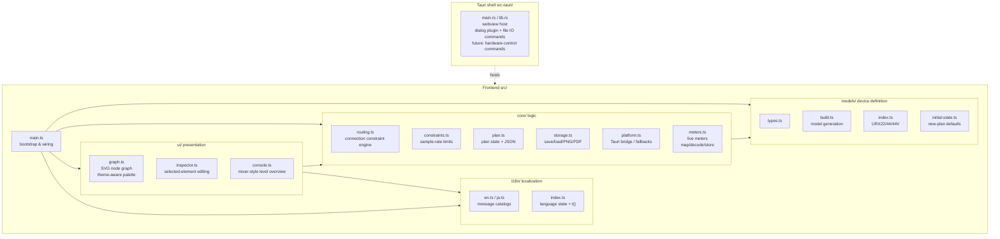

# Architecture

> 日本語版: [../ja/architecture.md](../ja/architecture.md)

## Purpose

Create and visualize routing plans for the YAMAHA URX22 / URX44 / URX44V in a GUI, constraining
the editor so that only paths the device physically allows can be wired. Plans persist as JSON and
can be exported as images. In the future the same plan data will be reflected onto real
hardware.

## Tech stack and rationale

| Layer | Choice | Rationale |
| --- | --- | --- |
| Desktop shell | Tauri 2 | Ship Windows 11 / Apple silicon macOS from one source. Small binary. Future hardware control can be implemented natively in Rust |
| Frontend | TypeScript + Vite | The planning UI is pure frontend. It can be verified in a browser even without Rust |
| Rendering | Plain SVG | Draws the node-graph wiring. Keeps the no-runtime-dependency policy |
| Persistence | JSON | Human-readable. Also serves as the input for future hardware reflection |

Hardware control is handled on the Tauri (Rust) side, and the UI and core (model / constraints /
plan) are kept shell-independent.

## Module structure



## Data model

- **DeviceModel** — an immutable per-model device definition. It holds `nodes` (inputs / channels /
  buses / outputs / duckers), `rules` (legal paths = `RoutingRule[]`), and `channelPairs` (the mono
  channels that share one input source — CH1/2, CH3/4). `models/build.ts` generates it from per-model
  parameters. A ducker points at the stereo channel it rides on via `attachTo`; the UI draws it hung
  just below that channel ([below](#ducker-placement)).
- **Plan** — the mutable state the user creates. It holds `modelId`, node positions (`positions`),
  connections (`connections`), per-connection parameters (level / pan / pre-post, etc.),
  node name overrides (`nodeNames`, the device's CH SETTING name — read and written over the string
  IPC for the same nodes that carry a color; an empty name falls back to the model's default label).
  The toolbar's labels toggle chooses whether the canvas shows the planner's fixed labels ("CH 1",
  the default) or these device names ("ch 1"); model mode ignores `nodeNames` entirely),
  node color overrides
  (`nodeColors`, the device CH SETTING color, drawn as a thin top accent cap; the picker offers the
  device's fixed palette so a chosen color is read and written 1:1 to hardware — input channels,
  MIX, STEREO, FX and STREAMING), hidden nodes (`hidden`),
  and per-node notes (`notes`) with their minimized state (`noteCollapsed`). It serializes to JSON.
  A new plan comes from `defaultPlan(modelId)` in `models/initial-state.ts`, which seeds every model
  with a factory initial state (node parameters + routing + CH SETTING colors and names). Only URX44V is captured from real
  hardware; URX44 reuses that capture verbatim (it differs only by URX44V's HDMI input, which no
  default routes), and URX22 is an inferred remap of it (`models/initial-urx22.ts`, unverified until
  a real reset is captured). A device fetch instead starts from an empty plan (`emptyPlan` in
  `core/plan.ts`) and lets the readback (`core/control/`) fill in the live values.
  On startup the model selection is restored from the last choice (`localStorage("urx-model")`),
  falling back to URX44V when it is unset or invalid (the same "saved value → fallback" pattern as
  the theme and language).

The constraint core (`core/routing.ts`):

- `legalTargets(model, plan, fromRef)` — returns the set of input ports an output port can connect to.
- `legalSources(model, plan, toRef)` — the reverse: the output ports that can connect into an input
  port, so a wire can be dragged from the input side as well.
- `canConnect(model, plan, fromRef, toRef)` — checks rule existence and receiver multiplicity
  (`source` / `patch` / `key` accept one wire; `send` accepts many).
- `partnerChannel(model, nodeId)` — returns the paired mono channel. A `source` wire is mirrored onto
  the partner (and removed together with it) so a channel pair always shares one input source (UI: `graph.ts`).
  A ducker key source is the `key` kind, not `source`, so it never enters this mirroring — guaranteed by the
  kind rather than by the incidental fact that duckers are not in `channelPairs`.

The UI (`graph.ts`) uses these to let a wire be dragged from either an output or an input port,
highlighting the legal ports on the opposite side via `legalTargets` / `legalSources`. Clicking a
single-input port that already holds a source selects that wire, the same as clicking the wire itself.

For the detailed routing rules, see [device-model.md](device-model.md) (derived from the official
block diagram).

## Localization (i18n)

The UI is English-first with Japanese localization. The implementation is a dependency-free,
in-house module `src/i18n/`:

- `en.ts` — the base language and the source of truth for the message shape (the `Messages` type).
  It contains strings and interpolation functions.
- `ja.ts` — the Japanese translation that satisfies `Messages`. Adding a key makes TypeScript
  require a translation in every language.
- `index.ts` — the current language state, `t()` (returns the active catalog), and
  `setLang()` / `onLangChange()`. On startup it reads `localStorage("urx-lang")`; if absent it
  detects from `navigator.language`, with English as the final fallback.

> **The core stays language-agnostic.** `canConnect` in `core/routing.ts` returns failures as
> `ConnectError` codes, and `deserialize` in `core/plan.ts` throws a `PlanError` (with a code). The
> UI maps them to text (`t().error[code]`). This keeps `core/` and `models/` free of i18n, so the
> Node smoke test runs without browser APIs.

The language button at the right end of the toolbar switches languages; `setLang()` notifies
listeners, which re-render the static labels and the inspector.

> **Terminology.** Keep product / industry terms in English even in the Japanese UI: `Bus`,
> `Ducker`, `Bus send`, `Send (ON/OFF)`, `Pre-fader send`. The visible canvas element is a **node**;
> reserve "module" for software modules (`src/i18n/` etc.). The legend groups the wire kinds under
> "Connection types" and the node kinds under "Nodes".

## Display themes

The UI has a studio-rack aesthetic modeled on pro-audio gear, with two themes: dark and light. The
initial theme uses a saved choice (`localStorage("urx-theme")`) if present, otherwise it follows the
OS color scheme (`prefers-color-scheme`), falling back to dark when the OS does not prefer light (the
same "saved → system → fallback" order as the initial language). The button at the right end of the
toolbar toggles it, persisting to `localStorage("urx-theme")`.

The palette is split into two layers, kept in correspondence per theme:

- HTML elements (toolbar / inspector / background) — CSS custom properties in `src/style.css`
  (`:root` is dark, `[data-theme="light"]` is light; the attribute is set on `document.documentElement`).
- SVG nodes / wires — `PALETTES.dark` / `PALETTES.light` in `src/ui/graph.ts`. `setTheme()` re-renders.
  Light-theme nodes also get a soft drop shadow (`#node-shadow` filter) for physical lift.

The connection and node colors live in both layers: wire colors as `--w-*` (CSS) / `PALETTES.wire`
(graph.ts), and node-rail colors as `--rail-*` (CSS) / `PALETTES.rail`. The inspector's empty-state
**legend** reads the CSS variables, so it labels exactly the colors the graph draws and follows the theme.

> As with model/rule consistency (device-model.md ↔ models/), **keep the theme palette in sync
> between the CSS variables in style.css and `PALETTES` in graph.ts** — wire (`--w-*` ↔ `PALETTES.wire`),
> node rail (`--rail-*` ↔ `PALETTES.rail`), and the surface colors.
> Exception: `key` (the ducker key source) shares `source`'s blue and has no separate legend row, so it
> carries only a `PALETTES.wire.key` entry for rendering and no `--w-key` CSS variable (the `--w-*`
> variables back the legend swatches only).

PNG and PDF export (`core/storage.ts`) read `--canvas-bg` to paint the background, so the exported
image follows the current theme too. The PDF is a hand-built single-page document embedding one
FlateDecode image (deflate via the platform `CompressionStream`), so no runtime dependency is added.

## CONSOLE view (mixer-style level overview)

Alongside the node graph (GRAPH), a second view surveys the same plan as mixer-style vertical strips.
The GRAPH / CONSOLE toolbar tabs switch between them; while CONSOLE is shown the graph and inspector are
hidden (`setView` in `main.ts`). `src/ui/console.ts` lays strips out in INPUTS / BUS · FX / MONITOR /
MASTER groups, scrolling horizontally (there is no shared left ruler). The fader zone is three columns —
a **fader** (a real-console thin slot + cap; the cap position is the value), a **dB scale**, and a **level
meter**. The meter has a separate **OVER box** on top (clipping ≠ the level ceiling, ≠ the scale) over the
signal ladder (green→red; signal only while Live sync streams); the OVER box lights red on a device clip
(raw 32767) via the `sig.over` latch and decays over ~1 s. The scale follows each strip's range and aligns
its top/bottom to the fader travel, so a tick at the cap's height marks that level (a functional scale,
10/0/-10/-20/-40/-60/-80/-∞). Each tick centres its digits with the minus sign hanging left, so `10` and
`-10` line up vertically. Above the zone the scribble shows two lines — **node name + device CH SETTING
name**. Below it sit two 2-column chip groups: (1) channel / input (HA) — MUTE (on channels, FX returns and
the master; an FX return's is the device FX-channel ON, the master's is the STEREO master ON), then +48 / φ /
HPF on mono MIC channels (Hi-Z on CH3/4) or φL / φR on stereo channels (gated by `channelControl`); (2) the processing
chain GATE → COMP → EQ → INS FX, plus EQ + DUCKER on stereo channels (toggling the `duckerOn` of the ducker
node hung under them). An odd group gets an invisible spacer so its last chip never stretches to
full width. At the bottom (knobs bottom-aligned) are rotary knobs (`addKnob`/`wireKnob`, drag / arrow keys)
— channel **Gain and PAN/BAL** (the CH→STEREO send's pan, L63–C–R63), or the **PHONES level** (a 0–10 non-dB
scale) on the monitor buses (PHONES 1 ↔ mon1, PHONES 2 ↔ mon2, independent of the monitor fader, so no extra
tab). A knob's indicator can place specific values at the horizontal (`KnobSpec.angle`, left = -90° / right =
+90°): PHONES 2.0/8.0, A.Gain +8/+55, D.Gain -14/+15. Double-clicking a fader cap or a knob resets it to the
**factory value** (from `defaultPlan`).

- **Shared edit path** — fader / chip / gain edits mutate the plan directly and flow through the same change
  funnel as the graph and inspector (`markChanged` → `live.schedule()`), so live device sync mirrors a
  CONSOLE edit through the same snapshot diff. CONSOLE re-renders only the edited strip itself, avoiding a
  full rebuild mid-drag; returning to GRAPH reflects the edits via `graph.repaint*`.
- **Levels only (no routing)** — CONSOLE adjusts the levels of existing sends / paths; it never adds or
  removes connections (routing stays in the graph). `setSend` only updates an existing wire's level, so
  lowering a send to -∞ keeps the wire (the strip stays). INS FX has no separate on/off (No Effect is off),
  so toggling on restores the last chosen effect (or the first real option).
- **Send-on-fader** — a fixed “Output” label and the mode bar (MAIN / FX 1 / FX 2 / MIX 1 / MIX 2). A send
  mode flips the input-channel and FX-return faders to the send level into the chosen MIX/FX bus and shows
  **only that bus's sources** — non-send nodes (monitors, master, the buses themselves) and wire-less strips
  drop out. FX returns only follow sends to MIX buses. MAIN shows every strip at its own level.
- **Scribble colour** — the scribble uses each node's **CH SETTING colour** (`plan.nodeColors`, a device
  parameter) rather than the node-kind rail, picking black/white text from the colour's brightness
  (`textOn`); nodes with no assigned colour fall back to the rail colour.
- **Layout / scroll** — `#console-host` uses `min-width:0; overflow:hidden` to stay within `#stage`, keeping
  horizontal scroll inside the strip grid (`.con-strips`, its bar above the status bar). It does not scroll
  vertically except on very short windows (then within the strip grid). The master (STEREO) is no longer
  pinned to the right; it scrolls with the rest.
- **Live meters** — the meter column is always shown; signal only flows while Live sync is on
  (`console.setLive`; at rest it sits at the floor). `core/meters.ts` maps node ids to broker meter addresses
  (`meterId:x`), decodes the raw value (deci-dBFS, 32767 = OVER) to dBFS, and holds the latest reading in a
  `MeterStore`. The UI samples the ~10 Hz notifications on `requestAnimationFrame` and renders with fast
  attack / slow release, peak hold, and an OVER latch (the top OVER box), writing only the lanes that changed
  (compared at integer-percent). Subscriptions are scoped to the on-screen strips that have a meter in the
  current model (`metersForNodes`). Meter ids were confirmed on a real URX44V; models without a mapping show no meter.
- **Streaming path** — the Rust side (`src-tauri/src/vd.rs`) handles a meter subscription
  (`MetersSubscribe`/`MetersUnsubscribe`) by registering each address with the broker, and forwards meter
  `notify` frames to the frontend over a Tauri Channel during the idle socket drain (`pump` → `forward_meter`).
  Like the rest of live control, it is only active under the `--experimental` launch flag.

## Responsive layout (mobile)

The inspector — a fixed 300px column on desktop — becomes a bottom sheet (a rack drawer that slides up
from the foot of the screen) on narrow viewports (≤720px). For nodes whose inspector runs long
(channels, etc.) the selected node's identity (heading / name / color) stays pinned as a sticky header
while the parameters group into collapsible rack-module sections (ROUTING / INPUT / GATE / COMP / EQ /
Parameters) built on `<details>` (`section()` in `inspector.ts`). GATE / COMP / EQ / Ducker light their
header led from each section's ON state and an off section folds itself away; ROUTING defaults collapsed.
A hand-folded section persists its open/closed state per section kind to `localStorage`
(`urx-inspector-sections`), so it survives re-renders and reloads; toggling a section's ON value clears
that override so the fold reverts to following the on-state. Within a section, the EQ band editor is a
four-tab strip (LOW / LOW MID / HIGH MID / HIGH) showing one band at a time (the active band is kept
across re-renders), and the INPUT toggles flow two-up. Its visibility is driven by CSS alone:
`main.ts` toggles a single `has-selection` class on `<body>` from whether anything is selected, and
`body.has-selection #inspector` raises the sheet with `transform: translateY(0)` (off-screen at
`translateY(105%)` otherwise). It is dismissed by the heading's ✕ button (`onClose` →
`graph.clearSelection()`, reusing the existing deselect path) or by tapping empty canvas. Canvas zoom
works by mouse wheel (desktop) and two-finger pinch (touch); both share one "zoom about a fixed point"
routine (`zoomAt` in `graph.ts`). `viewport-fit=cover` plus `env(safe-area-inset-bottom)` clears the
notch / home indicator, and the toolbar drops its decorative VU meter + tagline below 720px.

## Hiding nodes

On larger models the nodes a plan does not need take space and clutter the diagram, so **any node**
can be collapsed off the canvas — connected or not. Hidden nodes collect on a **shelf**
docked along the bottom (an HTML overlay `graph.ts` builds — kept out of the SVG, so it never shows in
an export) as rail-colored chips; clicking a chip restores that one, and "Show all" restores them all.

- The toolbar "Hide unused" shelves every node with no *editable* connections (a convenience for
  clearing the never-wired nodes in one click). The inspector adds a "Hide this node" button for any
  selected node.
- **Multi-select**: Ctrl/Cmd-clicking nodes toggles them into a selection without dragging. With two or
  more selected, a floating action bar (an HTML overlay, like the shelf) offers a batch "Hide" that
  shelves the whole selection. "Clear" and `Escape` drop the selection. The selection set is transient
  view state, not persisted.
- **Wires of a hidden node**: any wire (fixed or editable) is skipped while either endpoint is hidden,
  so a shelved node takes its wires off-canvas with it and rendering never leaves a wire dangling. The
  connections themselves stay in `plan.connections` — hiding is purely visual — and reappear when the
  node is restored.
- **Ducker**: hiding a parent channel hides its ducker too, and restoring the ducker restores the
  parent — a ducker is never shown without its channel. On the shelf, a parent and its hidden ducker
  collapse into one chip (the child chip is suppressed); restoring the parent chip brings the whole
  unit back.
- A hidden node also drops from the **CONSOLE view** (`console.ts` filters `plan.hidden` out of its
  strip list, and a shelved ducker drops its chip from the parent strip).
- The hidden set persists as `plan.hidden` (an array of node ids) and is restored on load. Like
  `positions`, it is pure view state and does not affect routing rules (future hardware reflection may
  ignore it).
- The bulk "hide" and "show all" re-fit the diagram to reclaim space; while the shelf is open `fitView`
  frames the content above it, and a single restored node is parked at the viewport center.

## Ducker placement

A ducker is a sidechain key-source selector that *rides on* its stereo channel rather than being a
standalone output. It therefore carries its own `"ducker"` kind (a dedicated rail color), stays out of
the output column, and is drawn **hung at a fixed gap directly below** the parent channel it names via
`attachTo`.

- **Derived position** — a ducker's coordinates are never stored in `plan.positions`; they are always
  derived from the parent (`posOf` follows `attachTo` and offsets by the parent's height + gap), so it
  tracks the parent even when the parent's note expands.
- **Moves as one** — dragging the parent moves the child by the same delta; grabbing the child (ducker)
  redirects the drag to the parent, so either grab moves the unit. The child cannot be moved on its own.
- **Tether** — a single thin rail-colored line spans the gap to the parent, marking the two as one unit.
- **Auto-layout** — `autoLayout` skips the ducker and reserves the child's height below its parent.

## Column layout

Nodes lay out in five columns following the signal flow, left to right: inputs → channels → mix buses
(STEREO / MIX / FX) → derived buses (STREAMING / MONITOR) → outputs. The split of the bus stage into
two columns is deliberate: STREAMING and MONITOR take only the mix buses as input, so they are
downstream and sit in their own column rather than crowding the dense channel-to-bus convergence;
OSCILLATOR is a generator that feeds the mix buses, so it joins the channel column. The result is that
every wire flows strictly left to right, with no wire doubling back through the bus column. The
per-node column index is `layoutCol` in `build.ts`, stored as `pos.col`; `autoLayout` and the default
grid both stack each column independently. Both also share one vertical grid: a default row is
`pos.row * ROW_GAP` (with `build.ts` reserving an extra row under each stereo channel for its hung
ducker), and `autoLayout` snaps each node's advance to whole `ROW_GAP` rows — so running Arrange on a
fresh board moves nothing, while an expanded note simply claims more rows.

A node's `kind` (which drives its rail color and the channel-only name field) can differ from its
layout column: OSCILLATOR is `kind: "input"` (a signal source) and the MONITORs are `kind: "output"`
(sinks), so their rail color reflects their signal role even though they sit in the bus/channel
columns. The device does not color these in CH SETTING, so — unlike the STEREO / MIX / FX / STREAMING
buses — they carry no color picker.

## Node labels

The label sits at a fixed left inset and must clear the header button (its visible box starts near the
right edge), which leaves room for roughly 15 monospace characters. Longer labels are handled two ways:
a node with a `sublabel` stacks two tiers in the fixed-height header — the node name, then a dim
secondary legend below it (e.g. a ducker's `CH 3/4 · Source`); a long single-line label with no sublabel
is shrunk just enough by `fitScale` to stay clear of the button (`microSD Playback`, `HDMI (down-mix)`).
Lists and the inspector show both tiers joined via `fullLabel()` so no context is lost.

## Node notes

Each node can carry a free-text note. The note renders **inside the node frame**, below the
header, in a recessed panel; the node grows downward to contain it while the header (label, jacks,
wires) stays anchored, so routing is unaffected. Notes are part of the SVG, so they appear in PNG /
PDF exports.

- **Add** — a note-less node shows a faint pen button at the header right (`graph.ts` `makeNoteAdd`).
  Clicking it (or double-clicking the node) opens an in-place editor: a floating HTML `<textarea>`
  positioned over the panel, kept out of the export.
- **Edit** — once a node is selected, clicking its open note area edits it; the header (outside the
  note) still drags the node, and an unselected node drags from anywhere. Editing is canvas-only —
  the inspector has no note field.
- **Minimize / expand** — a noted node shows a `+` / `−` button (`makeNoteToggle`): `−` minimizes
  the note to the header, `+` re-expands it. The minimized state persists per node.
- **Persistence & layout** — notes persist as `plan.notes` (node id → text) and the minimized set as
  `plan.noteCollapsed`, both pure view state (future hardware reflection may ignore them). `Arrange` stacks each column
  by the nodes' actual heights (`nodeHeight`, expanded note included), so a note never overlaps the
  node below it.

## Persistence format

```jsonc
{
  "format": "urx-router-plan",
  "version": 1,
  "modelId": "URX44V",
  "sampleRate": 48000,
  "positions": { "ch1": { "x": 1, "y": 0 } },
  "connections": [
    { "from": "in.micline1:out", "to": "ch1:in", "kind": "source" },
    { "from": "ch1:out", "to": "bus.stereo:in", "kind": "send",
      "params": { "level": 0, "pan": 0, "tap": "post" } }
  ],
  "nodeNames": { "ch1": "Lead Vox" },
  "nodeColors": { "ch1": "#4a78c0" },
  "hidden": ["in.micline2", "out.sdrec"],
  "notes": { "ch1": "Lead vox — comp + chorus +2 dB" },
  "noteCollapsed": ["ch1"]
}
```

Phase 1 implemented save/load with browser standards (Blob download / file input). Phase 2 adds
native save/open dialogs (`tauri-plugin-dialog`) plus a recent-plans list; file IO uses small
`std::fs` app commands (`read_text_file` / `write_text_file` / `write_binary_file`). Everything is
reached via `core/platform.ts` through `window.__TAURI_INTERNALS__.invoke`, so no Tauri npm package
is bundled; when not running under Tauri it falls back to the browser path. The plan format is
unchanged apart from the added `sampleRate`, `nodeNames`, `nodeColors`, `hidden`, `notes` and
`noteCollapsed` fields (older files default them on load).

## Build and distribution

Installers are produced by `pnpm tauri build`, which embeds `frontendDist`
(`../dist`) into the binary. A plain `cargo build` artifact instead reads
`devUrl` and shows a blank window without the dev server (always verify with
`tauri build`). The app version has a single source: `src-tauri/tauri.conf.json` sets `version`
to `"../package.json"`, so Tauri reads it from the root `package.json` at build time (`Cargo.toml`'s
version stays independent as the crate version).

| Platform | Output | Notes |
| --- | --- | --- |
| macOS (Apple silicon) | `.dmg` + `.app` (`src-tauri/target/release/bundle/`) | arm64 only; ad-hoc signed (Gatekeeper warning until notarized) |
| Windows | `.msi` + `.exe` (NSIS) | built on a Windows host or in CI; cross-compiling from macOS is unsupported |

Releases are automated by `.github/workflows/release.yml`. Pushing a `vX.Y.Z`
tag (or `vX.Y.Z-{alpha,beta,rc}*` for a prerelease) runs three jobs: `check-tag`
validates the tag, `create-release` opens a **draft** GitHub Release, and a
`build` matrix (`macos-14` / `windows-latest`) packages each platform with
[`tauri-action`](https://github.com/tauri-apps/tauri-action) and attaches the
bundles to the draft. The draft is left for manual review before publishing. A
manual `workflow_dispatch` run builds without creating a release, uploading the
bundles as job artifacts only (to verify the packaging pipeline).

macOS signing and notarization are optional: when the signing secrets (`MACOS_SIGNING_CERT` /
`MACOS_SIGNING_CERT_PASSWORD` / `MACOS_SIGNING_IDENTITY`) and notarization secrets
(`MACOS_NOTARIZATION_USERNAME` / `MACOS_NOTARIZATION_PASSWORD` / `MACOS_NOTARIZATION_TEAM_ID`) are
present the workflow forwards them to `tauri-action`; otherwise it ships an unsigned bundle. The
secret names are shared with the author's other repos for reuse.
The Windows console window is already suppressed in release builds by
`windows_subsystem = "windows"` in `src-tauri/src/main.rs` (it appears in dev /
`cargo build`).

### Browser demo (GitHub Pages)

Separate from the desktop app, a browser-only demo is published to GitHub Pages. `vite build --mode demo`
(`pnpm build:demo`, with `.env.demo` setting `VITE_DEMO=1`) builds it, and `.github/workflows/pages.yml`
publishes `dist` to Pages when a `vX.Y.Z` release tag is pushed, so the demo tracks released versions. The demo is a viewer, so file save / load and PNG / PDF
export are hidden from the toolbar (`src/core/env.ts`'s `DEMO` flag hides `[data-demo-hide]` elements). A
normal (desktop) build eliminates that branch as dead code and keeps every feature, so distributed binaries
are unaffected. `vite.config.ts`'s relative `base: "./"` lets assets resolve under a sub-path.

### Auto-update

The desktop app checks for a newer release at startup. The Tauri updater / process plugins are registered
in `src-tauri/` on desktop only, and the frontend calls `plugin:updater|check` /
`plugin:updater|download_and_install` / `plugin:process|restart` directly from `src/core/platform.ts`, the
same way as the dialog calls (no added npm runtime dependency). When an update exists it shows a confirm
dialog, then downloads, installs, and restarts. Browser / demo builds disable this via the `DEMO` branch,
which is eliminated as dead code.

Distribution rides on GitHub Releases. Enabling `bundle.createUpdaterArtifacts` in `tauri.conf.json` makes
`tauri-action` emit signed bundles plus a `latest.json`, served from the
`https://github.com/semnil/urx-router/releases/latest/download/latest.json` endpoint listed under
`plugins.updater.endpoints`. Update bundles **require a minisign signature**, with a key pair separate from
macOS code signing.

Generate and register the signing key (one-time):

```sh
pnpm tauri signer generate -w ~/.tauri/urx-router-updater.key
gh secret set TAURI_SIGNING_PRIVATE_KEY < ~/.tauri/urx-router-updater.key
gh secret set TAURI_SIGNING_PRIVATE_KEY_PASSWORD
```

- The printed **public key** is set in `plugins.updater.pubkey` in `tauri.conf.json` and committed — a
  public key is safe to commit.
- Keep the **private key** and its password out of git and register them as the secrets above (`release.yml`
  forwards them to `tauri-action`). Without the secrets the bundles are unsigned and no `latest.json` is
  produced, so auto-update will not work.

## Third-party licenses

The web layer ships with zero runtime dependencies, but a distributed desktop build statically links
the Tauri runtime and its Rust crates, which carry their own open-source licenses. None are
GPL/AGPL/LGPL — the set is permissive plus file-scoped weak-copyleft (MPL-2.0), all satisfied by
bundling their notices.

The notice file is generated from the Cargo dependency graph with
[`cargo-about`](https://github.com/EmbarkStudios/cargo-about):

```sh
cargo install cargo-about            # once (or: brew install cargo-about)
cd src-tauri && cargo about generate about.hbs -o THIRD_PARTY_LICENSES.html
```

`src-tauri/about.toml` lists the accepted SPDX ids, `src-tauri/about.hbs` is the output template, and
the generated `THIRD_PARTY_LICENSES.html` is git-ignored — regenerated for distribution, bundled as a
Tauri resource (an in-app credits view) in Phase 2, then wired into CI so a dependency change can't
silently drop a notice.
