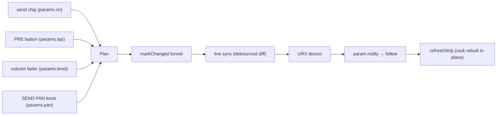

# CONSOLE send rack (design specification)

> 日本語版: [../ja/console-sends.md](../ja/console-sends.md)

**Status: implemented (2026-07-12).** This document specifies the per-strip SENDS rack that
replaced the CONSOLE view's "Send to" mode tabs (send-on-fader). It is the behavioral reference
for the rack; the CONSOLE section of [architecture.md](architecture.md) summarizes it. Implemented
in `src/ui/console.ts` (rack builder), `src/style.css` (`.con-sends` / `.con-spop`),
`src/core/midi/controls.ts` (the `tap` control), with coverage in `e2e/console.spec.ts`.

## Background

The tabbed design had two structural problems:

1. Muting one send required a tab switch first, and the switch flipped the whole view's context.
2. Sends to different buses could never be seen or operated at the same time.

The rack gives every strip always-available controls for all of its sends, so the "Send to" tabs,
the send-on-fader mode, and the console mode bar (`Output [MAIN]` / `Send to [...]`) are removed.
The head MUTE chip keeps controlling the → STEREO main path (on the strips that have that send: channels,
FX channels, MIX buses); the rack never touches the main path. The node master ON/OFF (CH_ON / MIX 675 /
STEREO / MONITOR, all `np.on`, and the oscillator's `osc.on`) is a **power LED** on the scribble — the whole
scribble is its button; when off the strip dims (the shared `isNodeInactive` predicate, matching the graph),
so the old red "CH MUTE" badge is gone. STEREO and the MONITOR buses have no → STEREO send, so they carry no
MUTE chip; the power LED is their only on/off.

## Layout

A fixed-height section between the strip head and the fader zone:

```text
├─ head (unchanged) ────────────┤
│ SENDS                     ▾   │  header: label / transient value readout / collapse
│ [F1]   [F2]   [M1]   [M2]     │  send enable chips (amber = on)
│ [PRE]  [PRE]  [PRE]  [PRE]    │  pre-fader toggles (amber = pre)
│   ┃      ┃      ┃      ┃      │  vertical mini faders (groove + cap,
│  ─╂──────╂──────╂──────╂─     │   2 px 0 dB through-tick, ~80 px travel)
│   ┃      ┃      ┃      ┃      │
│ [         PAN ▾          ]    │  opens the SEND PAN popover
├─ meter point / fader zone ────┤
```

Expanded height ≈ 156 px, collapsed ≈ 24 px (header only). Orientation, groove, cap, and the
0 dB line reuse the main fader's grammar exactly; the four per-column ticks visually fuse into one
0 dB reference line, so a strip's send distribution reads like a bar chart.

## Behavior

### Slots

- Fixed column order: FX 1, FX 2, MIX 1, MIX 2 (the previous tab order).
- The slot set per model = `SEND_TARGETS` whose bus exists in the model and is not hidden. A
  shelved bus drops its column on **every** strip (same rule as the old tabs), so columns stay
  aligned across strips.
- A strip that lacks a particular send leaves that column blank (e.g. FX channels show only
  MIX 1 / MIX 2). Strips with no sends at all (MIX / MONITOR / STEREO / OSCILLATOR / STREAMING)
  render a dimmed `SENDS` header only — its collapse arrow still works, so the global collapse is
  reachable from any strip. Meter-only strips get the same spacer so fader tops stay aligned.

### Send enable chip

- Toggles the fixed send connection's `params.on`. Lit amber = send active (ON polarity, like the
  scribble power LED — deliberately *not* MUTE polarity; the label is the destination, not
  "MUTE").
- Chip labels are the destination short forms `F1` / `F2` / `M1` / `M2`; the full name appears in
  the header readout and the SEND PAN popover.

### PRE button

- Toggles the send connection's `tap` (`pre` / `post`); lit = PRE. This is the only tap indicator
  (no extra marker), and it stays readable while the send itself is off.
- CH → FX taps cannot be written to the device: while live-connected the button renders read-only
  with the existing `inspector.prePostLcdOnly` tooltip (`sendTapWritable`).
- A hover tooltip (new i18n key) spells out the pre-fader meaning, mirroring the C.INT tooltip
  mechanism.

### Column fader

- Snaps to the `LEVEL_STEPS_DB` grid (41 detents over ~80 px ≈ 2 px per detent).
- **Relative drag** with pointer capture — no absolute jump-to-click (a 1 px aim error is a full
  detent and live sync writes immediately). First write only after a 3 px drag threshold
  (protects against mis-grabs and double-click). Shift-drag = fine mode (per detent).
- Keyboard: Arrow = 1 detent, PageUp/PageDown = 6, Home = max, End = −∞ (same as the main fader).
  Double-click = factory reset.
- No numeric column. While a column is hovered / dragged / focused, the rack header swaps its
  `SENDS` label for a value readout — `MIX 1 PRE -3.2` (destination, tap when PRE, level). The
  header has a fixed height so the swap never reflows the rack. Exact values are also exposed via
  `aria-valuetext` (`"PRE, -3.2 dB"` / `"off (-∞)"`).

### Collapse

- Clicking any `SENDS` header collapses/expands the rack on **all** strips at once (columns must
  stay aligned). Hovering one header highlights every header, previewing the global scope;
  `aria-expanded` is kept in sync across strips.
- Persisted globally in `localStorage` (`urx-sends-open`, default open).
- While collapsed the header shows one small amber dot per active (ON) send, keeping routing
  presence glanceable.

### SEND PAN popover

- Trigger: the full-width `PAN ▾` button at the rack bottom (only on strips that have sends). The
  popover opens directly below that button at strip width, with an upward caret pointing at it.
- Content: header `SEND PAN`, then the MIX sends' rotary knobs laid out as horizontal columns
  (destination label above each knob, value below). The column order, the "C" knob, and the
  label-on-top arrangement reuse the head BAL/PAN knob and the SENDS rack column grammar, so the
  rack and the popover stay symmetric. FX sends are mono on the device and have no pan. Pan Link
  (BUS type) locks render the knob read-only, as in the inspector.

  ```text
  ┌─── SEND PAN ───┐
  │  MIX 1   MIX 2  │  destination labels (above the knobs)
  │   (◎)     (◎)   │  rotary knobs (side by side, same as the head BAL/PAN knob)
  │    C       C    │  values (below the knobs)
  └─────────────────┘
  ```

- The knobs form one horizontal band, so a future inter-send pan link fits as a full-width row
  below the columns.
- Open/close mirrors the meter-point popover (outside click / Escape close, viewport clamping,
  anchor caret).

The popover deliberately holds **only** pan: level editing lives on the column fader, on/off on
the chip, tap on the PRE button, and value reading in the header readout, so every control has
exactly one home.

### MIDI control

- Send level / send on-off / send pan reuse the existing send-scoped control ids
  (`controlId(node, param, target)`), so mappings made against the old send tabs keep working
  unchanged. The rack chips, column faders, and SEND PAN knobs are armable in learn mode.
- New: a `tap` control per MIX send (toggle). CH → FX taps are rejected as device-locked, like the
  other locked controls.

### Live sync / follow

All rack edits go through the shared `markChanged` funnel (identical to the graph / inspector),
BAL-linked pairs mirror via `mirrorBalPair`, and device-side changes arrive through `follow` →
`refreshStrip`, which rebuilds the whole strip including the rack. Sends have no meters — the
broker exposes no per-send meter addresses — so the rack contains no signal display by design.

## Rejected alternatives (do not re-litigate without new evidence)

| Alternative | Rejection reason |
| --- | --- |
| Global "Send to" tabs (previous design) | Mute needs tab switch; no cross-send visibility |
| Per-strip flip tabs / TotalMix-style side panel | One send visible at a time / horizontal growth per strip |
| Horizontal mini-fader rows | Only horizontal control on the console; reads as a balance slider — sends really have a pan, so "the visible slider is the send pan" is a coherent wrong model that causes live mis-writes |
| Rotary send knobs in rows | Needle angle is the weakest at-a-glance encoding; misreads as per-send pan below the GAIN/PAN knobs; 3 px adjacent-knob gap |
| PRE = green / POST = amber hue on the chip | Deutan/protan contrast ratio 1.07–1.21 (indistinguishable); collides with meter green; GRAPH marks PRE amber; vanishes on OFF chips |
| Level-colored send buttons (blue→green→yellow→red) | Red collides with MUTE/OVER, green with meters; bar/cap position already encodes level |
| Dashed border / double frame / notch / tag chip markers | Lit-state dashed border disintegrates at 17 px; inner keyline mimics MIDI-learn rings; silhouettes vanish on dark chips |
| Numeric value column in rows | Illegible at the available width; replaced by the header readout |

## Implementation notes

- `src/ui/console.ts`: rack builder replaces the mode bar / `renderModes` / send-mode strip
  filtering; `Mode` state and `usesSend`-driven head swapping are removed (heads always render the
  MAIN control set).
- `src/style.css`: rack styles; keep light-theme parity (grooves stay dark per `--groove`).
- `src/i18n/{en,ja}.ts`: retire `outputLabel` / `sendToLabel`; add keys for `SENDS`, `SEND PAN`,
  and the PRE tooltip.
- `src/core/midi/controls.ts` + `engine.ts`: add the `tap` toggle control for MIX sends.
- E2E: rewrite `console.spec.ts` mode-tab tests as rack tests (chip toggle, PRE toggle, fader
  keyboard grid steps, global collapse + persistence, dots, SEND PAN popover, readout, blank
  slots, sendless strips, FX-tap read-only while live-stubbed); extend `midi.spec.ts` for rack
  arming. Unit: controls catalog / engine tap handling.
- Update `docs/{en,ja}/architecture.md` (CONSOLE section) and the README screenshots after
  implementation.

## Accepted trade-offs / watch items

- Strips without sends carry a blank rack band while expanded (alignment cost; collapse
  mitigates).
- Sub-24 px touch targets in the browser demo (desktop-first product; relative drag and keyboard
  paths mitigate).
- Comparing one send across many strips is slightly slower than the old horizontal rows (the
  fixed-y-band advantage is traded for grammar consistency and the elimination of the pan
  misread).
- 19 px column pitch relies on pointer capture + the drag threshold to avoid adjacent-column
  mis-grabs.

## Edit → device data path


