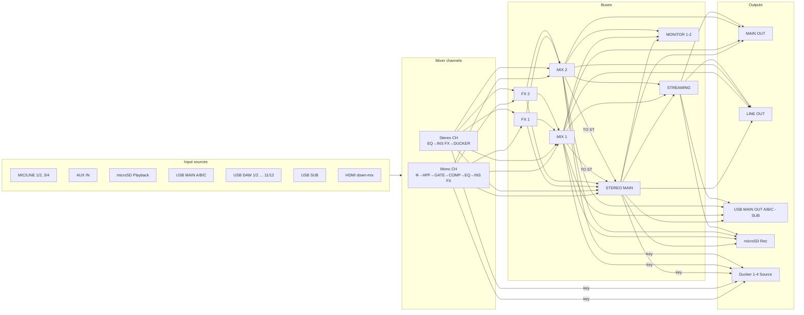

# Device routing model

> 日本語版: [../ja/device-model.md](../ja/device-model.md)

This defines the routing structure and connection constraints of the YAMAHA URX series that the tool
handles. It is the basis of the constraint engine that enforces "only routable paths can be wired"
in the GUI, and the data definitions in the code (`src/models/`) must be kept consistent with this
document.

## Sources

- Official block diagram: `USB AUDIO INTERFACE URX44V URX44 URX22 Block Diagram`
  (Yamaha Corporation, 2026, file ID `MWEM-C0`).
  URL: <https://usa.yamaha.com/files/download/other_assets/5/2927055/urx44v_44_22_block_diagram_en_c0.pdf>
- Official user guide (HTML): <https://manual.yamaha.com/audio/music_audio_production/urx44_urx22/ug/en-US/>

> The PDFs themselves are not included in the repository because they are copyrighted. The structure
> is reconstructed here in our own words.

## Per-model parameters

| Item | URX22 | URX44 | URX44V |
| --- | --- | --- | --- |
| Mono input channels | CH1–2 | CH1–4 | CH1–4 |
| Stereo input channels | CH3/4, 5/6, 7/8, 9/10 | CH5/6, 7/8, 9/10, 11/12 | CH5/6, 7/8, 9/10, 11/12 |
| MIC/LINE combo inputs | 2 (1 is Hi-Z) | 4 (3/4 are Hi-Z) | 4 (3/4 are Hi-Z) |
| MIC IN (front mini) | yes (wired into the MIC/LINE 1 input) | same | same |
| AUX IN | yes | yes | yes |
| Analog outputs | MAIN OUT | MAIN OUT + LINE OUT | MAIN OUT + LINE OUT |
| USB ports | MAIN (32-bit) + SUB (16-bit) | MAIN + SUB | MAIN + SUB |
| USB DAW record ch | 10 | 12 | 12 |
| microSD recording | no | yes (up to 16 tracks) | yes |
| HDMI | no | no | IN / THRU (8→2 down-mix) |
| MIX buses | STEREO + MIX1 + MIX2 | same | same |
| FX buses | FX1 + FX2 | same | same |

## Signal-flow overview

## Decision points (basis of the constraint engine)

Routing is not free wiring; it consists of a **limited set of decision points** over the fixed
signal paths inside the device. Each decision point has a "set of sources" and a "receiver
multiplicity". The tool expresses this as `RoutingRule`.

Connection kinds (`kind`):

- `source` — the receiver accepts **only one wire** (a selector). Channel input-source selection and
  bus source selection.
- `patch` — the receiver accepts **only one wire** (output patch / Signal Assign).
- `key` — the receiver accepts **only one wire** (ducker sidechain-trigger select). A selector like
  `source`, but it never carries the mono-pair source mirroring, so it is its own kind (see §10).
- `send` — the receiver accepts **many** (a bus is a summing mix), with level/pan/PRE-POST/ON. Sends from channels / FX to buses.
  The fixed main-fader paths (CH / FX channel → STEREO) are LEVEL/PAN + a **STEREO-assign ON** only and carry **no PRE/POST** (see §2).
- `sendSwitch` — the receiver accepts **many** but the send is **ON/OFF only** (no per-wire level/pan). Used for the MIX→STEREO "TO ST" send.

> A `source` / `patch` / `key` receiver rejects a second selector wire (only one source can feed it).
> The `key` wire shares the blue selector color with `source` on the canvas.

### 1. Channel input source (`source`, one receiver)

Each mixer channel selects one input source from the following. The device picks MIC/LINE and
USB DAW in fixed 2-channel pairs (1/2, 3/4 and 1/2…11/12), so each is a single source node here.
The front mini jack is wired into the MIC/LINE 1 input and is not a separate source choice.

| Option | URX22 | URX44 | URX44V |
| --- | --- | --- | --- |
| MIC/LINE 1/2 | ✓ | ✓ | ✓ |
| MIC/LINE 3/4 | — | ✓ | ✓ |
| AUX IN | ✓ | ✓ | ✓ |
| microSD Playback | — | ✓ | ✓ |
| USB MAIN A / B / C | ✓ | ✓ | ✓ |
| USB DAW 1/2 … N | ✓ (…9/10) | ✓ (…11/12) | ✓ (…11/12) |
| USB SUB | ✓ | ✓ | ✓ |
| HDMI (down-mix) | — | — | ✓ |

> On the URX44V, every channel (CH1–4, 5/6, 7/8, 9/10, 11/12) can select USB MAIN A/B/C,
> each USB DAW pair, and USB SUB as its input source (verified on hardware).
>
> **Mono-channel pairing**: CH1–4 form the pairs CH1/2 and CH3/4; fixing one channel's input source
> fixes its partner too (e.g. choosing MIC/LINE 1/2 on CH1 also sets CH2 to MIC/LINE 1/2). The tool
> wires the same source node to both channels (L/R is implied by channel position).
>
> **All Input / All USB DAW are not sources**: the INPUT screen's `[All Input]` and `[All USB DAW]`
> buttons are bulk-set actions — one tap rewrites every channel's input source from a fixed table
> (All Input → CH1/2 = MIC/LINE 1/2, CH3/4 = MIC/LINE 3/4, CH5/6 = AUX IN; All USB DAW → CHn/n+1 =
> USB DAW n/n+1). They are not selectable per-channel sources, so they are not source nodes.
>
> **New-plan factory sources**: a `new` plan seeds each channel's captured factory source — mono channels
> from MIC/LINE (CH1/2 ← MIC/LINE 1/2, CH3/4 ← MIC/LINE 3/4), stereo channels CH5/6 = AUX, CH7/8 = USB MAIN A,
> CH9/10 = USB MAIN B, CH11/12 = USB MAIN C (stereo sources read from param 209/210, confirmed on URX44V;
> URX44 identical; URX22 is the same set shifted down one stereo pair — CH3/4 = AUX, CH5/6 = USB MAIN A,
> CH7/8 = USB MAIN B, CH9/10 = USB MAIN C — inferred, not yet captured).

### 2. Channel → bus send (`send`, many receivers)

Each channel output is sent to the following buses. **All are fixed (`fixed`) — always wired,
non-removable**: the device has no "remove this routing", only a per-send ON switch (SEND_ON) and
level, so the model matches that (the old "wire presence = SEND_ON" is gone; on/off is held in the
connection param `params.on`, default ON). LEVEL is the shared **level_gain** scale **-∞ … +10.00 dB**
(UG p155; slider bottom = -∞ off, one step up is -96.0 dB) — every fader, send and the monitor use it.
The scale is a **discrete, non-uniform grid** (wide steps in the tail, finer toward 0 dB), not a continuous
dB value: the hardware snaps to fixed detents, so e.g. -15.0 dB is not settable (adjacent detents jump
-16 / -14). The sliders walk this grid **by index**, giving each detent equal travel so the dense steps near
0 dB are not cramped (`core/levels.ts`).
PAN/BAL uses the device scale **L63 – C – R63** (the UG shows C as the nominal centre; L63/R63 are the
hard-pan ends). PRE/POST states whether the send is tapped **before (PRE) or after (POST) the STEREO
main-fader level** (the CH → STEREO level). The STEREO send itself — being that reference — has no PRE/POST.

- STEREO — the channel's main fader path. In the block diagram it sits *outside* the dashed
  SEND blocks; LEVEL/PAN + a **STEREO-assign ON/OFF** stay editable. That ON is the **post-fader SEND TO
  STEREO switch** added in firmware V1.3 (`params.on`, default ON), **independent of the channel master
  (CH_ON)** — CH_ON mutes the whole channel, this ON only cuts the send into STEREO. It has **no PRE/POST**
  (this path is the PRE/POST reference point). Seeded at **unity (0 dB)**. In the console the **MAIN tab
  MUTE** toggles this STEREO assign (just as the MIX/FX tab MUTE toggles each send); the channel master
  (CH_ON) is set from the graph inspector only (when off the strip dims with a CH MUTE tag).
- MIX 1 / MIX 2 — LEVEL/PAN/**PRE/POST** + **ON/OFF (SEND_ON)**. Seeded **ON at -∞ (off)**.
- FX 1 / FX 2 — LEVEL/**PRE/POST** + **ON/OFF (SEND_ON)** (FX-bus sends are mono and carry **no PAN**). Seeded **ON at -∞ (off)**.

Because every send is now always wired (≈ 48 on URX44V: 8 CH × 4 + 2 FX × 3 + 8 CH→STEREO + 2 MIX→STEREO),
deletion can no longer thin the board. Instead **off (`params.on=false`) / -∞ sends are dimmed with a fine
dotted line** so the live routing stands out, and a toolbar **"Hide off sends"** toggle can drop them entirely
(shown by default). The MIX → STEREO TO ST switch (§3) is dimmed the same way when off.

> **BUS Type (MIX 1 / MIX 2, CH SETTING).** Each MIX bus is VARI (variable per-send level, the
> default and what the tool models) or FIXED (a fixed send level — sends into the bus carry no
> adjustable LEVEL). **Pan Link** (VARI only) ties each send's PAN to the source channel PAN, so the
> per-send PAN is no longer independent. Stored on the MIX bus node; the connection panel hides the
> LEVEL (FIXED) or PAN (Pan Link) accordingly and shows a short note. The console applies the same
> locks in that MIX send tab, rendering the send fader (FIXED) or pan knob (Pan Link) read-only.

> On the canvas a PRE MIX/FX send is drawn **dashed with an amber "PRE" tap marker just after the
> source**, so it is visible without selecting the connection. POST (the default) is solid and unmarked.
> The marker is carried into image exports (PNG/PDF).

### 3. Bus-to-bus (`send` / `sendSwitch`)

- FX 1 / FX 2 channel → STEREO / MIX 1 / MIX 2 (`send`; **all fixed** — always wired, non-removable.
  The device has no "remove this routing", only a per-send ON switch (SEND_ON) and level, so the model
  matches that (same fixed + `params.on` model as the §2 input-channel → bus sends — every send unified).
  - The **channel → STEREO** leg is the FX main path: **no PRE/POST** but a **STEREO-assign ON/OFF** (LEVEL/BAL
    + the V1.3 post-fader ON `params.on` — the main path is the PRE/POST reference point).
  - The **MIX 1/2 sends** carry LEVEL/BAL/**PRE/POST** plus an **ON/OFF (SEND_ON)** held as a connection
    param (`params.on`, default ON) and toggled by the console's **MIX 1/2 tab MUTE button**.
  - Each leg is seeded at **-∞ (off)** by default so nothing sums until raised. **All ship ON at the factory**
    (SEND_ON = 1 at -∞) and a `new` plan seeds them ON.
  - Each FX channel also has its own **channel ON/OFF** (mute), handled like the input-channel CH_ON.
    **Both FX 1 and FX 2 ship ON at the factory**. It is **set from the graph inspector only** — the console
    MUTE drives a send ON/OFF on every tab (MAIN tab = → STEREO assign, MIX tab = → MIX send), so when the
    channel master is off the strip dims with a **CH MUTE** tag (on the MAIN and send tabs alike). Off also
    dims the node on the canvas and tags it MUTE.
  - MIX 1 / MIX 2 buses also have their own **master ON/OFF** (a bus-master switch like the STEREO master;
    ships ON), independent of the MIX → STEREO TO ST switch. It is **edited only in the graph inspector**; the
    console shows it read-only — when the master is off the MIX strip dims and gets a CH MUTE tag (the same
    indicator a send tab uses for a channel whose master is off). The STEREO / MIX inspector toggles sit at the
    top of the Parameters section under the same "Channel" label as an FX channel.
  - The STEREO master and each MIX bus also carry a **master BALANCE** — the bus output's L/R balance
    (±63, centre 0; STEREO param 583, MIX 676 with the L/R instances linked per bus). It is edited in the
    graph inspector (below the fader) and on the CONSOLE master / MIX strip (a `BAL` knob). The device keeps
    the **BALANCE** label even with Pan Link on: Pan Link ties each *send's* pan to its source channel, which
    is independent of the bus output balance.
- OSCILLATOR → STEREO / MIX 1–2 / FX 1–2 (`sendSwitch`; an ON/OFF assign, not a
  summing send — the oscillator has one global level. Stereo destinations carry
  independent L/R in the wire (`oscL` / `oscR`); FX buses are mono)
- MIX 1 / MIX 2 → STEREO (`sendSwitch`; the "TO ST" send inside the MIX 1–2 OUT block — **fixed**, always
  wired and non-removable. ON/OFF only, no independent LEVEL/PAN; the on/off is the TO ST switch held in
  `params.on` (**off at the factory**), and off is dimmed on the canvas. Pushed to the device as param `677`
  at the stereo MIX's L instance (MIX1 = 0 / MIX2 = 2); confirmed by live param-notify)

> **Post Fader Send for FX (DAW Integration menu, V1.2+).** Each FX bus can additionally be fed by a
> MIX bus **post-fader** (FX 1 ← MIX n, FX 2 ← MIX n). This appears only when compatible DAW software
> is connected — a DAW-Integration-only feature with no standalone device control address, so the tool
> does **not** model it.

### 4. Streaming / monitor source (`source`, one receiver)

- STREAMING input source ← STEREO OUT / MIX 1 OUT / MIX 2 OUT (with DELAY)
- MONITOR 1–2 source ← STEREO OUT / MIX 1 OUT / MIX 2 OUT (MONO)

The STREAMING channel carries a **DELAY** (the DELAY screen, STREAMING channel only): an on/off, a
**Delay Time** (1.00 … 1000.00 ms, 0.01 ms steps), and a **Frame rate** selector (24 / 25 / 29.97D /
29.97 / 30D / 30 / 60 / 120). The delay is a single time value; the frame rate only changes how that
time is shown in frames on the device — it does not alter the delay. Edited on the streaming bus node
(inspector DELAY section), not a wire.

### 5. Output patch (`patch`, one receiver)

Source selection for the analog outputs (MAIN / LINE).

| Output | Selectable sources | URX22 | URX44/44V |
| --- | --- | --- | --- |
| MAIN OUT | STEREO / MIX1 / MIX2 / STREAM / MONITOR1 / MONITOR2 | ✓ | ✓ |
| LINE OUT | same as above | — | ✓ |

> PHONES 1 / 2 / front are a **fixed 1:1 wire** to MONITOR 1 / MONITOR 2 / MONITOR 1 with no
> source select, so — like DAW Rec — they are **not modeled as editable nodes** (user guide:
> "The Monitor 1, 2 signals are output from PHONES 1, 2").

### 6. USB OUT Signal Assign (`patch`, one receiver)

| Output | Selectable sources |
| --- | --- |
| USB MAIN OUT A / B / C | STEREO OUT / STREAM OUT / MIX1 OUT / MIX2 OUT / CH 1–N OUT |
| USB SUB OUT | same as above |

### 7. DAW Rec Signal Assign (fixed, no node)

- CH n OUT → USB DAW OUT n is a **fixed 1:1 wire** (the block diagram shows no source-select box)
- Because it cannot be re-routed, it is **not modeled as an editable node** (there is no `USB DAW OUT` node)
- N = 10 (URX22) / 12 (URX44, URX44V)

### 8. SD Rec Signal Assign (`record`, one source per track pair; URX44 / URX44V only)

- microSD Rec records up to **16 tracks** as **8 stereo track pairs** (1/2, 3/4, … 15/16). Each pair
  selects **one** record source — a **channel pair** (CH 1/2 … CH 11/12), **STEREO**, or a **MIX**
  bus (block diagram: "SD Rec Signal Assign"; RECORDER menu = Track Count + per-pair Source select +
  a read-only level meter).
- It is a **single source select** (`record`), not a summing send: there is **no per-source level /
  pan / PRE-POST**. The recorded tap is the channel's **Rec Point**.
- The SD Rec node (`out.sdrec`) is a header; the 8 track-pair slots (`out.sdrec.t1` … `t8`) hang
  stacked below it and are wired from their source. **Track Count** gates how many pairs are active
  (slots beyond it are hidden). microSD playback is 2-track (stereo), represented as the single input
  source `microSD Playback`.

> **Live control**: the per-track source assign is read and written over vd (param 736, one port ref
> per track). **Track Count is read-only** — the device accepts a software write but ignores it
> (param 839; only the front panel changes it), so live sync reads it back but cannot push it (see
> [known-issues.md](known-issues.md)). The factory assignment is tracks 1-12 = CH 1-12, tracks 13/14
> = none, tracks 15/16 = STEREO, Track Count 16.

> **Source of the track count**: the URX44V records **up to 16 tracks** to microSD and plays back
> **2 tracks** (official Yamaha URX44V product spec). The URX44 also supports microSD recording.
> DAW recording exposes channels **1–12 individually** over USB (verified on hardware).

### 9. HDMI THRU (fixed passthrough, no node, URX44V only)

- HDMI input (Audio 2ch + Video) → HDMI THRU is a **fixed 1:1 wire** with no source select, so —
  like DAW Rec — it is **not modeled as an editable node**.
- The HDMI input itself remains a selectable channel source.

### 10. Ducker key source (`key`, one receiver)

- Ducker 1–4 Source ← CH 1–N OUT / STEREO OUT / MIX 1 OUT / MIX 2 OUT (sidechain trigger select)
- **A channel key is that channel's CH OUT — the same Rec Point tap as a direct out, ahead of its
  fader and Ducker** — so the source channel's fader / mute do not change the trigger. A bus key
  (STEREO / MIX) is post-fader. The planner notes this on a channel-sourced key wire in the inspector.
- Each ducker lives on one stereo channel, so Ducker 1–4 map in order to the model's stereo pairs: URX22 = CH 3/4, 5/6, 7/8, 9/10; URX44 / URX44V = CH 5/6, 7/8, 9/10, 11/12. The on-canvas node is labeled simply `Ducker` with the host pair in its sublabel (`CH 5/6 · Source`); the 1–4 ordinal is the block-diagram enumeration only — the hung position already names the channel, so it is not repeated on the node.
- Because a ducker belongs to its host channel rather than being a standalone output, it is drawn as a dedicated `ducker`-kind node hung directly below the matching stereo channel (placement, movement and hide behavior in [architecture.md](architecture.md)).
- When a ducker's on/off (`duckerOn`, factory OFF) is off, the node dims and gets an `OFF` tag like a muted channel (it marks bypass, so the tag is `OFF` rather than `MUTE`).
- The Ducker sits **post-fader** on the channel's main path, so the STEREO main path and POST sends are ducked but a **PRE (pre-fader) send taps ahead of it and is not ducked**. When a ducked channel has a PRE send, the inspector flags that send next to its fixed-connection note (no canvas indicator, to avoid clutter).

## Fixed (non-wireable) elements

- The channel-strip processing order (Φ → HPF → GATE → COMP → EQ → INS FX) is fixed.
  The channel's **Rec Point** (recording / direct-out tap) selects a stage along this chain:
  MONO IN offers PRE GATE / PRE COMP / PRE EQ / PRE INS FX / PRE FADER; ST IN (EQ only) offers
  PRE EQ / PRE FADER. Default PRE FADER. Stored as a per-channel parameter, not a wire.
  In SSMCS mode the list drops PRE EQ (the morphing strip has no discrete EQ stage), and
  switching to SSMCS with PRE EQ selected moves the tap to PRE COMP (device behavior,
  mirrored by the planner).
  - **A channel direct out to USB MAIN / SUB or microSD Rec is tapped at this Rec Point** (i.e.
    before the fader and Ducker). To send a fader/Ducker-processed signal to those outputs you must
    route via a STEREO / MIX bus (the bus is post-Ducker). The planner surfaces this
    (`directOutTarget` in `core/routing.ts`): a channel → USB/SD direct-out wire is annotated as a
    Rec Point tap, and **a channel whose Ducker is on and is wired to a USB direct out raises a
    warning at the top of the inspector** (`duckerBypassWarnings`). microSD Rec is excluded from the
    warning — dry recording is a valid workflow — and gets a neutral note pointing at Rec Point.
- MONO IN selects a **COMP/EQ Type** (CH SETTING) — COMP->EQ or **SSMCS** (Sweet Spot Morphing
  Channel Strip), mutually exclusive. SSMCS replaces the COMP / 4-band EQ with a dedicated morphing
  strip: pick one **Sweet Spot Data** preset (6 generic + 28 artist/use-case = 34), then shape it
  with **Comp Drive** / **Morphing** / **Out Gain**. Its compressor carries Attack / Release /
  Ratio / Knee plus a side-chain filter (Q / Freq / Gain), and its EQ is **3-band (Low shelf / Mid
  peaking / High shelf)** — not the 4-band PEQ. ST IN has no SSMCS (always EQ only). The inspector
  swaps the COMP/EQ sections for the SSMCS sections per the type, with the SSMCS Main section between
  GATE and COMP. SSMCS and COMP->EQ are separate banks on the device that are not preserved across a
  switch, so switching the type reloads the destination bank to factory (matching the device — the
  previous bank's edits are gone, and re-entering a bank always starts from factory): SSMCS turns
  COMP/EQ on and resets every value to the device initial; COMP->EQ resets to COMP off / EQ on and
  reloads the factory comp / 4-band EQ / EQ 1-knob values. GATE is type-independent and untouched. The
  SSMCS initial values are read from a real MONO IN SSMCS bank with the default "01 Basic" preset loaded.
- Every EQ (input channels and output STEREO / MIX buses) has a **1-knob** mode where one knob drives
  the whole 4-band PEQ: an **on/off**, a preset **type**, and a **level** (effect depth 0–100 %). The
  type is a shared preset whose dropdown shows only the applicable subset — **Intensity / Vocal** on
  MONO IN channels, **Intensity / Loudness** on stereo channels and output buses. When 1-knob is on
  the device recomputes the 4-band PEQ from the knob, so the tool does **not** author the band values
  (they are device-driven); the inspector hides the band tabs and the write skips the band commands.
- The mono CH and stereo CH structure is fixed (only the count varies per model). A MONO IN pair
  (CH1/2, CH3/4) carries a **Signal Type** (CH SETTING): STEREO links the two adjacent channels,
  MONO × 2 keeps them independent (the default). The tool keeps both nodes and stores the flag on the
  pair's primary (odd) channel — it does not merge them into one node — and draws a heart tie between
  the pair when linked. STEREO adds a **PAN / BAL** mode. Switching the mode (or entering STEREO)
  re-initializes the pan of **every bus send** (STEREO / MIX 1–2 / FX 1–2) from both pair members:
  PAN hard-pans the odd channel left (L63 = −63) and the even one right (R63 = +63); BAL centres both
  (C = 0) and the send pan then reads as a BALANCE (as a native stereo channel does — shown identically in
  both GRAPH and CONSOLE). **In BAL mode only**, the pair behaves as one stereo channel: an edit to either
  channel is auto-mirrored to the other (node params in general plus each send's LEVEL / PRE-POST / ON and
  the pan). In BAL mode the pan is the pair's single shared balance, so both channels read the same value
  (the re-init above seeds it centred); the Signal Type / PAN-BAL flags live on the primary alone. In PAN
  mode the two channels stay independent (pan included — no mirroring).
- **Every channel / FX-channel send is fixed** (the STEREO main path plus every MIX 1–2 / FX 1–2 send), as is
  **MIX 1/2 → STEREO (TO ST)**: always wired, shown pre-connected, and non-removable. Unlike the items above
  they *are* drawn as wires (between visible nodes) since their LEVEL/PAN/PRE-POST/ON (SEND_ON; TO ST is ON/OFF
  only) remain editable; only the routing is locked, and an off (ON=OFF) / -∞ send is dimmed on the canvas (§2).
- MONITOR 1 / 2 have an output **ON/OFF** (the MONITOR-screen [ON] button, factory ON), toggled on the
  MONITOR node and via the MUTE on the console MONITOR strip.
- PHONES 1/2/front are a fixed 1:1 wire to the MONITOR buses (no source select, no node). PHONES
  carries the same signal as its MONITOR bus but has its own **PHONES Level** (a unit-less 0.0 …
  10.0 scale, independent of the monitor fader), edited on the MONITOR 1 / 2 nodes — PHONES 1 ↔
  MONITOR 1, PHONES 2 ↔ MONITOR 2.
- The CUE bus (solo/monitor interrupt) is **not modeled**: its routing is cleared at power-off, so
  it cannot hold a persistent assignment that a saved plan would represent.

## Sample-rate-dependent constraints

| Constraint | Condition |
| --- | --- |
| INS FX unavailable | sample rate above 96 kHz |
| Stereo channel (CH 5/6–11/12) EQ unavailable | sample rate 176.4 / 192 kHz |
| FX2 unavailable | sample rate above 96 kHz |

> These are surfaced as **warnings** (an inspector notice plus a dimmed, dashed outline on the
> affected node); they do not forbid the wiring itself — matching the device, which keeps the
> routing and merely disables the setting when the rate changes. The sample rate is set per plan
> and persisted in the plan JSON.
