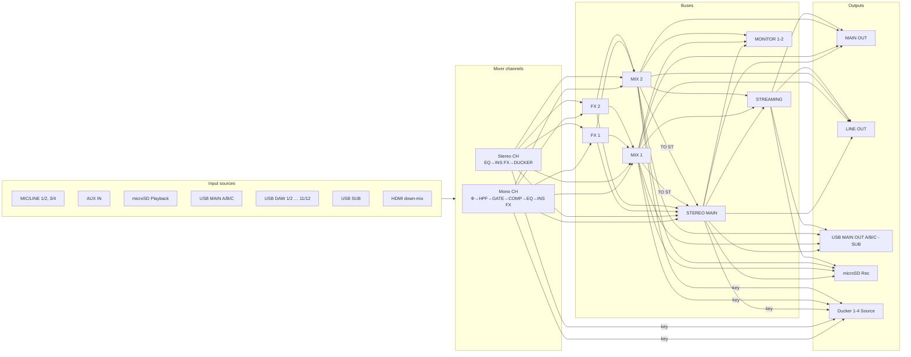

# Device routing model

> 日本語版: [../ja/device-model.md](../ja/device-model.md)

This defines the routing structure and connection constraints of the YAMAHA URX series that the tool
handles. It is the basis of the constraint engine that enforces "only routable paths can be wired"
in the GUI, and the data definitions in the code (`src/models/`) must be kept consistent with this
document.

## Sources

- Official block diagram: `USB AUDIO INTERFACE URX44V URX44 URX22 V1.2 Block Diagram`
  (Yamaha Corporation, 2025, file ID `MWEM-B0`).
  URL: <https://usa.yamaha.com/files/download/other_assets/5/2927055/URX44V_URX44_URX22_Block_Diagram_En_B0.pdf>
- Official user guide (HTML): <https://manual.yamaha.com/audio/music_audio_production/urx44_urx22/ug/en-US/>

> The PDFs themselves are not included in the repository because they are copyrighted. The structure
> is reconstructed here in our own words.

## Per-model parameters

| Item | URX22 | URX44 | URX44V |
| --- | --- | --- | --- |
| Mono input channels | CH1–2 | CH1–4 | CH1–4 |
| Stereo input channels | CH3/4, 5/6, 7/8, 9/10 | CH5/6, 7/8, 9/10, 11/12 | CH5/6, 7/8, 9/10, 11/12 |
| MIC/LINE combo inputs | 2 (1 is Hi-Z) | 4 (3/4 are Hi-Z) | 4 (3/4 are Hi-Z) |
| MIC IN (front mini) | yes (wired into the MIC/LINE 1 input) | same | same |
| AUX IN | yes | yes | yes |
| Analog outputs | MAIN OUT | MAIN OUT + LINE OUT | MAIN OUT + LINE OUT |
| USB ports | MAIN (32-bit) + SUB (16-bit) | MAIN + SUB | MAIN + SUB |
| USB DAW record ch | 10 | 12 | 12 |
| microSD recording | no | yes (up to 16 tracks) | yes |
| HDMI | no | no | IN / THRU (8→2 down-mix) |
| MIX buses | STEREO + MIX1 + MIX2 | same | same |
| FX buses | FX1 + FX2 | same | same |

## Signal-flow overview

## Decision points (basis of the constraint engine)

Routing is not free wiring; it consists of a **limited set of decision points** over the fixed
signal paths inside the device. Each decision point has a "set of sources" and a "receiver
multiplicity". The tool expresses this as `RoutingRule`.

Connection kinds (`kind`):

- `source` — the receiver accepts **only one wire** (a selector). Channel input-source selection and
  bus source selection.
- `patch` — the receiver accepts **only one wire** (output patch / Signal Assign).
- `key` — the receiver accepts **only one wire** (ducker sidechain-trigger select). A selector like
  `source`, but it never carries the mono-pair source mirroring, so it is its own kind (see §10).
- `send` — the receiver accepts **many** (a bus is a summing mix), with level/pan/PRE-POST. Sends from channels / FX to buses.
  The fixed main-fader paths (CH / FX return → STEREO) are LEVEL/PAN only and carry **no PRE/POST** (see §2).
- `sendSwitch` — the receiver accepts **many** but the send is **ON/OFF only** (no per-wire level/pan). Used for the MIX→STEREO "TO ST" send.

> A `source` / `patch` / `key` receiver rejects a second selector wire (only one source can feed it).
> The `key` wire shares the blue selector color with `source` on the canvas.

### 1. Channel input source (`source`, one receiver)

Each mixer channel selects one input source from the following. The device picks MIC/LINE and
USB DAW in fixed 2-channel pairs (1/2, 3/4 and 1/2…11/12), so each is a single source node here.
The front mini jack is wired into the MIC/LINE 1 input and is not a separate source choice.

| Option | URX22 | URX44 | URX44V |
| --- | --- | --- | --- |
| MIC/LINE 1/2 | ✓ | ✓ | ✓ |
| MIC/LINE 3/4 | — | ✓ | ✓ |
| AUX IN | ✓ | ✓ | ✓ |
| microSD Playback | — | ✓ | ✓ |
| USB MAIN A / B / C | ✓ | ✓ | ✓ |
| USB DAW 1/2 … N | ✓ (…9/10) | ✓ (…11/12) | ✓ (…11/12) |
| USB SUB | ✓ | ✓ | ✓ |
| HDMI (down-mix) | — | — | ✓ |

> On the URX44V, every channel (CH1–4, 5/6, 7/8, 9/10, 11/12) can select USB MAIN A/B/C,
> each USB DAW pair, and USB SUB as its input source (verified on hardware).
>
> **Mono-channel pairing**: CH1–4 form the pairs CH1/2 and CH3/4; fixing one channel's input source
> fixes its partner too (e.g. choosing MIC/LINE 1/2 on CH1 also sets CH2 to MIC/LINE 1/2). The tool
> wires the same source node to both channels (L/R is implied by channel position).
>
> **All Input / All USB DAW are not sources**: the INPUT screen's `[All Input]` and `[All USB DAW]`
> buttons are bulk-set actions — one tap rewrites every channel's input source from a fixed table
> (All Input → CH1/2 = MIC/LINE 1/2, CH3/4 = MIC/LINE 3/4, CH5/6 = AUX IN; All USB DAW → CHn/n+1 =
> USB DAW n/n+1). They are not selectable per-channel sources, so they are not source nodes.

### 2. Channel → bus send (`send`, many receivers)

Each channel output can be sent to the following buses (the MIX / FX sends have ON/LEVEL, PRE/POST, PAN/BAL).
LEVEL is the shared **level_gain** scale **-∞ … +10.00 dB** (UG p155; slider bottom = -∞ off, one step up is
-96.0 dB) — every fader, send and the monitor use it. PAN/BAL uses the device scale **L63 – C – R63** (the
UG shows C as the nominal centre; L63/R63 are the hard-pan ends). PRE/POST states whether the send is tapped
**before (PRE) or after (POST) the STEREO main-fader level** (the CH → STEREO level). The STEREO send itself
— being that reference — has no PRE/POST.

- STEREO (TO ST) — **fixed**: the channel's main fader path. In the block diagram it sits
  *outside* the dashed SEND blocks, so it is always wired and cannot be rerouted or removed
  (`fixed` send). The tool seeds it into every plan pre-connected; only LEVEL/PAN stay editable
  (**no PRE/POST** — this path is the PRE/POST reference point).
- MIX 1 / MIX 2 (with PRE/POST)
- FX 1 / FX 2 (with PRE/POST)

> **BUS Type (MIX 1 / MIX 2, CH SETTING).** Each MIX bus is VARI (variable per-send level, the
> default and what the tool models) or FIXED (a fixed send level — sends into the bus carry no
> adjustable LEVEL). **Pan Link** (VARI only) ties each send's PAN to the source channel PAN, so the
> per-send PAN is no longer independent. Stored on the MIX bus node; the connection panel hides the
> LEVEL (FIXED) or PAN (Pan Link) accordingly and shows a short note.

> On the canvas a PRE MIX/FX send is drawn **dashed with an amber "PRE" tap marker just after the
> source**, so it is visible without selecting the connection. POST (the default) is solid and unmarked.
> The marker is carried into image exports (PNG/PDF).

### 3. Bus-to-bus (`send` / `sendSwitch`)

- FX 1 / FX 2 return → STEREO / MIX 1 / MIX 2 (`send`; the **return → STEREO** leg is the FX
  main path and is likewise **fixed** — always wired, non-removable, **no PRE/POST**. It is seeded at
  **-∞ (off)** by default so an FX return is not summed into the main mix until raised. The MIX 1/2
  sends stay optional, with PRE/POST.)
- OSCILLATOR → STEREO / MIX 1–2 / FX 1–2 (`sendSwitch`; an ON/OFF assign, not a
  summing send — the oscillator has one global level. Stereo destinations carry
  independent L/R in the wire (`oscL` / `oscR`); FX buses are mono)
- MIX 1 / MIX 2 → STEREO (`sendSwitch`; the "TO ST" send inside the MIX 1–2 OUT block — ON/OFF only, no independent LEVEL/PAN)

> **Post Fader Send for FX (DAW Integration menu, V1.2+).** Each FX bus can additionally be fed by a
> MIX bus **post-fader** (FX 1 ← MIX n, FX 2 ← MIX n). This appears only when compatible DAW software
> is connected. Modeled as a per-FX-bus selector (— / MIX 1 / MIX 2) on the FX bus node, defaulting to
> none; it mirrors the device dropdown rather than a drawn patch.

### 4. Streaming / monitor source (`source`, one receiver)

- STREAMING input source ← STEREO OUT / MIX 1 OUT / MIX 2 OUT (with DELAY)
- MONITOR 1–2 source ← STEREO OUT / MIX 1 OUT / MIX 2 OUT (MONO)

### 5. Output patch (`patch`, one receiver)

Source selection for the analog outputs (MAIN / LINE).

| Output | Selectable sources | URX22 | URX44/44V |
| --- | --- | --- | --- |
| MAIN OUT | STEREO / MIX1 / MIX2 / STREAM / MONITOR1 / MONITOR2 | ✓ | ✓ |
| LINE OUT | same as above | — | ✓ |

> PHONES 1 / 2 / front are a **fixed 1:1 wire** to MONITOR 1 / MONITOR 2 / MONITOR 1 with no
> source select, so — like DAW Rec — they are **not modeled as editable nodes** (user guide:
> "The Monitor 1, 2 signals are output from PHONES 1, 2").

### 6. USB OUT Signal Assign (`patch`, one receiver)

| Output | Selectable sources |
| --- | --- |
| USB MAIN OUT A / B / C | STEREO OUT / STREAM OUT / MIX1 OUT / MIX2 OUT / CH 1–N OUT |
| USB SUB OUT | same as above |

### 7. DAW Rec Signal Assign (fixed, no node)

- CH n OUT → USB DAW OUT n is a **fixed 1:1 wire** (the block diagram shows no source-select box)
- Because it cannot be re-routed, it is **not modeled as an editable node** (there is no `USB DAW OUT` node)
- N = 10 (URX22) / 12 (URX44, URX44V)

### 8. SD Rec Signal Assign (`sendSwitch`, one receiver; URX44 / URX44V only)

- microSD Rec 1/2 … 15/16 ← STEREO OUT / MIX 1–2 OUT / CH 1–N OUT (up to 16 tracks)
- It is an **ON/OFF record-source assign**, not a summing send: the RECORDER menu (Track Count +
  Source select + a read-only level meter) and the block diagram ("SD Rec Signal Assign") carry **no
  per-source level / pan / PRE-POST**. The recorded tap is the channel's **Rec Point**.
- microSD playback is 2-track (stereo); this model represents it as the single input source
  `microSD Playback`.

> **Source of the track count**: the URX44V records **up to 16 tracks** to microSD and plays back
> **2 tracks** (official Yamaha URX44V product spec). The URX44 also supports microSD recording.
> DAW recording exposes channels **1–12 individually** over USB (verified on hardware).

> **v0.1 simplification**: microSD Rec is originally a per-track-slot rule, but v0.1 simplifies it
> into a single group node that receives multiple sources (each an `sendSwitch` assign) to avoid node
> explosion. Per-slot assignment UI is planned for Phase 2.

### 9. HDMI THRU (fixed passthrough, no node, URX44V only)

- HDMI input (Audio 2ch + Video) → HDMI THRU is a **fixed 1:1 wire** with no source select, so —
  like DAW Rec — it is **not modeled as an editable node**.
- The HDMI input itself remains a selectable channel source.

### 10. Ducker key source (`key`, one receiver)

- Ducker 1–4 Source ← CH 1–N OUT / STEREO OUT / MIX 1 OUT / MIX 2 OUT (sidechain trigger select)
- Each ducker lives on one stereo channel, so Ducker 1–4 map in order to the model's stereo pairs: URX22 = CH 3/4, 5/6, 7/8, 9/10; URX44 / URX44V = CH 5/6, 7/8, 9/10, 11/12. The on-canvas node is labeled simply `Ducker` with the host pair in its sublabel (`CH 5/6 · Source`); the 1–4 ordinal is the block-diagram enumeration only — the hung position already names the channel, so it is not repeated on the node.
- Because a ducker belongs to its host channel rather than being a standalone output, it is drawn as a dedicated `ducker`-kind node hung directly below the matching stereo channel (placement, movement and hide behavior in [architecture.md](architecture.md)).

## Fixed (non-wireable) elements

- The channel-strip processing order (Φ → HPF → GATE → COMP → EQ → INS FX) is fixed.
  The channel's **Rec Point** (recording / direct-out tap) selects a stage along this chain:
  MONO IN offers PRE GATE / PRE COMP / PRE EQ / PRE INS FX / PRE FADER; ST IN (EQ only) offers
  PRE EQ / PRE FADER. Default PRE FADER. Stored as a per-channel parameter, not a wire.
- MONO IN selects a **COMP/EQ Type** (CH SETTING) — COMP->EQ or **SSMCS** (Sweet Spot Morphing
  Channel Strip), mutually exclusive. SSMCS replaces the COMP / 4-band EQ with a dedicated morphing
  strip: pick one **Sweet Spot Data** preset (6 generic + 28 artist/use-case = 34), then shape it
  with **Comp Drive** / **Morphing** / **Out Gain**. Its compressor carries Attack / Release /
  Ratio / Knee plus a side-chain filter (Q / Freq / Gain), and its EQ is **3-band (Low shelf / Mid
  peaking / High shelf)** — not the 4-band PEQ. ST IN has no SSMCS (always EQ only). The inspector
  swaps the COMP/EQ sections for the SSMCS sections per the type.
- The mono CH and stereo CH structure is fixed (only the count varies per model). A MONO IN pair
  (CH1/2, CH3/4) carries a **Signal Type** (CH SETTING): STEREO links the two adjacent channels,
  MONO × 2 keeps them independent (the default). The tool keeps both nodes and stores the flag on the
  pair's primary (odd) channel — it does not merge them into one node — and draws a heart tie between
  the pair when linked. STEREO adds a **PAN / BAL** mode. Switching the mode (or entering STEREO)
  re-initializes the pan of **every bus send** (STEREO / MIX 1–2 / FX 1–2) from both pair members:
  PAN hard-pans the odd channel left (L63 = −63) and the even one right (R63 = +63); BAL centres both
  (C = 0) and the send pan then reads as a BALANCE (as a native stereo channel does). Broader parameter
  mirroring is a device behavior not auto-applied (the planner records the configuration).
- **CH n → STEREO and FX 1/2 return → STEREO are fixed sends** (the main fader / return paths):
  always wired, shown pre-connected, and non-removable. Unlike the items above they *are* drawn
  as wires (between visible nodes) since their LEVEL/PAN remain editable; only the routing is locked.
- PHONES 1/2/front are a fixed 1:1 wire to the MONITOR buses (no source select, no node).
- The CUE bus (solo/monitor interrupt) is **not modeled**: its routing is cleared at power-off, so
  it cannot hold a persistent assignment that a saved plan would represent.

## Sample-rate-dependent constraints

| Constraint | Condition |
| --- | --- |
| INS FX unavailable | sample rate above 96 kHz |
| FX2 unavailable | sample rate above 96 kHz |
| HDMI EQ unavailable | sample rate 176.4 / 192 kHz |
| HDMI down-mix EQ | enabled only when the input is 2ch |

> As of Phase 2, these are surfaced as **warnings** (an inspector notice plus a dimmed, dashed
> outline on the affected node); they do not forbid the wiring itself. The sample rate is set per
> plan and persisted in the plan JSON. Wiring will be tightened in future hardware reflection.
