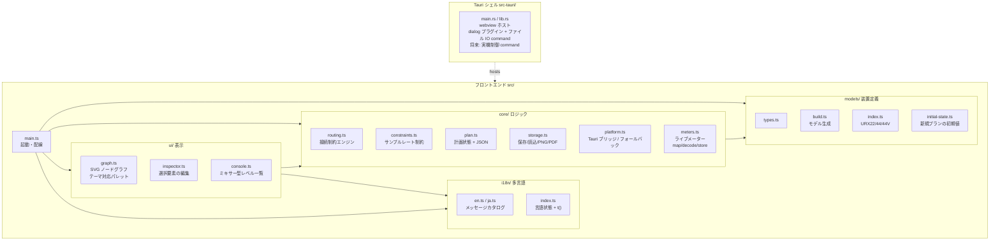

# アーキテクチャ

> English version: [../en/architecture.md](../en/architecture.md)

## 目的

YAMAHA URX22 / URX44 / URX44V のルーティング計画を GUI で作成・可視化し、
装置が物理的に許す経路のみを結線できるよう制約する。計画は JSON で永続化し、画像出力する。
将来は同じ計画データを実機へ反映する。

## 技術スタックと選定理由

| 層 | 採用 | 理由 |
| --- | --- | --- |
| デスクトップシェル | Tauri 2 | Windows 11 / Apple silicon macOS をワンソースで配布。小バイナリ。将来の実機制御を Rust でネイティブ実装できる |
| フロントエンド | TypeScript + Vite | 計画 UI は純フロント。Rust 未導入でもブラウザ確認できる |
| 描画 | 素の SVG | ノードグラフの結線描画。ランタイム外部依存を持たない方針 |
| 永続化 | JSON | 人間可読。将来の実機反映の入力にもなる |

実機制御は Tauri (Rust) 側で扱う前提とし、UI とコア (モデル/制約/計画) はシェル非依存に保つ。

## モジュール構成



## データモデル

- **DeviceModel** — 機種ごとの不変な装置定義。`nodes` (入力/チャンネル/Bus/出力/Ducker)、
  `rules` (接続可能な経路 = `RoutingRule[]`)、`channelPairs` (入力ソースを共有するモノ CH の組
  = CH1/2・CH3/4) を持つ。`models/build.ts` が機種パラメータから生成する。Ducker は載っている
  ステレオチャンネルを `attachTo` で指し、UI ではその真下にぶら下げて描く ([下記](#ducker-の配置))。
- **Plan** — ユーザーが作成する可変状態。`modelId`、ノード配置 (`positions`)、結線 (`connections`)、
  各結線のパラメータ (level/pan/pre-post 等)、ノード名の上書き (`nodeNames`、実機 CH SETTING 名。
  色と同じノード群について文字列 IPC で読み書きする。空文字は機種の既定ラベルにフォールバック。
  ツールバーのラベルトグルで、canvas に機種の既定ラベル (「CH 1」、デフォルト) を表示するか
  これらのデバイス名 (「ch 1」) を表示するか選べる。model モードは `nodeNames` を完全に無視)、
  ノード色の上書き (`nodeColors`、実機 CH SETTING 色。ノード上端の細い色キャップとして描画。
  ピッカーは実機の固定パレットを提示し、選んだ色は実機と 1:1 で読み書きする — 入力 ch・MIX・STEREO・FX・STREAMING)、
  非表示ノード (`hidden`)、ノードごとのノート (`notes`) とその最小化状態 (`noteCollapsed`) を持つ。
  JSON にシリアライズする。
  新規プランは `models/initial-state.ts` の `defaultPlan(modelId)` が生成し、全機種に工場初期値
  (ノードパラメータ + ルーティング + CH SETTING 色・名前) をシードする。実機からキャプチャ済みなのは URX44V のみ。URX44 は
  そのキャプチャをそのまま流用する (差分は URX44V の HDMI 入力のみで、初期接続はこれを経路に使わない)。
  URX22 はそれを位置対応で再マップした推測値 (`models/initial-urx22.ts`、実機リセットを採取するまで未検証)。
  デバイス取得時のみ `emptyPlan` から始め、読み戻し (`core/control/`) が実機値で埋める。
  起動時の機種選択は前回の選択 (`localStorage("urx-model")`) を復元し、無効/未保存なら URX44V に
  フォールバックする (テーマ・言語と同じ「保存値 → フォールバック」)。

制約の核 (`core/routing.ts`):

- `legalTargets(model, plan, fromRef)` — ある出力ポートから結線可能な入力ポート集合を返す。
- `legalSources(model, plan, toRef)` — 逆方向。ある入力ポートへ結線可能な出力ポート集合を返す。入力側からのドラッグ結線に使う。
- `canConnect(model, plan, fromRef, toRef)` — 規則の有無と受け口多重度 (`source`/`patch`/`key` は1本、`send` は複数) を判定。
- `partnerChannel(model, nodeId)` — ペアとなる相方のモノ CH を返す。`source` 結線時に同一ソースを相方へミラーし、削除時も連動させる (UI: `graph.ts`)。Ducker のキーソースは `source` ではなく `key` 種別なのでこのミラーリングを通らない (モノペア非所属という偶然ではなく型で保証)。

UI (`graph.ts`) はこれらを使い、出力・入力どちらのポートからもドラッグで結線できる (反対側の接続可能ポートを `legalTargets` / `legalSources` でハイライト)。既にソースを持つ single-input ポートのクリックは、その結線を選択する (配線クリックと同等)。

詳細なルーティング規則は [device-model.md](device-model.md) を参照 (公式ブロックダイアグラム由来)。

## 多言語対応 (i18n)

UI は英語を基本とし、日本語ローカライズに対応する。実装は外部依存ゼロの自前モジュール `src/i18n/`:

- `en.ts` — 基準言語であり、メッセージ構造 (`Messages` 型) の一次情報。文字列と補間用関数を持つ。
- `ja.ts` — `Messages` 型に従う日本語訳。キーを追加すると TypeScript が全言語の翻訳を要求する。
- `index.ts` — 現在の言語状態、`t()` (現在のカタログを返す)、`setLang()` / `onLangChange()`。
  起動時に `localStorage("urx-lang")` を読み、無ければ `navigator.language` で判定し、最終フォールバックは英語。

> **コアは言語非依存に保つ**。`core/routing.ts` の `canConnect` は失敗を `ConnectError` コードで返し、
> `core/plan.ts` の `deserialize` は `PlanError` (コード付き) を投げる。UI 側 (`t().error[code]`) で文言に変換する。
> これにより `core/` と `models/` は i18n に依存せず、Node 上のスモークテストもブラウザ API なしで動く。

ツールバー右端の言語ボタンで切り替え、`setLang()` がリスナーへ通知して静的ラベルとインスペクタを再描画する。

> **用語の統一**。製品/業界用語は日本語 UI でも英語表記を保つ: `Bus` / `Ducker` / `Bus send` /
> `Send (ON/OFF)` / `Pre-fader send`。キャンバス上の可視要素は **ノード (node)** と呼び、
> `モジュール (module)` はソフトウェアモジュール (`src/i18n/` 等) に限定する。凡例は配線種別を
> 「接続の種類」、ノード種別を「ノード」でグループ化する。

## 表示テーマ

UI はプロオーディオ機材を意匠としたスタジオラック調で、ダークとライトの 2 テーマを持つ。
初期テーマは保存値 (`localStorage("urx-theme")`) があればそれを使い、無ければ OS のカラースキーム設定
(`prefers-color-scheme`) に追従し、どちらでもなければダークにフォールバックする (言語の初期判定と同じ
「保存値 → システム設定 → フォールバック」の順)。ツールバー右端のボタンで切り替え、`localStorage("urx-theme")`
に永続化する。

配色は二層に分かれ、テーマごとに対応させる:

- HTML 要素 (ツールバー/インスペクタ/背景) — `src/style.css` の CSS カスタムプロパティ
  (`:root` がダーク、`[data-theme="light"]` がライト。属性は `document.documentElement` に付与)。
- SVG ノード/配線 — `src/ui/graph.ts` の `PALETTES.dark` / `PALETTES.light`。`setTheme()` で再描画する。
  ライトテーマのノードには立体感を出すソフトドロップシャドウ (`#node-shadow` フィルタ) を付与する。

接続色とノード色は両層に存在する: 配線色は `--w-*` (CSS) / `PALETTES.wire` (graph.ts)、
ノードのレール色は `--rail-*` (CSS) / `PALETTES.rail`。インスペクタの未選択時の**凡例**は CSS 変数を
読むため、グラフが描く色と完全に一致し、テーマに追従する。

> ルーティング規則とモデルの一致 (device-model.md ↔ models/) と同様に、**テーマ配色は style.css の
> CSS 変数と graph.ts の `PALETTES` を一致させる** — 配線 (`--w-*` ↔ `PALETTES.wire`)、
> ノードレール (`--rail-*` ↔ `PALETTES.rail`)、および各サーフェス色。
> 例外: `key` (Ducker キーソース) は `source` と同じ青を共有し独立した凡例行を持たないため、
> 描画用に `PALETTES.wire.key` だけを持ち `--w-key` CSS 変数は設けない (CSS `--w-*` は凡例スウォッチ専用)。

PNG / PDF 出力 (`core/storage.ts`) は `--canvas-bg` を読んで背景を塗るため、出力画像も現在のテーマに追従する。
PDF は単一の FlateDecode 画像を埋め込んだ 1 ページ文書を手書きで生成する (deflate はプラットフォームの
`CompressionStream`) ため、ランタイム外部依存を追加しない。

## CONSOLE ビュー (ミキサー型レベル一覧)

ノードグラフ (GRAPH) に加え、同じ plan をミキサー型の縦ストリップで俯瞰する第 2 ビューを持つ。
ツールバーの GRAPH / CONSOLE タブで切り替え、CONSOLE 表示中はグラフとインスペクタを隠す
(`main.ts` の `setView`)。`src/ui/console.ts` が入力 (INPUTS) / バス・FX (BUS / FX) /
モニター (MONITOR) / マスター (MASTER) のグループにストリップを並べる。各ストリップは横スクロールで
並ぶ (左端の共有ルーラーは持たない)。フェーダーゾーンは **フェーダー** (実機調の細い溝＋つまみ。位置=設定値) /
**dB スケール** / **レベルメーター** の 3 列。メーターは上端に独立した **OVER 枠**を持ち (クリップ表示。
レベル天井や目盛とは別物なので分離)、その下に信号ラダー (緑→赤・信号は Live sync 中のみ)。OVER 枠は実機
クリップ (生値 32767) のラッチ (`sig.over`) で赤く点灯し約 1 秒で減衰する。スケールは各ストリップのレンジに
合わせ、上端・下端をフェーダーの可動域に揃えるので、つまみと同じ高さの目盛がそのレベルを指す (機能的な
目盛、10/0/-10/-20/-40/-60/-80/-∞)。目盛の数字は符号を分離して中央寄せ (「−」を左へハングさせ `10` と
`-10` の桁を縦に揃える)。上部のスクリブルは **ノード名 + 実機 CH SETTING 名** の 2 行。その下にトグルチップを
2 列グリッドで 2 グループ置く: ①チャンネル/入力 (HA) — MUTE (チャンネル・FX リターン・マスターが持つ。FX リターンは実機の FX チャンネル ON、マスターは STEREO master ON)、モノ MIC CH は +48 / φ / HPF (CH3/4 は Hi-Z)、
ステレオ CH は φL / φR (`channelControl` の `phases`/フラグで判定) ②処理チェーン — GATE → COMP → EQ →
INS FX、ステレオ CH は EQ + DUCKER (直下に吊るした ducker ノードの `duckerOn` をトグル)。チップが奇数の
グループは不可視スペーサで最後のチップが全幅化しないようにする。最下段に回転つまみ
(`addKnob`/`wireKnob`、ドラッグ/矢印キー) — チャンネルは **Gain と PAN/BAL** (CH→STEREO 送りの pan、
L63–C–R63)、モニターバスは **PHONES レベル** (0–10 の非 dB、PHONES 1 ↔ mon1 / PHONES 2 ↔ mon2。
モニターフェーダーとは独立で新タブは設けない)。
つまみの指針は値ごとに水平アンカーを置ける (`KnobSpec.angle`、左=-90°/右=+90°): PHONES 2.0/8.0・
A.Gain +8/+55・D.Gain -14/+15 を左右の水平に。
フェーダーつまみ・各つまみはダブルクリックで**工場初期値** (`defaultPlan` から取得) にリセットする。

- **編集経路の共有** — フェーダー・チップ・Gain の編集は plan を直接更新し、グラフ/インスペクタと同じ
  変更ファネル (`markChanged` → `live.schedule()`) を通る。よって実機ライブ同期は CONSOLE の編集も
  同じ snapshot 差分で実機へ反映する。CONSOLE は編集したストリップだけを自前で再描画し、ドラッグ中の
  全体再構築を避ける。GRAPH へ戻る際に `graph.repaint*` で編集を反映する。
- **レベル調整専用 (ルーティング不可)** — CONSOLE は既存の送り/経路の**レベルを調整するだけ**で、結線の
  追加・削除はしない (ルーティングは GRAPH 専任)。`setSend` は既存結線のレベルを更新するのみ。送りを -∞ まで
  下げてもワイヤは残る (再表示可能)。INS FX は No Effect 値が OFF なので、OFF→ON は直前の値 (無ければ先頭の実エフェクト) を復元する。
- **send-on-fader** — 上部に固定ラベル「出力」とモードバー (MAIN / FX 1 / FX 2 / MIX 1 / MIX 2)。送りモードでは
  入力チャンネルと FX リターンのフェーダーを「選択した MIX/FX バスへの送りレベル」へ切り替え、**その送り元
  だけを表示**する (対象バスへ送れないモニター/マスター/バス自身や、送りワイヤを持たないストリップは非表示)。
  FX リターンは MIX バスへの送りのみ追従。MAIN モードでは全ストリップが自身のレベルを表示する。
- **スクリブル色** — 種別レール色ではなく、各ノードの **CH SETTING 色** (`plan.nodeColors`、実機パラメーター)
  を背景に使い、色の輝度に応じて黒/白の文字色を選ぶ (`textOn`)。色未設定のノードはレール色にフォールバック。
- **レイアウト/スクロール** — `#console-host` は `min-width:0; overflow:hidden` で `#stage` 内に収め、横スクロールを
  ストリップ領域 (`.con-strips`) に閉じ込める (スクロールバーはステータスバーの上)。縦は通常スクロールせず、
  ウィンドウが極端に低いときだけストリップ領域内で縦スクロールする。マスター (STEREO) は右端固定をやめ、
  他と同じく横スクロールで流れる。
- **ライブメーター** — メーター列は常時表示し、信号が流れるのは Live sync 中のみ (`console.setLive`・待機時は底=空)。
  `core/meters.ts` がノード id を broker のメーターアドレス (`meterId:x`) へ写像し、生値 (deci-dBFS、
  32767 = OVER) を dBFS へデコードして `MeterStore` に保持する。UI は `requestAnimationFrame` で約 10 Hz の
  通知をサンプリングし、速いアタック・遅いリリースとピークホールド、OVER ラッチ (上部の OVER 枠) で描画する
  (前回値と整数% で比較し、変化したレーンだけ書き込む)。購読は画面に出ているストリップかつ現機種に存在する
  メーターだけに絞る (`metersForNodes`)。メーター id は実機 URX44V で確認した値で、写像の無い機種は表示しない。
- **配信経路** — Rust 側 (`src-tauri/src/vd.rs`) はメーター購読 (`MetersSubscribe`/`MetersUnsubscribe`) を
  受けると各アドレスを broker に登録し、アイドル時のソケット排出 (`pump`) でメーター `notify` フレームを
  Tauri Channel 経由でフロントへ転送する (`forward_meter`)。実機制御と同じく `--experimental` 起動時のみ有効。

## レスポンシブ対応 (モバイル)

デスクトップでは右側 300px の固定カラムのインスペクタは、狭い画面 (≤720px) では画面下部からせり上がる
ボトムシート (ラックの引き出し) に切り替わる。インスペクタが縦に伸びるノード (チャンネル等) では、選択ノードの
同一性 (見出し・名前・色) を sticky ヘッダとして固定したまま、パラメータを `<details>` ベースの折りたたみ可能な
ラック調モジュール (ROUTING / INPUT / GATE / COMP / EQ / Parameters) にグルーピングする (`inspector.ts` の
`section()`)。GATE / COMP / EQ / Ducker は各セクションの ON 状態でヘッダの LED を点灯させ、OFF のセクションは
自動で畳む。ROUTING は既定で畳む。手動で開閉したセクションはセクション種別ごとに `localStorage`
(`urx-inspector-sections`) へ永続化し、再描画・リロードをまたいで保持する。セクションの ON 値をトグルすると
その上書きは解除され、開閉は ON 状態に追従する状態へ戻る。セクション内では、EQ バンド編集は 4 タブ
(LOW / LOW MID / HIGH MID / HIGH) で 1 バンドずつ表示し (選択バンドは再描画をまたいで保持)、INPUT の
トグルは 2 カラムで並べる。表示状態は CSS のみで完結する: `main.ts` が選択の有無に
応じて `<body>` へ `has-selection` クラスを単一トグルし、`body.has-selection #inspector` が
`transform: translateY(0)` でシートを上げる (未選択時は画面外 `translateY(105%)`)。閉じる導線は見出しの
✕ ボタン (`onClose` → `graph.clearSelection()` で既存の選択解除経路を再利用) と空キャンバスのタップ。
キャンバスのズームはホイール (デスクトップ) と 2 本指ピンチ (タッチ) の両方に対応し、どちらも同じ
「指定点を固定して拡縮する」処理 (`graph.ts` の `zoomAt`) を共有する。`viewport-fit=cover` と
`env(safe-area-inset-bottom)` でノッチ/ホームインジケータを避け、ツールバーは 720px 以下で装飾の
VU メーターとタグラインを落とす。

## ノードの非表示

ノード数の多い機種では不要なノードが場所を取り図を読みづらくする。そのため**任意のノード**を
(接続の有無にかかわらず) キャンバスから一時的に隠せる。隠したノードはキャンバス下部の**シェルフ**
(`graph.ts` が組み立てる HTML オーバーレイ。SVG には含めないため画像出力には写らない) にレール色の
チップとして並び、クリックで個別復帰、「全て表示」で一括復帰する。

- ツールバー「未接続を隠す」が編集可能な結線を持たない全ノードを隠す (結線していないノードをまとめて
  片付ける補助機能)。インスペクタは選択中の任意のノードに「このノードを隠す」ボタンを出す。
- **複数選択**: Ctrl (Mac は Cmd) + クリックでノードをドラッグせず選択にトグル追加する。2 つ以上選択すると
  キャンバス上にフローティングのアクションバー (シェルフ同様の HTML オーバーレイ) が現れ、選択全体を
  一括「非表示」にする。「選択解除」または `Escape` で選択を解く。選択集合は一時的なビュー状態で永続化しない。
- **隠したノードの配線**: 端点が隠れている配線は固定・編集可能を問わず描画をスキップするため、隠した
  ノードは自身の配線ごとキャンバス外へ退避し、配線が宙吊りにならない。配線自体は `plan.connections` に
  残り (非表示は純粋に表示上の操作)、ノードを復帰すると再び現れる。
- **Ducker**: 親チャンネルを隠すと Ducker も連動して隠れ、Ducker を復帰すると親も復帰する — Ducker が
  親無しで単体表示になることはない。シェルフでは親子が共に隠れた場合は親チップ 1 つに集約し (子チップは
  抑制)、親チップの復帰でユニットごと戻す。
- 隠したノードは **CONSOLE ビュー**からも消える (`console.ts` がストリップ一覧から `plan.hidden` を
  除外し、隠れた Ducker は親ストリップの DUCKER チップを落とす)。
- 隠した集合は `plan.hidden` (ノード id 配列) として計画に保存され、再読込で復元する。配置 (`positions`) と
  同じ純粋なビュー状態であり、ルーティング規則には影響しない (将来の実機反映は無視してよい)。
- 一括の「隠す」「全て表示」は表示領域を再利用するため再フィットする。シェルフが開いている間は
  `fitView` がその高さぶんを除いて図を収め、復帰した単一ノードはビューポート中央に配置する。

## Ducker の配置

Ducker はサイドチェーンのキーソース選択器で、対応するステレオチャンネルに「載っている」装置であり、
独立した出力ではない。そのため独自の種別 `"ducker"` (専用レール色) を持ち、出力カラムには置かず、
`attachTo` で指す親チャンネルの**真下に固定の隙間でぶら下げて**描く。

- **位置の導出** — Ducker の座標は `plan.positions` に保存せず、常に親の位置から導出する
  (`posOf` が `attachTo` を辿り、親の高さ + 隙間ぶん下に置く)。親にノートが開いてもその下に追従する。
- **一体の移動** — 親をドラッグすると子も同量で追従する。子 (Ducker) を掴んだドラッグは親の移動に
  振り替えるため、どちらを掴んでもユニットごと動く。子の単独移動はできない。
- **テザー** — 親との隙間に細いレール色の線を 1 本引き、両者が一体であることを最小限に示す。
- **自動整列** — `autoLayout` は Ducker をスキップし、親チャンネルの下に子のぶんの高さを予約する。

## 列レイアウト

ノードは信号フロー順に左から右へ 5 列で並ぶ: 入力 → チャンネル → ミックスバス (STEREO / MIX / FX) →
派生バス (STREAMING / MONITOR) → 出力。バス段を 2 列に分けるのは意図的なもの: STREAMING と MONITOR は
ミックスバスのみを入力に取る下流バスなので、チャンネル→バスの密な収束に重ならないよう独立列に置く。
OSCILLATOR はミックスバスへ送る生成元なのでチャンネル列に含める。これにより全ての結線が左→右の一方向に
流れ、バス列を逆走する配線が無くなる。各ノードの列番号は `build.ts` の `layoutCol` が決め `pos.col` に持つ。
`autoLayout` と既定グリッドはどちらも列ごとに独立して縦に積み、同じ縦グリッドを共有する: 既定の行は
`pos.row * ROW_GAP` (`build.ts` はステレオ ch ごとに ducker 用の 1 行を余分に予約)、`autoLayout` は各ノードの
縦送りを `ROW_GAP` の整数倍にスナップする。よって新規プランで整列を実行してもノードは動かず、展開ノートは
必要な行数だけ確保される。

ノードの `kind` (rail 配色とチャンネル/バス限定の name フィールドを駆動) はレイアウト列と異なる場合がある:
OSCILLATOR は `kind: "input"` (信号生成元)、MONITOR は `kind: "output"` (シンク) で、バス/チャンネル列に居ても
rail 配色は信号上の役割を反映する。これらは実機 CH SETTING で着色されないため、STEREO / MIX / FX / STREAMING
バスと違い色ピッカーを持たない。

## ノードラベル

ラベルは左に固定インセットで配置し、ヘッダー右上のボタン (可視枠は右端寄り) と衝突しない幅に収める必要が
あり、等幅で約 15 文字ぶんの余裕しかない。これを超える長いラベルは 2 系統で扱う。`sublabel` を持つノードは
固定高さのヘッダー内に二段で積む — 主表記 (ノード名) と、その下の淡色の副題 (例: Ducker の `CH 3/4 · Source`)。
副題の無い長い単行ラベルは `fitScale` がボタン手前に収まるぶんだけ縮小する (`microSD Playback`、`HDMI (down-mix)`)。
一覧やインスペクタは `fullLabel()` で両段を結合表示し、文脈を欠落させない。

## ノードノート

各ノードには自由記述のノートを付けられる。ノートは**ノード枠内**のヘッダー下、くぼんだ
パネルに描画され、ノードはそれを収めるよう下方向に伸びる。ヘッダー (ラベル・ジャック・配線) は
固定されたままなのでルーティングには影響しない。ノートは SVG の一部であり PNG / PDF 出力にも写る。

- **追加** — ノート無しのノードはヘッダー右に淡色のペンボタンを出す (`graph.ts` `makeNoteAdd`)。
  クリック (またはノードのダブルクリック) でその場エディタが開く。エディタはパネル上に重ねた
  浮動 HTML `<textarea>` で、出力には含めない。
- **編集** — ノードを選択した状態で、開いているノートエリアをクリックすると編集に入る。ヘッダー
  (ノート外) のドラッグは移動、未選択ノードはどこでもドラッグで移動。編集はキャンバス専用で、
  インスペクタにノート欄は無い。
- **最小化 / 展開** — ノート付きノードは `+` / `−` ボタンを出す (`makeNoteToggle`)。`−` でノートを
  ヘッダーまで最小化、`+` で再展開する。最小化状態はノードごとに永続化する。
- **永続化と整列** — ノートは `plan.notes` (ノード id → 文字列)、最小化集合は `plan.noteCollapsed` として
  保存する。いずれも純粋なビュー状態 (将来の実機反映は無視してよい)。「整列」は各列をノードの実高さ
  (`nodeHeight`、展開ノート込み) で積み上げるため、ノートが直下のノードに重ならない。

## 永続化フォーマット

```jsonc
{
  "format": "urx-router-plan",
  "version": 1,
  "modelId": "URX44V",
  "sampleRate": 48000,
  "positions": { "ch1": { "x": 1, "y": 0 } },
  "connections": [
    { "from": "in.micline1:out", "to": "ch1:in", "kind": "source" },
    { "from": "ch1:out", "to": "bus.stereo:in", "kind": "send",
      "params": { "level": 0, "pan": 0, "tap": "post" } }
  ],
  "nodeNames": { "ch1": "メインVo" },
  "nodeColors": { "ch1": "#4a78c0" },
  "hidden": ["in.micline2", "out.sdrec"],
  "notes": { "ch1": "メインVo — Comp + サビ +2 dB" },
  "noteCollapsed": ["ch1"]
}
```

保存・読込は Phase 1 ではブラウザ標準 (Blob ダウンロード / file input) で実装した。
Phase 2 ではネイティブの保存/読込ダイアログ (`tauri-plugin-dialog`) と最近使った計画を追加。
ファイル IO は小さな `std::fs` の自前 command (`read_text_file` / `write_text_file` / `write_binary_file`)。
いずれも `core/platform.ts` から `window.__TAURI_INTERNALS__.invoke` 経由で呼ぶため Tauri の npm パッケージは同梱しない。
Tauri 外で動作する場合はブラウザ標準にフォールバックする。
計画フォーマットは `sampleRate` / `nodeNames` / `nodeColors` / `hidden` / `notes` / `noteCollapsed` フィールドが追加された以外は不変 (古いファイルは読込時に既定値 — 空配列・空オブジェクト等 — を補う)。

## ビルドと配布

インストーラーは `pnpm tauri build` で生成する。これは `frontendDist` (`../dist`) を
バイナリに埋め込む。素の `cargo build` 成果物は代わりに `devUrl` を読みに行き、dev サーバが
無いと白画面になる (検証は必ず `tauri build` 系で行う)。アプリのバージョンは `package.json` を
単一の出所とし、`src-tauri/tauri.conf.json` の `version` が `"../package.json"` を指す
(Tauri がビルド時に読む。`Cargo.toml` の version はクレート版数として独立)。

| プラットフォーム | 成果物 | 備考 |
| --- | --- | --- |
| macOS (Apple silicon) | `.dmg` + `.app` (`src-tauri/target/release/bundle/`) | arm64 のみ。ad-hoc 署名 (公証まで Gatekeeper 警告) |
| Windows | `.msi` + `.exe` (NSIS) | Windows ホストまたは CI でビルド。macOS からのクロスコンパイルは非対応 |

リリースは `.github/workflows/release.yml` で自動化する。`vX.Y.Z` タグ (プレリリースは
`vX.Y.Z-{alpha,beta,rc}*`) を push すると 3 ジョブが走る: `check-tag` がタグを検証し、
`create-release` が **draft** の GitHub Release を作り、`build` マトリクス (`macos-14` /
`windows-latest`) が各プラットフォームを [`tauri-action`](https://github.com/tauri-apps/tauri-action)
でパッケージし draft に添付する。draft は公開前に手動レビューする。手動 `workflow_dispatch`
実行ではリリースを作らず、成果物を job artifact としてのみ残す (パッケージ検証用)。

macOS の署名・公証は任意で、署名 secret (`MACOS_SIGNING_CERT` / `MACOS_SIGNING_CERT_PASSWORD` /
`MACOS_SIGNING_IDENTITY`) と公証 secret (`MACOS_NOTARIZATION_USERNAME` / `MACOS_NOTARIZATION_PASSWORD` /
`MACOS_NOTARIZATION_TEAM_ID`) があれば `tauri-action` に渡し、無ければ未署名で配布する
(secret 名は他リポジトリと共通化)。Windows のコンソールウィンドウは `src-tauri/src/main.rs` の
`windows_subsystem = "windows"` によりリリースビルドで既に抑止される (dev / `cargo build` では出る)。

### ブラウザデモ (GitHub Pages)

デスクトップ版とは別に、ブラウザだけで試せるデモを GitHub Pages で配信する。`vite build --mode demo`
(`pnpm build:demo`。`.env.demo` が `VITE_DEMO=1` を与える) でビルドし、`.github/workflows/pages.yml`
が `vX.Y.Z` リリースタグの push 時に `dist` を Pages へ公開する (デモはリリース版に追従する)。デモはビューア用途のため、ファイルの保存 / 読込と
PNG / PDF 出力をツールバーから隠す (`src/core/env.ts` の `DEMO` フラグが `[data-demo-hide]` 要素を
非表示にする)。通常 (デスクトップ) ビルドではこの分岐がデッドコードとして除去され全機能が出るため、
配布バイナリには影響しない。`vite.config.ts` の `base: "./"` (相対) によりサブパス配信でもアセットが解決する。

### 自動アップデート

デスクトップ版は起動時に新しいリリースの有無を確認する。Tauri の updater / process プラグインを
`src-tauri/` でデスクトップ時のみ登録し、フロントエンドは `src/core/platform.ts` から dialog と
同じ流儀で `plugin:updater|check` / `plugin:updater|download_and_install` / `plugin:process|restart`
を直接 invoke する (npm ランタイム依存を増やさない)。更新があれば確認ダイアログを出し、承諾後に
ダウンロード → インストール → 再起動する。ブラウザ / デモビルドでは `DEMO` 分岐で無効化され、関連
コードはデッドコードとして除去される。

配信は GitHub Releases を使う。`tauri.conf.json` の `bundle.createUpdaterArtifacts` を有効化すると
`tauri-action` が署名済みバンドルと `latest.json` を生成し、`plugins.updater.endpoints` が指す
`https://github.com/semnil/urx-router/releases/latest/download/latest.json` から配信される。
更新バンドルは **minisign 署名が必須** で、macOS のコード署名とは別の鍵ペアを使う。

署名鍵の生成と登録 (初回のみ):

```sh
pnpm tauri signer generate -w ~/.tauri/urx-router-updater.key
gh secret set TAURI_SIGNING_PRIVATE_KEY < ~/.tauri/urx-router-updater.key
gh secret set TAURI_SIGNING_PRIVATE_KEY_PASSWORD
```

- 出力された **公開鍵** は `tauri.conf.json` の `plugins.updater.pubkey` に設定・コミット済み。公開鍵は
  git にコミットしてよい。
- **秘密鍵** とパスワードは git 管理外に置き、上記 secret として登録する (`release.yml` が
  `tauri-action` に渡す)。secret 未設定だと署名されず `latest.json` も生成されないため、自動
  アップデートは機能しない。

## サードパーティライセンス

Web 層はランタイム外部依存ゼロだが、配布するデスクトップビルドは Tauri ランタイムと Rust クレートを
静的リンクし、それらは各自のオープンソースライセンスを持つ。GPL/AGPL/LGPL は含まれず、許容的
ライセンスとファイル単位の弱コピーレフト (MPL-2.0) のみで、いずれも通知の同梱で義務を満たせる。

通知ファイルは Cargo の依存グラフから
[`cargo-about`](https://github.com/EmbarkStudios/cargo-about) で生成する:

```sh
cargo install cargo-about            # 初回のみ (または brew install cargo-about)
cd src-tauri && cargo about generate about.hbs -o THIRD_PARTY_LICENSES.html
```

`src-tauri/about.toml` が受容する SPDX id を列挙し、`src-tauri/about.hbs` が出力テンプレート。
生成物 `THIRD_PARTY_LICENSES.html` は git 管理外で、配布時に再生成し、Phase 2 で Tauri リソース
(アプリ内クレジット画面) として同梱、さらに CI に組み込んで依存変更で通知が欠落しないようにする。
