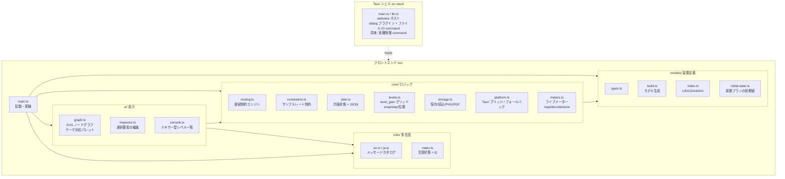

# アーキテクチャ

> English version: [../en/architecture.md](../en/architecture.md)

## 目的

YAMAHA URX22 / URX44 / URX44V のルーティング計画を GUI で作成・可視化し、
装置が物理的に許す経路のみを結線できるよう制約する。計画は JSON で永続化し、画像出力する。
将来は同じ計画データを実機へ反映する。

## 技術スタックと選定理由

| 層 | 採用 | 理由 |
| --- | --- | --- |
| デスクトップシェル | Tauri 2 | Windows 11 / Apple silicon macOS をワンソースで配布。小バイナリ。将来の実機制御を Rust でネイティブ実装できる |
| フロントエンド | TypeScript + Vite | 計画 UI は純フロント。Rust 未導入でもブラウザ確認できる |
| 描画 | 素の SVG | ノードグラフの結線描画。ランタイム外部依存を持たない方針 |
| 永続化 | JSON | 人間可読。将来の実機反映の入力にもなる |

実機制御は Tauri (Rust) 側で扱う前提とし、UI とコア (モデル/制約/計画) はシェル非依存に保つ。

## モジュール構成



## データモデル

- **DeviceModel** — 機種ごとの不変な装置定義。`nodes` (入力/チャンネル/Bus/出力/Ducker)、
  `rules` (接続可能な経路 = `RoutingRule[]`)、`channelPairs` (入力ソースを共有するモノ CH の組
  = CH1/2・CH3/4) を持つ。`models/build.ts` が機種パラメータから生成する。Ducker は載っている
  ノードは `attachTo` で親に「載る」ことができ (Ducker はチャンネルに・microSD Rec スロットはヘッダに)、
  UI ではその真下にぶら下げて描く ([下記](#ぶら下げノード-duckermicrosd-rec-スロット))。
- **Plan** — ユーザーが作成する可変状態。`modelId`、ノード配置 (`positions`)、結線 (`connections`)、
  各結線のパラメータ (level/pan/pre-post 等)、ノード名の上書き (`nodeNames`、実機 CH SETTING 名。
  色と同じノード群について文字列 IPC で読み書きする。空文字は機種の既定ラベルにフォールバック。
  ツールバーのラベルトグルで、canvas に機種の既定ラベル (「CH 1」、デフォルト) を表示するか
  これらのデバイス名 (「ch 1」) を表示するか選べる。model モードは `nodeNames` を完全に無視)、
  ノード色の上書き (`nodeColors`、実機 CH SETTING 色。ノード上端の細い色キャップとして描画。
  ピッカーは実機の固定パレットを提示し、選んだ色は実機と 1:1 で読み書きする — 入力 ch・MIX・STEREO・FX・STREAMING。
  CH SETTING の **Icon** (色・名前の兄弟項目) は意図的に非対応 — mono ch (CH1–4) は実機がアイコンを broker に公開しないため制御不可で、stereo ch・バスのみ公開する非対称な機能になる)、
  非表示ノード (`hidden`)、ノードごとのノート (`notes`) とその最小化状態 (`noteCollapsed`) を持つ。
  JSON にシリアライズする。
  新規プランは `models/initial-state.ts` の `defaultPlan(modelId)` が生成し、全機種に工場初期値
  (ノードパラメータ + ルーティング + CH SETTING 色・名前) をシードする。実機からキャプチャ済みなのは URX44V のみ。URX44 は
  そのキャプチャをそのまま流用する (差分は URX44V の HDMI 入力のみで、初期接続はこれを経路に使わない)。
  URX22 はそれを位置対応で再マップした推測値 (`models/initial-urx22.ts`、実機リセットを採取するまで未検証)。
  デバイス取得時のみ `emptyPlan` から始め、読み戻し (`core/control/`) が実機値で埋める。
  起動時の機種選択は前回の選択 (`localStorage("urx-model")`) を復元し、無効/未保存なら URX44V に
  フォールバックする (テーマ・言語と同じ「保存値 → フォールバック」)。

制約の核 (`core/routing.ts`):

- `legalTargets(model, plan, fromRef)` — ある出力ポートから結線可能な入力ポート集合を返す。
- `legalSources(model, plan, toRef)` — 逆方向。ある入力ポートへ結線可能な出力ポート集合を返す。入力側からのドラッグ結線に使う。
- `possibleTargets(model, fromRef)` / `possibleSources(model, toRef)` — plan を考慮せず規則のみで接続先/元を返す `legalTargets`/`legalSources` の superset。占有済みの single-input ポートも含むため、「規則はあるが既に埋まっている」結線先を示せる。
- `canConnect(model, plan, fromRef, toRef)` — 規則の有無と受け口多重度 (`source`/`patch`/`key` は1本、`send` は複数) を判定。single-input ポートの占有は既存結線の種別を問わず数えるため、壊れた/異種 kind を持つ手編集ファイルでも単一入力の不変条件をすり抜けられない。
- `partnerChannel(model, nodeId)` — ペアとなる相方のモノ CH を返す。`source` 結線時に同一ソースを相方へミラーし、削除時も連動させる (UI: `graph.ts`)。Ducker のキーソースは `source` ではなく `key` 種別なのでこのミラーリングを通らない (モノペア非所属という偶然ではなく型で保証)。
- `isBalLinkedPair(model, plan, id)` / `mirrorBalPair(model, plan, id)` — STEREO リンク済み MONO IN ペアが BAL モードのとき、片 ch の編集を相方へミラーする (ノードパラメーター全般 + 各 Send の LEVEL/PRE-POST/ON/pan。pan は BAL の共有バランス 1 値。Signal Type/PAN-BAL フラグは primary のみ保持)。各編集 funnel から呼ぶ: グラフ/インスペクタは `main.ts` の `onUpdateParams`/`onUpdateNodeParams`、CONSOLE は `console.ts` の `commit`。GRAPH/CONSOLE で同一関数を共有し挙動を一致させる。PAN モードでは非ミラー。詳細は [device-model.md](device-model.md)。
- STEREO リンク済みペアは canvas 上で♥コネクタで結ばれ、1 ユニットとしてドラッグできる。リンク時 (`stereoLink` が ON になった `onUpdateNodeParams` から呼ぶ `alignStereoPair`) はまず相方を保持ノードの隣へスナップする — 選択中のメンバーは固定し、もう一方を既定レイアウトの相対オフセットへ移動する — ため、リンク前の手動移動で開いた隙間に♥タイが伸びることがない。リンク後もペアは独立した保存位置を保つ (ducker の親由来位置と異なる) ので、自由にドラッグできる。

UI (`graph.ts`) はこれらを使い、出力・入力どちらのポートからもドラッグで結線できる。反対側のポートは2層でハイライトする (結線可能 = 塗り、規則はあるが占有済み = 輪郭のみ)。出力からのドラッグは possible があれば開始し、入力からは legal があるときのみ開始する。既にソースを持つ single-input ポートのクリックは、その結線を選択する (配線クリックと同等)。

**経路トレース**: ノードを長押し (`LONG_PRESS_MS` ≒ 450ms、`LONG_PRESS_TOLERANCE` を超えて動かさず保持) すると、そこへ流れ込む信号経路をハイライトする。`routing.ts` の `upstreamNodes` が、生きた配線 (`isOffSend` が偽) のみを後ろ向きに辿ってそのノードの上流クロージャ (入力・チャンネル・バスを含む) を求める — OFF / -∞ 送りを辿ると常時結線の送りメッシュが全ノードへ到達してクロージャが盤面全体になるため除外する。クロージャ内のノードはアクセント枠で強調し、両端がクロージャに含まれる生きた配線を点灯する。配線・ノードとも経路外は減光する (配線と同じ lit / faded の二極。ノードの素の opacity は `restingOpacity` がノード状態から導出し (`makeNode` と同じ優先順位: レート無効 > inactive > 未確認 > 通常)、これに係数を掛けて下げるのでミュート/未確認ノードの減光を壊さない)。複数選択時の点灯と同じ視覚言語。トレースは選択とは独立した状態 (`pathNodes`) で、選択変更・Esc・空キャンバスのクリックで解除する。上流の無いノード (入力など) はステータスバーにその旨を出すだけで何も点灯しない。クロージャはノード単位ではなく経路単位で正確に求まる: ステレオ入力は source をチャンネルのペアにミラーするため、ペアの片方をミュートしても、そのミュートされたチャンネルは経路外になる一方、共有する入力は生きたままの相方チャンネル経由で点灯し続ける — ペアの両方を消すまで入力は実際に経路上にある。

**OFF 表示の統一**: ノードが無音化される状態 — チャンネル/マスター/FX/MONITOR のミュート (`params.on`)、Ducker のバイパス (`duckerOn`)、オシレータの停止 (`osc.on`) — は `isNodeInactive` 述語に集約し、ノード本体を一律に減光 + 右上バッジ (MUTE / Ducker・OSC は OFF) で表す。同時に複数状態に該当しうるため、表示は **レート無効 > ミュート > 未確認** の優先順位で 1 つだけ出す (バッジの重なりを避ける)。無音化されたノードに繋がる固定送りは `isOffSend` 述語で減光 + 細破線にして背面へ退避させ (OSC→bus は L/R アサインの双方 OFF でも対象)、両端のジャックも消灯する (ポート点灯は配線の OFF 状態に追従)。複数選択時は選択集合全体に接続する配線を点灯させ、ノード強調と一致させる。

詳細なルーティング規則は [device-model.md](device-model.md) を参照 (公式ブロックダイアグラム由来)。

## 多言語対応 (i18n)

UI は英語を基本とし、日本語ローカライズに対応する。実装は外部依存ゼロの自前モジュール `src/i18n/`:

- `en.ts` — 基準言語であり、メッセージ構造 (`Messages` 型) の一次情報。文字列と補間用関数を持つ。
- `ja.ts` — `Messages` 型に従う日本語訳。キーを追加すると TypeScript が全言語の翻訳を要求する。
- `index.ts` — 現在の言語状態、`t()` (現在のカタログを返す)、`setLang()` / `onLangChange()`。
  起動時に `localStorage("urx-lang")` を読み、無ければ `navigator.language` で判定し、最終フォールバックは英語。

> **コアは言語非依存に保つ**。`core/routing.ts` の `canConnect` は失敗を `ConnectError` コードで返し、
> `core/plan.ts` の `deserialize` は `PlanError` (コード付き) を投げる。UI 側 (`t().error[code]`) で文言に変換する。
> これにより `core/` と `models/` は i18n に依存せず、Node 上のスモークテストもブラウザ API なしで動く。

ツールバー右側の言語ボタン (現在のコード `EN` / `JA` を表示) で切り替え、`setLang()` がリスナーへ通知して静的ラベルとインスペクタを再描画する。

> **用語の統一**。製品/業界用語は日本語 UI でも英語表記を保つ: `Bus` / `Ducker` / `Bus send` /
> `Send (ON/OFF)` / `Pre-fader send`。キャンバス上の可視要素は **ノード (node)** と呼び、
> `モジュール (module)` はソフトウェアモジュール (`src/i18n/` 等) に限定する。凡例は配線種別を
> 「接続の種類」、ノード種別を「ノード」でグループ化する。

## 表示テーマ

UI はプロオーディオ機材を意匠としたスタジオラック調で、ダーク・ライトの 2 パレットを `light` / `dark` /
`auto` の 3 値テーマ**モード**で選ぶ。モードは `localStorage("urx-theme")` に永続化し、新規インストールの
既定は `auto`。`auto` は OS のカラースキーム (`prefers-color-scheme`) からパレットを解決し、OS 設定の変更に
ライブ追従する。ツールバー右端のグリフボタンが `light → dark → auto` を巡回し (アイコン ☀ / ☾ / ◐ は現在
モードを表示)、`resolveTheme()` がモードを適用パレットへ写像、`applyThemeButton()` がボタン面を更新する。

配色は二層に分かれ、テーマごとに対応させる:

- HTML 要素 (ツールバー/インスペクタ/背景) — `src/style.css` の CSS カスタムプロパティ
  (`:root` がダーク、`[data-theme="light"]` がライト。属性は `document.documentElement` に付与)。
- SVG ノード/配線 — `src/ui/graph.ts` の `PALETTES.dark` / `PALETTES.light`。`setTheme()` で再描画する。
  ライトテーマのノードには立体感を出すソフトドロップシャドウ (`#node-shadow` フィルタ) を付与する。

接続色とノード色は両層に存在する: 配線色は `--w-*` (CSS) / `PALETTES.wire` (graph.ts)、
ノードのレール色は `--rail-*` (CSS) / `PALETTES.rail`。インスペクタの未選択時の**凡例**は CSS 変数を
読むため、グラフが描く色と完全に一致し、テーマに追従する。

> ルーティング規則とモデルの一致 (device-model.md ↔ models/) と同様に、**テーマ配色は style.css の
> CSS 変数と graph.ts の `PALETTES` を一致させる** — 配線 (`--w-*` ↔ `PALETTES.wire`)、
> ノードレール (`--rail-*` ↔ `PALETTES.rail`)、および各サーフェス色。
> 例外: `key` (Ducker キーソース) は `source` と同じ青を共有し独立した凡例行を持たないため、
> 描画用に `PALETTES.wire.key` だけを持ち `--w-key` CSS 変数は設けない (CSS `--w-*` は凡例スウォッチ専用)。

PNG / PDF 出力 (`core/storage.ts`) は `--canvas-bg` を読んで背景を塗るため、出力画像も現在のテーマに追従する。
PDF は単一の FlateDecode 画像を埋め込んだ 1 ページ文書を手書きで生成する (deflate はプラットフォームの
`CompressionStream`) ため、ランタイム外部依存を追加しない。

## CONSOLE ビュー (ミキサー型レベル一覧)

ノードグラフ (GRAPH) に加え、同じ plan をミキサー型の縦ストリップで俯瞰する第 2 ビューを持つ。
ツールバーの GRAPH / CONSOLE タブで切り替え、CONSOLE 表示中はグラフとインスペクタを隠す
(`main.ts` の `setView`)。`src/ui/console.ts` が入力 (INPUTS) / バス・FX (BUS / FX) /
モニター (MONITOR) / マスター (MASTER) のグループにストリップを並べる。各ストリップは横スクロールで
並ぶ (左端の共有ルーラーは持たない)。フェーダーゾーンは **フェーダー** (実機調の細い溝＋つまみ。位置=設定値) /
**dB スケール** / **レベルメーター** の 3 列。メーターはこの 1 つの目盛を共有する: 信号ラダー (信号は
Live sync 中のみ) が各 dBFS 読み値を対応する dB 目盛と同じ位置に描き、**上端は 0 dB**・下端は最下段目盛 (−∞)。
ラダーは **緑 / 黄 / 赤の 3 色帯**で、色は点灯部の高さではなく**絶対 dBFS 位置**に固定される: 緑 ≤ -18 dBFS / 黄 -18〜-9 dBFS /
赤 -9〜0 dBFS。境界は EBU R68-2000 の基準レベル (Alignment level -18 dBFS / Permitted Maximum Level -9 dBFS) に合わせる
(閾値定数は `core/meters.ts` の `METER_GREEN_TOP_DB` / `METER_YELLOW_TOP_DB`)。独立した **OVER 枠**は 0 dB の上端のすぐ上に置かれ
(クリップ表示。レベル天井とは別物)、実機クリップ (生値 32767) のチャンネル別ラッチで赤く点灯し約 1 秒で減衰する。
**ステレオタップ** (`isStereoTap` — タップが 2 本目の `r` メーターアドレスを持つ) では、ラダー枠・OVER 枠は分割せず、内部に **バー列とクリップセルを 2 本ずつ**
(`.mtrcol.l/.r`・`.lit.l/.r`。中央 2px のギャップで区切る) 持ち、L と R を独立にメーター表示・クリップ表示する。モノストリップは 1 列のまま。
各ストリップのメーター状態は `MeterLane[]` (モノ 1・ステレオ 2 要素) で、`paintMeters` は index で回す (レーン 0 = L・レーン 1 = R)。スケールは各ストリップのレンジに合わせ上端・下端をフェーダーの
可動域に揃えるので、1 本の目盛でフェーダーとメーターの両方を読める (機能的な目盛、10/5/0/-5/-10/-20/-40/-∞)。
0 dB の横線はフェーダーつまみの中心を貫く。フェーダー/メーターが 0 dB で頭打ちになるストリップ
(メーターのみの STREAMING と OSCILLATOR) は届かない +5/+10 目盛を表示しない。目盛の数字は符号を分離して中央寄せ (「−」を左へハングさせ `10` と
`-10` の桁を縦に揃える)。上部のスクリブルは **ノード名 + 実機 CH SETTING 名** の 2 行 (MONITOR バスは CH SETTING 名を持たないため、2 行目はリンク先の PHONES 出力名 `Phone 1` / `Phone 2` を表示する)。その下にトグルチップを
2 列グリッドで 2 グループ置く: ①チャンネル/入力 (HA) — MUTE (チャンネル・FX チャンネル・マスター・MIX・MONITOR バスが持つ。**入力/FX チャンネルはアクティブタブの Send ON** — MAIN= → STEREO アサイン、Send タブ= → MIX/FX Send (SEND_ON) — を指し、チャンネルマスター (CH_ON / FX チャンネル ON) ではない (マスターはインスペクタのみで設定)。マスターは STEREO master ON、**MIX バスは MIX → STEREO の TO ST スイッチ** (`params.on`、muted = TO ST OFF)、**MONITOR バスは実機の MONITOR ON** (`np.on` → `MONITOR_ON`、MONITOR 画面の [ON] ボタン))。MONITOR バスはさらに **CUE Int** (`cueInterrupt` → `MONITOR_CUE_INTERRUPT`、工場 ON) と **MONO** (`mono` → `MONITOR_MONO`、工場 OFF) のチップを持つ。モノ MIC CH は +48 / φ / HPF (CH3/4 は Hi-Z)、
ステレオ CH は φL / φR (`channelControl` の `phases`/フラグで判定) ②処理チェーン — GATE → COMP → EQ →
INS FX、ステレオ CH は EQ + DUCKER (直下に吊るした ducker ノードの `duckerOn` をトグル)。チップが奇数の
グループは不可視スペーサで最後のチップが全幅化しないようにする。最下段に回転つまみ
(`addKnob`/`wireKnob`、ドラッグ/矢印キー) — チャンネルは **Gain と PAN/BAL** (CH→STEREO Send の pan、
L63–C–R63)、STEREO マスターと MIX バスは **マスター BALANCE** (バス出力の L/R バランス、`nodeParams.pan` →
STEREO 583 / MIX 676。Pan Link 時も `BAL` ラベルのまま)、モニターバスは **PHONES レベル** (0–10 の非 dB、
PHONES 1 ↔ mon1 / PHONES 2 ↔ mon2。モニターフェーダーとは独立で新タブは設けない)。
つまみの指針は値ごとに水平アンカーを置ける (`KnobSpec.angle`、左=-90°/右=+90°): PHONES 2.0/8.0・
A.Gain +8/+55・D.Gain -14/+15・OSCILLATOR LEVEL -50/-8 を左右の水平に。
フェーダーつまみ・各つまみはダブルクリックで**工場初期値** (`defaultPlan` から取得) にリセットする。

- **メーターポイント (ストリップ毎のタップ)** — ノードは信号経路上に複数の観測可能なメータータップ点を持ち、
  各ストリップはメーター (とライブ読み値) にどのタップを表示するか選べる。メーター上端の琥珀バッジを押すと
  縦の信号チェーン popover (`con-tappop`・信号順・選択中をハイライト) が開く。ストリップのスクロールに
  クリップされないよう `position: fixed` で配置する。タップ → `meter_id` は実機で確定 (`core/meters.ts` の
  ブロックダイアグラムと照合・`NODE_TAPS`): mono チャンネルは INPUT → PRE GATE → PRE COMP → PRE EQ →
  PRE INS FX → PRE FADER → POST、stereo チャンネルは INPUT → PRE FADER → PRE DUCKER → POST
  (HPF/GATE/COMP/INS FX 無し・LEVEL が DUCKER の前)、出力バスは PRE EQ (sum) → PRE FADER → PRE INS FX → POST、
  FX チャンネルは PRE FADER → POST。モニターと OSC は単一メーターでセレクタ無し。STREAMING と OSCILLATOR は
  実機メーターを持つが level フェーダーが無いため、**メーターのみの strip** (`buildMeterOnlyStrip`: フェーダー・
  設定値・タップセレクタ無しでライブメーターのみ) として表示する。**OSCILLATOR** はさらにフェーダーの代わりに
  **ON ボタン** (通常 OFF・点灯 = 発振中・`osc.on`) と **LEVEL 回転つまみ** (−96…0 dB の共有レベル・指針の水平
  マークは左 -50 / 右 -8) を持つ。選択は機種別に `localStorage` (`urx-metertap`) へ永続化。読み値は 2 セル:
  フェーダー設定値 (白) と選択タップのライブ値 (琥珀)。既定タップは最下流点。
- **編集経路の共有** — フェーダー・チップ・Gain の編集は plan を直接更新し、グラフ/インスペクタと同じ
  変更ファネル (`markChanged` → `live.schedule()`) を通る。よって実機ライブ同期は CONSOLE の編集も
  同じ snapshot 差分で実機へ反映する。CONSOLE は編集したストリップだけを自前で再描画し、ドラッグ中の
  全体再構築を避ける。GRAPH へ戻る際に `graph.repaint*` で編集を反映する。
- **レベル調整専用 (ルーティング不可)** — CONSOLE は既存の Send/経路の**レベルを調整するだけ**で、結線の
  追加・削除はしない (ルーティングは GRAPH 専任)。`setSend` は既存結線のレベルを更新するのみ。Send を -∞ まで
  下げてもワイヤは残る (再表示可能)。INS FX は No Effect 値が OFF なので、OFF→ON は直前の値 (無ければ先頭の実エフェクト) を復元する。
- **send-on-fader** — 上部に固定ラベル「出力」とモードバー (MAIN / FX 1 / FX 2 / MIX 1 / MIX 2)。モードバーの
  タブは毎レンダリングで表示中のバスから組み立てる (`renderModes`): FX/MIX バスをグラフで隠すとそのタブも消え、
  開いていたタブのバスが消えた場合は MAIN へ戻る。Send モードでは
  入力チャンネルと FX チャンネルのフェーダーを「選択した MIX/FX バスへの Send レベル」へ切り替え、**その Send 元
  だけを表示**する (対象バスへ Send できないモニター/マスター/バス自身や、Send ワイヤを持たないストリップは非表示)。
  FX チャンネルは MIX バスへの Send のみ追従。MAIN モードでは全ストリップが自身のレベルを表示する。
  全 Send が固定 (常時結線) になったため、入力チャンネルと FX チャンネルは Send モードで同じ扱い:
  - Send モードの **ストリップには `PRE` チップ**が出て、その Send の PRE/POST タップを切り替える
    (グラフ/インスペクタの tap と同じ値。CH/FX → MIX/FX Send はいずれも tap を持つ)。**FX 1 / FX 2** タブの
    tap は CH → FX Send で実機へ書き込めないため、Live sync 接続中はチップが読み取り専用になる
    (インスペクタと同じ挙動・[known-issues.md](known-issues.md) 参照)。MIX タブの tap は常時編集可。
  - **MUTE はそのタブの Send の ON/OFF** を指す — MAIN タブ= → STEREO アサイン (フェーダー後段の SEND TO STEREO
    スイッチ・ファーム V1.3)、MIX/FX タブ= → MIX/FX Send (SEND_ON)。チャンネル本体のマスターミュート (CH_ON) は
    **グラフのインスペクタのみ**で設定する。
  - **PAN/BAL つまみ**はタブ依存で、MAIN= → STEREO 主経路の PAN/BAL、Send モード=その Send の pan を制御する
    (fader と同じ接続)。FX バスへの Send はモノで pan を持たないため、**FX タブではつまみを省く**。
  - **チャンネル本体のコントロールは MAIN タブのみ** — HA トグル (+48 / φ / HPF / Hi-Z)・処理チェーン
    (GATE / COMP / EQ / INS FX / DUCKER)・Gain つまみは Send 制御を持たないため、Send タブでは非表示にする
    (`!usesSend` でガード。`channelControl` の能力判定も Send モードでは省く)。Send タブに残るのはフェーダー
    (Send レベル)・MUTE・PRE・PAN/BAL のみ。
  これにより strip の各コントロールはタブ毎に独立 (MAIN 出力のコントロールが他タブに混入しない)。
  **チャンネル/FX チャンネル本体が master mute (チャンネル ON=OFF) の場合**、Send に関わらず全体が
  無音になるため、**MAIN・Send どのタブでも** strip を減光し scribble に赤「CH MUTE」バッジを出す
  (グラフのノード mute と同じ視覚言語)。各タブの MUTE/PRE/BAL は操作可能のまま (実機は Send ON/OFF と
  channel ON が独立パラメーターのため・親切なゲートアウト表示は実機に無い)。
- **スクリブル色** — 種別レール色ではなく、各ノードの **CH SETTING 色** (`plan.nodeColors`、実機パラメーター)
  を背景に使う。文字色は黒/白のうち実際のコントラスト比 (WCAG 相対輝度) が高い方を選び (`inkOn`)、
  あわせて反対トーンの淡いハロー (`text-shadow`) を載せて中間色の上でも小さなデバイス名が潰れないようにする。
  色未設定のノードはレール色にフォールバック。
- **レイアウト/スクロール** — `#console-host` は `min-width:0; overflow:hidden` で `#stage` 内に収め、横スクロールを
  ストリップ領域 (`.con-strips`) に閉じ込める (スクロールバーはステータスバーの上)。縦は通常スクロールせず、
  ウィンドウが極端に低いときだけストリップ領域内で縦スクロールする。マスター (STEREO) は右端固定をやめ、
  他と同じく横スクロールで流れる。**ヘッダ領域 (名前・チップ・つまみ) は MAIN タブの最も高いストリップに合わせて
  全タブ・全チャンネルで固定**し (画面外で MAIN を組んで計測する `mainHeadHeight`・機種＋非表示集合でキャッシュ)、
  残りのウィンドウ高さをフェーダー/レベルメーターのゾーン (`flex: 1`) が占める。よってフェーダーとメーターの高さは
  開いている画面の高さにフィットし、Send タブでも MAIN と同じヘッダ高・フェーダー開始位置に揃う。
- **読み値** — 各ストリップ最下段は設定レベル (dB) のみを表示する (send 先はアクティブタブで判別できるため、
  旧「→ MAIN / → MIX SEND」行は廃止)。モノフォントの `∞` は x-height で描かれ数字より小さく見えるため、`-∞` 表示は
  `∞` を拡大して数字と同じ高さに揃える (`setLevelText` が `∞` を `.glyph-inf` span で包む。CONSOLE の読み値・dB スケールと
  インスペクタの値表示で共通の `src/ui/glyph.ts`)。
- **ライブメーター** — メーター列は常時表示し、信号が流れるのは Live sync 中のみ (`console.setLive`・待機時は底=空)。
  `core/meters.ts` がノード id を broker のメーターアドレス (`meterId:x`) へ写像し、生値 (deci-dBFS、
  32767 = OVER) を dBFS へデコードして `MeterStore` に保持する。UI は約 30 fps に制限した `requestAnimationFrame`
  ループでサンプリングし (実機の更新は約 10 Hz なのでこれ以上速く描いても利得が無い)、速いアタック・遅いリリースと
  ピークホールド、チャンネル別 OVER ラッチ (上部の OVER 枠) で描画する
  (前回値と整数% で比較し、変化したレーン (ステレオは L/R) だけ書き込む)。**描画は合成のみ (compositor-only) に保つ**: バーは
  `height`/`bottom` ではなく `transform: scaleY`/`translateY` を 0..1 の型付き (`@property`) カスタムプロパティで
  駆動し、毎フレームの style 再計算・レイアウト・ペイントを避ける。数値読み値のテキストだけは数フレームに 1 回に
  間引き (テキスト変更はレイアウトを起こすため)、`will-change` は信号のあるストリップ (`.live`) にのみ付けて無音
  ストリップの合成層を解放する。購読は画面に出ているストリップかつ現機種に存在する
  メーターだけに絞る (`metersForNodes`)。メーター id は実機 URX44V で確認した値で、写像の無い機種は表示しない。
- **配信経路** — Rust 側 (`src-tauri/src/vd.rs`) はメーター購読 (`MetersSubscribe`/`MetersUnsubscribe`) を
  受けると各アドレスを broker に登録し、ソケット排出 (`pump`) でメーター `notify` フレームを Tauri Channel 経由で
  フロントへ転送する (`pump` が各フレームを `parse_meter` で解析し、排出 1 サイクル分を `Vec<MeterUpdate>` の
  1 バッチにまとめて送る)。broker は約 250 件/秒を流すため 1 件ずつ送ると IPC 境界を約 250 回/秒越えるが、バッチ化で
  約 30 回/秒へ削減する。各排出は時間制限付き (`PUMP_BUDGET`・30 ms) で、連続供給がワーカーを占有して実機書込みを
  待たせることも、バッチを遅らせることも防ぐ。購読ストリーム中はワーカーがコマンドを短い間隔でポーリングするので、
  時間制限付きの pump が連続実行され供給に追従する。メーターが流れるのは Live sync 中だけである (`console.setLive` で購読を開始する)。
  購読は Live sync の有無に紐づき、ビューの表示・非表示には紐づかない: GRAPH ↔ CONSOLE のタブ切替では
  描画ループ (`requestAnimationFrame`) だけを止め (`stopPaint`)、broker 購読は温存する。全アドレスの再登録は
  切替毎に約 1 秒のメーター停止を生むため、購読の全解除 (`stopMeters`) は Live sync 終了時だけ行い、再表示は温まった
  ストリームから即座に再開する。
- **実機側操作の追従 (device follow)** — ライブ同期の逆方向。同じ排出経路で**実機側のパラメーター変更**も
  購読でき (`ParamsSubscribe`/`parse_param`・メーターと共有の `notify_frame` でエンベロープ解析を共通化)、
  全 writable アドレスを登録して各 `notify` を転送する (メーターと同様、排出ごとにバッチ送信)。`notify` は変更アドレス**と新しい値**を運ぶため検出は
  即時かつ正確。Live sync 中は `core/control/follow.ts` の `DeviceFollow` が各通知を live snapshot のアドレス
  →ノード索引 (`live.lookup`) で分類する: ノードローカルなスカラ (フェーダー/PAN/ON/レベル。カタログで
  `follow: "direct"`) は読み戻しなしで値を直接 plan へ適用し (`applyDirect`)、その 1 アドレス分の snapshot も
  実機値へその場でパッチする (`live.noteDirect`・全再変換なし)。それ以外は所有ノードを burst 確定後に読み戻す
  (`applyNodeState`・`applyDeviceState` と同一の逆写像を対象ノードだけにゲートするので乖離しない)。未知アドレスや
  一度に**3 つを超える**コントロール変更 (両手 + 1 = シーン/プリセット呼び出し) は全体読み戻しへ昇格する。実機が
  静かになった後は取りこぼし保険として全体読み戻しを 1 回だけ走らせる。これにより実機本体で動かしたフェーダーは
  往復ゼロで、深い編集はそのノードだけを読み戻して盤面へ追従する。反映は共通ファネルで約 20 Hz (実機は約 10 Hz)
  に上限を設ける。direct のみの反映は触れたノード (`graph.repaintDirtyNodes`) とストリップ (`console.refreshStrip`)
  だけを再描画し (盤面全体は再構築せず)、snapshot 再基底も省く (noteDirect 済み)。scoped/全体読み戻しのみ両ビュー
  を再構成し snapshot を全再基底する。可視なビューは常に 1 つだけなので、非表示ビューの再構築は次に開くまで遅延
  させる。アプリ自身の書込みの戻りは snapshot 一致で無視し、登録アドレス集合は構造変更時のみ再登録する。

## 実機制御の接続

各デバイス操作 (取得・書込み・Live sync・self-test) は `vdConnect` で接続を開き、Rust ワーカーの `handshake` を
走らせる。`handshake` は broker に `getDeviceList` を投げて実機の `dev_uid` を得たのち、`/vd/synchronize` を読んで
**実機が物理的に接続されているか**を確認する — `sync_status` は URX 接続中のみ `"online"` を返す。Device Center は
実機を切断してもなお `getDeviceList` のエントリを残し (キャッシュ済みパラメーターの読み出しにも応答する) ため、
リストの有無だけでは「実機あり」と「残骸エントリ」を区別できない。これを切り分けるのが `sync_status` の確認である。
`online` 確認後、`handshake` は `/vd/device` から実機の System ファームウェアバージョン (`firm_list` の "System" エントリ) も
読み取り `DeviceSummary.firmware` に載せる。frontend はこれを確認済みの `SUPPORTED_SYSTEM_FIRMWARE` (`core/control/firmware.ts`)
と照合し、異なる場合は取得・書込み・Live sync の開始時に警告する (続行/中断はユーザーが選択)。読み取りはベストエフォートで、
取得できない場合はフィールドが空となり、警告を出さず操作を続行する。

接続失敗は生の英語文字列ではなく安定した機械可読コードで返す: `broker-unreachable` (Device Center 未起動)、
`no-device` (起動済みだが URX 未接続 — 空リスト・`sync_status != online`・リストタイムアウトの各形は、ユーザーの
取るべき対処が同一 (実機を接続する) のため単一コードに集約)、`control-worker-gone` (Rust ワーカースレッドが
異常終了または無応答 — ハンドシェイク・コマンド送信・応答待ちの各失敗を 1 コードに集約) のいずれか。フロントの
`connectFailureStatus` がこれらのコードをローカライズ済みメッセージ (`error.brokerUnreachable` / `error.noDevice` /
`error.controlWorkerGone`) へ写像し、それ以外の接続段階の障害は各操作のエラー整形にフォールバックする。接続が事前チェックを兼ねるため、取得と Live sync は**破棄確認の前に**接続し、
未接続状態は plan を乱す前に明示する。

### 接続世代 (generation)

同時に install される接続は 1 つ (`VdState`) だが、2 つの操作のライフサイクルは重なりうる: プラン差し替え
(ファイル読込・機種切替) は Live セッションを *fire-and-forget* の `vdDisconnect` で解除し、後続の操作 (例: 書込み)
はその解除が走り切る前に自分の接続を開く。遅延した解除が別の接続を閉じてしまうのを防ぐため、各接続は世代 (`epoch`)
を持つ: `install` は接続時に世代をインクリメントして返し、`disconnect(epoch)` は現在世代と一致するときだけ閉じる
— 旧セッションの遅延解除は構造的に no-op になる。フロント側の各保有者は自分が接続した epoch で切断する
(`withDevice` と self-test はローカルの `device` から、保持し続ける Live セッションは接続時に控えた `liveEpoch` から)。
これにより、await しない切断と後続の接続の順序は、呼び出し順の規律に頼らずとも無害になる。

### 長時間処理のキャンセル

取得・書込み・self-test は実機全体を 1 接続で逐次往復するため、リンクが滞ると数分かかりうる。そこで各操作は
`AbortController` を持ち、メニュー項目が実行中「中止」ラベルへトグルする (再クリックで `abort()`)。シグナルは
読み戻し (`applyDeviceState`) と差分/送信 (`diffPlan` / `sendConverging`) の往復と往復の間で確認され、発行中の 1 件は
完了させてから離脱する (実機を一貫状態に保つ)。キャンセルは `withDevice` で `status.canceled` として表示する。

### 切断・部分失敗の通知

リンクがコマンド実行中に切れた場合は次の操作が broker エラーを返して surface するが、保持接続の**アイドル時**
(Live sync 中で編集がない間) は無通知になる。さらに **URX だけを物理切断**した場合は broker ソケットは生きたままで、
書き込みも broker が受理し続ける (実機不在でも成功応答を返す) ため、ソケット断や書き込みエラーでは検知できない。
これらを埋めるため Rust ワーカーは `pump` (アイドル時のソケット排出) と読み書きの往復ループ (`do_set` / `do_get_value`) で、
(a) ソケット断と、(b) Device Center が切断の瞬間に自発送出する `/vd/synchronize` フレーム (`sync_status` が `online` 以外へ
遷移するもの。handshake / sync_status が意図的に読む経路とは区別する) の両方を検知する。いずれかを見た瞬間に
`LinkEvent` を 1 度フロントへ push し (`vdWatchLink`)、または往復中なら当該コマンドをエラーにして、フロントは Live
セッションを解除する。取得・書込みが個別の読み書きに失敗した場合は件数をステータスに出すほか、各失敗の理由を
Markdown レポートに保存するか確認する (`formatReadbackReport` / `formatWriteReport`)。保存ダイアログは接続を解放した
後に提示する。実機追従の読み戻しも同様に、読み取り失敗の件数を status 行へ出し (`← デバイス (n・m 件未読)`)、
ログのみで握り潰さない。バックグラウンドの reconcile が部分失敗しても無通知にならない。

エラーの提示先は意味で分ける: **予定した操作が完了しなかったもの** (読込・取得・書込・self-test・接続・Live sync
起動の失敗、および Live sync 中のリンク断) は見落とされにくいよう**モーダル**で出す (`errorDialog` → `showError`。
status 行は事前にクリアして「接続中…」が背後に残らないようにする)。**通常の進捗・情報・キャンセル・部分成功**は
従来どおり画面下部の status 行に出す。Live sync 中のランタイムエラーは複数ソース (live / follow / リンク監視) から
ほぼ同時に届きうるため `stopLiveOnError` に集約し、`liveSessionUp` フラグで初回だけ切断 + ダイアログ表示する
(2 件目以降は `deactivateLive` が同フラグを同期的に下ろすため早期 return しダイアログを重ねない)。

## レスポンシブ対応 (モバイル)

デスクトップでは右側 300px の固定カラムのインスペクタは、狭い画面 (≤720px) では画面下部からせり上がる
ボトムシート (ラックの引き出し) に切り替わる。インスペクタが縦に伸びるノード (チャンネル等) では、選択ノードの
同一性 (見出し・名前・色) を sticky ヘッダとして固定したまま、パラメータを `<details>` ベースの折りたたみ可能な
ラック調モジュール (ROUTING / INPUT / GATE / COMP / EQ / Parameters) にグルーピングする (`inspector.ts` の
`section()`)。GATE / COMP / EQ / Ducker は各セクションの ON 状態でヘッダの LED を点灯させ、OFF のセクションは
自動で畳む。ROUTING は既定で畳む。ノードの ON/OFF (チャンネル ON・各マスター・FX・MONITOR・Ducker・OSC) は
全種別でパラメータ群の先頭に置き、盤面の OFF 表示と対応させる。手動で開閉したセクションはセクション種別ごとに `localStorage`
(`urx-inspector-sections`) へ永続化し、再描画・リロードをまたいで保持する。セクションの ON 値をトグルすると
その上書きは解除され、開閉は ON 状態に追従する状態へ戻る。セクション内では、EQ バンド編集は 4 タブ
(LOW / LOW MID / HIGH MID / HIGH) で 1 バンドずつ表示し (選択バンドは再描画をまたいで保持)、INPUT の
トグルは 2 カラムで並べる。表示状態は CSS のみで完結する: `main.ts` が選択の有無に
応じて `<body>` へ `has-selection` クラスを単一トグルし、`body.has-selection #inspector` が
`transform: translateY(0)` でシートを上げる (未選択時は画面外 `translateY(105%)`)。閉じる導線は見出しの
✕ ボタン (`onClose` → `graph.clearSelection()` で既存の選択解除経路を再利用) と空キャンバスのタップ。
キャンバスのズームはホイール (デスクトップ) と 2 本指ピンチ (タッチ) の両方に対応し、どちらも同じ
「指定点を固定して拡縮する」処理 (`graph.ts` の `zoomAt`) を共有する。`viewport-fit=cover` と
`env(safe-area-inset-bottom)` でノッチ/ホームインジケータを避け、ツールバーは 720px 以下で装飾の
VU メーターとタグラインを落とす。

## ノードの非表示

ノード数の多い機種では不要なノードが場所を取り図を読みづらくする。そのため**任意のノード**を
(接続の有無にかかわらず) キャンバスから一時的に隠せる。隠したノードはキャンバス下部の**シェルフ**
(`graph.ts` が組み立てる HTML オーバーレイ。SVG には含めないため画像出力には写らない) にレール色の
チップとして並び、クリックで個別復帰、「全て表示」で一括復帰する。

- ツールバー「未接続を隠す」が結線を 1 本も持たないノードのみを隠す (固定送りは結線として数えるため、
  工場出荷の固定送りだけが残る CH は対象外。未使用 CH を畳むときは個別操作で行う)。インスペクタは
  選択中の任意のノードに「このノードを隠す」ボタンを出す。
- **複数選択**: Ctrl (Mac は Cmd) + クリックでノードをドラッグせず選択にトグル追加する。2 つ以上選択すると
  キャンバス上にフローティングのアクションバー (シェルフ同様の HTML オーバーレイ) が現れ、選択全体を
  一括「非表示」にする。「選択解除」または `Escape` で選択を解く。選択集合は一時的なビュー状態で永続化しない。
- **隠したノードの配線**: 端点が隠れている配線は固定・編集可能を問わず描画をスキップするため、隠した
  ノードは自身の配線ごとキャンバス外へ退避し、配線が宙吊りにならない。配線自体は `plan.connections` に
  残り (非表示は純粋に表示上の操作)、ノードを復帰すると再び現れる。
- **Ducker**: 親チャンネルを隠すと Ducker も連動して隠れ、Ducker を復帰すると親も復帰する — Ducker が
  親無しで単体表示になることはない。シェルフでは親子が共に隠れた場合は親チップ 1 つに集約し (子チップは
  抑制)、親チップの復帰でユニットごと戻す。
- 隠したノードは **CONSOLE ビュー**からも消える (`console.ts` がストリップ一覧から `plan.hidden` を
  除外し、隠れた Ducker は親ストリップの DUCKER チップを落とす)。
- 隠した集合は `plan.hidden` (ノード id 配列) として計画に保存され、再読込で復元する。配置 (`positions`) と
  同じ純粋なビュー状態であり、ルーティング規則には影響しない (将来の実機反映は無視してよい)。
- 加えて、隠した集合は機種ごとに `localStorage("urx-hidden")` (機種 id → ノード id 配列のマップ) にも記録され、
  起動・機種切替・新規プランで `newPlan` がその機種ぶんを復元する (デバイス即時制御のワークフローで盤面レイアウトが
  アプリ再起動をまたいで残るように)。ファイル読込時はファイルの `hidden` が優先 (従来通り現在状態を上書き) し、
  `loadPlan` がその値を `urx-hidden` に再記録するため、現在状態と localStorage は常に一致する。
- 一括の「隠す」「全て表示」は表示領域を再利用するため再フィットする。シェルフが開いている間は
  `fitView` がその高さぶんを除いて図を収め、復帰した単一ノードはビューポート中央に配置する。

## ぶら下げノード (Ducker・microSD Rec スロット)

一部のノードは独立配置でなく親に「載って」おり、`attachTo` で親を指し、その**真下に固定の隙間で
ぶら下げて**描く。2 種類がこれを使う:

- **Ducker** (サイドチェーンのキーソース選択器) はステレオチャンネルにぶら下がる。独自の種別
  `"ducker"` (専用レール色) を持ち、チャンネル 1 つにつき子 1 つ。
- **microSD Rec スロット** (`out.sdrec.t1` … `t8`) は SD Rec ヘッダノード (`header: true`) にぶら下がる。
  ヘッダは直接の配線を持たず (ポートを描画せず・インスペクタにルーティングを出さない)、**複数**の
  子を順に積んで持つ。

共通の挙動:

- **位置の導出** — ぶら下げノードの座標は `plan.positions` に保存せず、`posOf` が `attachTo` を辿り
  親の高さ + 隙間ぶん下に、さらに先行する**表示中**の兄弟の高さぶん下げる (SD Rec スロットは積み重なり、
  非表示の 1 つは残りを詰める)。親にノートが開いてもその下に追従する。
- **一体の移動** — 親をドラッグすると全ぶら下げ子が同量で追従し (`attachedDescendants`)、子を掴んだ
  ドラッグは親の移動に振り替えるため、どちらを掴んでもユニットごと動く。
- **テザー** — 親との隙間に細いレール色の線を 1 本引き、ユニットであることを示す。
- **自動整列** — `autoLayout` はぶら下げ子をスキップし、親の下に子の合計高さを予約する。
- **シェルフ** — ぶら下げノードは通常ノードと同様にシェルフでき (自分の chip で復帰)、親をシェルフすると
  ユニットごと 1 つの chip に畳まれる。SD Rec スロットのうち Track Count を超えるものは *gated* (chip 無しで
  非表示・Track Count を上げて復帰) で、ユーザーによるシェルフとは区別される。

## 列レイアウト

ノードは信号フロー順に左から右へ 5 列で並ぶ: 入力 → チャンネル → ミックスバス (STEREO / MIX / FX) →
派生バス (STREAMING / MONITOR) → 出力。バス段を 2 列に分けるのは意図的なもの: STREAMING と MONITOR は
ミックスバスのみを入力に取る下流バスなので、チャンネル→バスの密な収束に重ならないよう独立列に置く。
OSCILLATOR はミックスバスへ Send する生成元なのでチャンネル列に含める。これにより全ての結線が左→右の一方向に
流れ、バス列を逆走する配線が無くなる。各ノードの列番号は `build.ts` の `layoutCol` が決め `pos.col` に持つ。
`autoLayout` と既定グリッドはどちらも列ごとに独立して縦に積み、同じ縦グリッドを共有する: 既定の行は
`pos.row * ROW_GAP` (`build.ts` はステレオ ch ごとに ducker 用の 1 行を余分に予約)、`autoLayout` は各ノードの
縦送りを `ROW_GAP` の整数倍にスナップする。よって新規プランで整列を実行してもノードは動かず、展開ノートは
必要な行数だけ確保される。

ノードの `kind` (rail 配色とチャンネル/バス限定の name フィールドを駆動) はレイアウト列と異なる場合がある:
OSCILLATOR は `kind: "input"` (信号生成元)、MONITOR は `kind: "output"` (シンク) で、バス/チャンネル列に居ても
rail 配色は信号上の役割を反映する。これらは実機 CH SETTING で着色されないため、STEREO / MIX / FX / STREAMING
バスと違い色ピッカーを持たない。

## ノードラベル

ラベルは左に固定インセットで配置し、ヘッダー右上のボタン (可視枠は右端寄り) と衝突しない幅に収める必要が
あり、等幅で約 15 文字ぶんの余裕しかない。これを超える長いラベルは 2 系統で扱う。`sublabel` を持つノードは
固定高さのヘッダー内に二段で積む — 主表記 (ノード名) と、その下の淡色の副題 (例: Ducker の `CH 3/4 · Source`)。
副題の無い長い単行ラベルは `fitScale` がボタン手前に収まるぶんだけ縮小する (`microSD Playback`、`HDMI (down-mix)`)。
一覧やインスペクタは `fullLabel()` で両段を結合表示し、文脈を欠落させない。

## ノードノート

各ノードには自由記述のノートを付けられる。ノートは**ノード枠内**のヘッダー下、くぼんだ
パネルに描画され、ノードはそれを収めるよう下方向に伸びる。ヘッダー (ラベル・ジャック・配線) は
固定されたままなのでルーティングには影響しない。ノートは SVG の一部であり PNG / PDF 出力にも写る。

- **追加** — ノート無しのノードはヘッダー右に淡色のペンボタンを出す (`graph.ts` `makeNoteAdd`)。
  クリック (またはノードのダブルクリック) でその場エディタが開く (押し続ける長押しは経路トレースなので、素早い二度押しと保持は別ジェスチャ)。
  エディタはパネル上に重ねた浮動 HTML `<textarea>` で、出力には含めない。
- **編集** — ノードを選択した状態で、開いているノートエリアをクリックすると編集に入る。ヘッダー
  (ノート外) のドラッグは移動、未選択ノードはどこでもドラッグで移動。編集はキャンバス専用で、
  インスペクタにノート欄は無い。
- **最小化 / 展開** — ノート付きノードは `+` / `−` ボタンを出す (`makeNoteToggle`)。`−` でノートを
  ヘッダーまで最小化、`+` で再展開する。最小化状態はノードごとに永続化する。
- **永続化と整列** — ノートは `plan.notes` (ノード id → 文字列)、最小化集合は `plan.noteCollapsed` として
  保存する。いずれも純粋なビュー状態 (将来の実機反映は無視してよい)。「整列」は各列をノードの実高さ
  (`nodeHeight`、展開ノート込み) で積み上げるため、ノートが直下のノードに重ならない。

## 永続化フォーマット

```jsonc
{
  "format": "urx-router-plan",
  "version": 1,
  "modelId": "URX44V",
  "sampleRate": 48000,
  "positions": { "ch1": { "x": 1, "y": 0 } },
  "connections": [
    { "from": "in.micline1:out", "to": "ch1:in", "kind": "source" },
    { "from": "ch1:out", "to": "bus.stereo:in", "kind": "send",
      "params": { "level": 0, "pan": 0, "tap": "post" } }
  ],
  "nodeNames": { "ch1": "メインVo" },
  "nodeColors": { "ch1": "#4a78c0" },
  "hidden": ["in.micline2", "out.sdrec"],
  "notes": { "ch1": "メインVo — Comp + サビ +2 dB" },
  "noteCollapsed": ["ch1"]
}
```

保存・読込は Phase 1 ではブラウザ標準 (Blob ダウンロード / file input) で実装した。
Phase 2 ではネイティブの保存/読込ダイアログ (`tauri-plugin-dialog`) と最近使った計画を追加。
ファイル IO は小さな `std::fs` の自前 command (`read_text_file` / `write_text_file` / `write_binary_file`)。
いずれも `core/platform.ts` から `window.__TAURI_INTERNALS__.invoke` 経由で呼ぶため Tauri の npm パッケージは同梱しない。
Tauri 外で動作する場合はブラウザ標準にフォールバックする。
計画フォーマットは `sampleRate` / `nodeNames` / `nodeColors` / `hidden` / `notes` / `noteCollapsed` フィールドが追加された以外は不変 (古いファイルは読込時に既定値 — 空配列・空オブジェクト等 — を補う)。
読込 (`deserialize`) は壊れた入力に寛容で、各コレクションは型ガードを通して非対応型を空既定へ落とし (`positions` も含め対称)、`connections` は要素単位で検証して不正な結線 (null・型違い・未知の `kind`) を除去する。これにより手編集や旧バージョン由来の壊れた値が plan へ流入してルーティング不変条件を崩すことを防ぐ。

## ビルドと配布

インストーラーは `pnpm tauri build` で生成する。これは `frontendDist` (`../dist`) を
バイナリに埋め込む。素の `cargo build` 成果物は代わりに `devUrl` を読みに行き、dev サーバが
無いと白画面になる (検証は必ず `tauri build` 系で行う)。アプリのバージョンは `package.json` を
単一の出所とし、`src-tauri/tauri.conf.json` の `version` が `"../package.json"` を指す
(Tauri がビルド時に読む。`Cargo.toml` の version はクレート版数として独立)。

| プラットフォーム | 成果物 | 備考 |
| --- | --- | --- |
| macOS (Apple silicon) | `.dmg` + `.app` (`src-tauri/target/release/bundle/`) | arm64 のみ。ad-hoc 署名 (公証まで Gatekeeper 警告) |
| Windows | `.msi` + `.exe` (NSIS) | Windows ホストまたは CI でビルド。macOS からのクロスコンパイルは非対応 |

リリースは `.github/workflows/release.yml` で自動化する。`vX.Y.Z` タグ (プレリリースは
`vX.Y.Z-{alpha,beta,rc}*`) を push すると 3 ジョブが走る: `check-tag` がタグを検証し、
`create-release` が **draft** の GitHub Release を作り、`build` マトリクス (`macos-14` /
`windows-latest`) が各プラットフォームを [`tauri-action`](https://github.com/tauri-apps/tauri-action)
でパッケージし draft に添付する。draft は公開前に手動レビューする。手動 `workflow_dispatch`
実行ではリリースを作らず、成果物を job artifact としてのみ残す (パッケージ検証用)。

macOS の署名・公証は任意で、署名 secret (`MACOS_SIGNING_CERT` / `MACOS_SIGNING_CERT_PASSWORD` /
`MACOS_SIGNING_IDENTITY`) と公証 secret (`MACOS_NOTARIZATION_USERNAME` / `MACOS_NOTARIZATION_PASSWORD` /
`MACOS_NOTARIZATION_TEAM_ID`) があれば `tauri-action` に渡し、無ければ未署名で配布する
(secret 名は他リポジトリと共通化)。Windows のコンソールウィンドウは `src-tauri/src/main.rs` の
`windows_subsystem = "windows"` によりリリースビルドで既に抑止される (dev / `cargo build` では出る)。

### ブラウザデモ (GitHub Pages)

デスクトップ版とは別に、ブラウザだけで試せるデモを GitHub Pages で配信する。`vite build --mode demo`
(`pnpm build:demo`。`.env.demo` が `VITE_DEMO=1` を与える) でビルドし、`.github/workflows/pages.yml`
が `vX.Y.Z` リリースタグの push 時に `dist` を Pages へ公開する (デモはリリース版に追従する)。デモはビューア用途のため、ファイルの保存 / 読込と
PNG / PDF 出力をツールバーから隠す (`src/core/env.ts` の `DEMO` フラグが `[data-demo-hide]` 要素を
非表示にする)。通常 (デスクトップ) ビルドではこの分岐がデッドコードとして除去され全機能が出るため、
配布バイナリには影響しない。`vite.config.ts` の `base: "./"` (相対) によりサブパス配信でもアセットが解決する。

### 自動アップデート

デスクトップ版は起動時に新しいリリースの有無を確認する。Tauri の updater / process プラグインを
`src-tauri/` でデスクトップ時のみ登録し、フロントエンドは `src/core/platform.ts` から dialog と
同じ流儀で `plugin:updater|check` / `plugin:updater|download_and_install` / `plugin:process|restart`
を直接 invoke する (npm ランタイム依存を増やさない)。更新があれば確認ダイアログを出し、承諾後に
ダウンロード → インストール → 再起動する。ブラウザ / デモビルドでは `DEMO` 分岐で無効化され、関連
コードはデッドコードとして除去される。

配信は GitHub Releases を使う。`tauri.conf.json` の `bundle.createUpdaterArtifacts` を有効化すると
`tauri-action` が署名済みバンドルと `latest.json` を生成し、`plugins.updater.endpoints` が指す
`https://github.com/semnil/urx-router/releases/latest/download/latest.json` から配信される。
更新バンドルは **minisign 署名が必須** で、macOS のコード署名とは別の鍵ペアを使う。

署名鍵の生成と登録 (初回のみ):

```sh
pnpm tauri signer generate -w ~/.tauri/urx-router-updater.key
gh secret set TAURI_SIGNING_PRIVATE_KEY < ~/.tauri/urx-router-updater.key
gh secret set TAURI_SIGNING_PRIVATE_KEY_PASSWORD
```

- 出力された **公開鍵** は `tauri.conf.json` の `plugins.updater.pubkey` に設定・コミット済み。公開鍵は
  git にコミットしてよい。
- **秘密鍵** とパスワードは git 管理外に置き、上記 secret として登録する (`release.yml` が
  `tauri-action` に渡す)。secret 未設定だと署名されず `latest.json` も生成されないため、自動
  アップデートは機能しない。

### 利用上の同意 (ライセンス表示と免責)

デスクトップ版は接続中の URX に設定を書き込めるため、書き込みが実機の現在の設定を上書きするリスクへの
同意導線を 2 段で持つ。**インストーラー**は `tauri.conf.json` の `bundle.licenseFile`
(`src-tauri/LICENSE.txt` — デバイス制御の注意書き・商標表記・MIT 全文を 1 ファイルに統合) を
ライセンス同意ページに表示する (Windows の WiX。プレーンテキストを RTF として表示し、同意しないと進めない)。
macOS の `.dmg` はドラッグインストールで同意ページを持たないため、**初回起動時の同意ゲート**で補う:
`src/ui/consent.ts` が全画面モーダルで同じ免責文を表示し、同意すると `localStorage`
(`urx-disclaimer-accepted`) に記録して以後は表示しない (自動更新後も再同意は不要)。拒否するとアプリを
終了する (`plugin:process|exit`)。ゲートはデスクトップ (`isTauri()`) 時のみ動き、ブラウザ / デモには出ない。

## サードパーティライセンス

Web 層はランタイム外部依存ゼロだが、配布するデスクトップビルドは Tauri ランタイムと Rust クレートを
静的リンクし、それらは各自のオープンソースライセンスを持つ。GPL/AGPL/LGPL は含まれず、許容的
ライセンスとファイル単位の弱コピーレフト (MPL-2.0) のみで、いずれも通知の同梱で義務を満たせる。

通知ファイルは Cargo の依存グラフから
[`cargo-about`](https://github.com/EmbarkStudios/cargo-about) で生成する:

```sh
cargo install cargo-about            # 初回のみ (または brew install cargo-about)
cd src-tauri && cargo about generate about.hbs -o THIRD_PARTY_LICENSES.html
```

`src-tauri/about.toml` が受容する SPDX id を列挙し、`src-tauri/about.hbs` が出力テンプレート。
生成物 `THIRD_PARTY_LICENSES.html` は git 管理外で、配布時に再生成する。CI には組み込み済みで
(post-merge の `licenses` ジョブが `cargo about generate` を実行し、依存変更で受容外ライセンスが
混入すると失敗する)、依存変更で通知が欠落しない。Tauri リソース (アプリ内クレジット画面) としての
同梱は将来対応。
