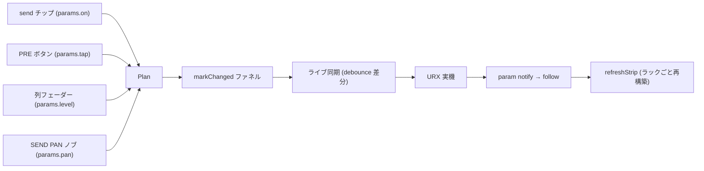

# CONSOLE センドラック (設計仕様)

> English: [../en/console-sends.md](../en/console-sends.md)

**ステータス: 実装済み (2026-07-12)。** CONSOLE ビューの「Send to」モードタブ (send-on-fader)
を置き換えたストリップ内 SENDS ラックの仕様。本書がラック挙動のリファレンスであり、
[architecture.md](architecture.md) の CONSOLE 節はその要約。実装は `src/ui/console.ts`
(ラックビルダー)・`src/style.css` (`.con-sends` / `.con-spop`)・`src/core/midi/controls.ts`
(`tap` コントロール)、テストは `e2e/console.spec.ts`。

## 背景

タブ方式には構造的な問題が 2 つあった:

1. send を 1 つミュートするにもタブ切替が必要で、切替は画面全体の文脈を反転させる。
2. 異なるバスへの send を同時に見る・操作することができない。

ラックは全ストリップに全 send の常設コントロールを与える。これに伴い「Send to」タブ、
send-on-fader モード、コンソールのモードバー (`Output [MAIN]` / `Send to [...]`) を廃止する。
ヘッドの MUTE チップは従来どおり → STEREO 主経路を制御し (その send を持つストリップ = チャンネル・FX
チャンネル・MIX バスのみ)、ラックは主経路に触れない。ノード master ON/OFF (CH_ON / MIX 675 / STEREO /
MONITOR、いずれも `np.on`、および OSC の `osc.on`) はスクリブル上の**電源 LED** — スクリブル全体がそのボタンで、
オフのときストリップが減光する (グラフと共有の `isNodeInactive` 述語)。これにより旧「CH MUTE」赤バッジは廃止。
STEREO と MONITOR バスは → STEREO send を持たないため MUTE チップを持たず、電源 LED が唯一の ON/OFF。

## レイアウト

ストリップのヘッドとフェーダーゾーンの間に置く固定高セクション:

```text
├─ ヘッド (変更なし) ────────────┤
│ SENDS                     ▾   │  ヘッダ: ラベル / 一時読み値 / 開閉
│ [F1]   [F2]   [M1]   [M2]     │  send 有効チップ (琥珀 = ON)
│ [PRE]  [PRE]  [PRE]  [PRE]    │  プリフェーダートグル (琥珀 = PRE)
│   ┃      ┃      ┃      ┃      │  縦ミニフェーダー (溝 + キャップ、
│  ─╂──────╂──────╂──────╂─     │   2px の 0 dB 貫通 tick・可動域 ~80px)
│   ┃      ┃      ┃      ┃      │
│ [         PAN ▾          ]    │  SEND PAN ポップオーバーを開く
├─ メーターポイント / フェーダーゾーン ─┤
```

展開時の高さ ≈ 156px、格納時 ≈ 24px (ヘッダのみ)。向き・溝・キャップ・0 dB 線は
メインフェーダーの文法をそのまま再利用する。4 列の tick は 1 本の 0 dB 基準線として
視覚的に融合し、ストリップ内の send 分布がバーチャートのように読める。

## 挙動

### スロット

- 列順は固定: FX 1, FX 2, MIX 1, MIX 2 (旧タブ順)。
- 機種ごとのスロット集合 = `SEND_TARGETS` のうちバスが機種に存在し、かつ非表示でないもの。
  バスを棚上げ (hidden) すると**全ストリップ**からその列が落ちる (旧タブと同じ規則)。
  列位置は常に全ストリップで揃う。
- その send を持たないストリップは該当列を空欄にする (例: FX チャンネルは MIX 1 / MIX 2 のみ)。
  send を全く持たないストリップ (MIX / MONITOR / STEREO / OSCILLATOR / STREAMING) は
  減光した `SENDS` ヘッダのみ表示する — 開閉矢印は機能するので、一括開閉には
  どのストリップからでも到達できる。メーター専用ストリップにも同じスペーサーを与え、
  フェーダー上端の整列を保つ。

### send 有効チップ

- 固定 send 接続の `params.on` をトグルする。琥珀点灯 = send 有効 (ON 極性。スクリブル電源 LED と
  同じで、MUTE 極性ではない — ラベルは送り先であって "MUTE" ではない)。
- チップラベルは送り先の短縮形 `F1` / `F2` / `M1` / `M2`。フル名はヘッダ読み値と
  SEND PAN ポップオーバーに現れる。

### PRE ボタン

- send 接続の `tap` (`pre` / `post`) をトグルする。点灯 = PRE。これが唯一のタップ表示で
  (追加マーカーは無い)、send が OFF の間も読める。
- CH → FX の tap はデバイスに書けない: ライブ接続中は既存の `inspector.prePostLcdOnly`
  ツールチップ付きで read-only 表示 (`sendTapWritable`)。
- ホバーツールチップ (新規 i18n キー) でプリフェーダーの意味を説明する
  (C.INT ツールチップと同じ機構)。

### 列フェーダー

- `LEVEL_STEPS_DB` グリッドにスナップ (41 detent / 可動域 ~80px ≈ 2px/detent)。
- **相対ドラッグ** + ポインタキャプチャ — クリック位置への絶対ジャンプはしない
  (1px の狙いズレが 1 detent になり、ライブ同期は即書き込むため)。最初の書込みは
  3px のドラッグ閾値後 (誤グラブとダブルクリックの保護)。Shift ドラッグ = 微動 (1 detent)。
- キーボード: 矢印 = 1 detent、PageUp/PageDown = 6、Home = 最大、End = −∞
  (メインフェーダーと同一)。ダブルクリック = 工場値リセット。
- 数値列は置かない。列のホバー / ドラッグ / フォーカス中、ラックヘッダの `SENDS` ラベルが
  読み値に入れ替わる — `MIX 1 PRE -3.2` (送り先・PRE 時のみタップ語・レベル)。ヘッダは
  固定高で、入替がラックをリフローさせない。正確な値は `aria-valuetext`
  (`"PRE, -3.2 dB"` / `"off (-∞)"`) でも公開する。

### 開閉

- どのストリップの `SENDS` ヘッダをクリックしても**全ストリップ一括**で開閉する
  (列整列の維持が理由)。1 つのヘッダのホバーで全ヘッダをハイライトし、効果範囲を
  事前提示する。`aria-expanded` は全ストリップで同期する。
- `localStorage` (`urx-sends-open`・既定 = 展開) にグローバル永続化。
- 格納中はヘッダに ON 中の send 数ぶんの小さな琥珀ドットを表示し、送りの有無を
  一瞥可能に保つ。

### SEND PAN ポップオーバー

- トリガー: ラック最下部の横長 `PAN ▾` ボタン (send を持つストリップのみ)。ポップオーバーは
  このボタンの直下にストリップ幅で開き、上向きキャレットでボタンを指す。
- 内容: ヘッダ `SEND PAN` + MIX send の回転ノブを横並び列で配置する (送り先ラベルを
  ノブの上、値をノブの下)。列順・「C」ノブ・ラベル上置きはヘッドの BAL/PAN ノブと
  SENDS ラックの列文法をそのまま踏襲し、ラックとポップオーバーで対称になる。
  FX send はデバイス上モノラルで pan を持たない。Pan Link (BUS type) ロックは
  インスペクタ同様ノブを read-only 表示する。

  ```text
  ┌─── SEND PAN ───┐
  │  MIX 1   MIX 2  │  送り先ラベル (ノブの上)
  │   (◎)     (◎)   │  回転ノブ (横並び・ヘッド BAL/PAN と同一意匠)
  │    C       C    │  値 (ノブの下)
  └─────────────────┘
  ```

- ノブ列は 1 本の横帯にまとまるため、将来の send 先間 PAN リンクは列の下に全幅 1 行を
  足すだけで収まる。
- 開閉挙動はメーターポイントポップオーバーに合わせる (外側クリック / Escape で閉じる・
  ビューポートクランプ・アンカーキャレット)。

ポップオーバーが持つのは意図的に **pan のみ**: レベル編集は列フェーダー、ON/OFF はチップ、
タップは PRE ボタン、値の読取はヘッダ読み値 — 各コントロールの置き場は常に 1 箇所。

### MIDI コントロール

- send レベル / send ON-OFF / send pan は既存の send スコープ付きコントロール id
  (`controlId(node, param, target)`) をそのまま使う — 旧 send タブ時代のアサインは
  無変更で動き続ける。ラックのチップ・列フェーダー・SEND PAN ノブはラーンで armable。
- 新規: MIX send ごとの `tap` コントロール (トグル)。CH → FX の tap は他のロック済み
  コントロールと同様、デバイスロックとして書込みを拒否する。

### ライブ同期 / follow

ラックの編集はすべて共有の `markChanged` ファネルを通る (グラフ / インスペクタと同一)。
BAL リンクペアは `mirrorBalPair` でミラーし、デバイス側の変更は `follow` → `refreshStrip`
(ラックを含むストリップ全体の再構築) で反映される。send にメーターは存在しない —
ブローカーは send 単位のメーターアドレスを公開していないため、ラックに信号表示が
無いのは仕様である。

## 不採用案 (新しい根拠なしに再検討しない)

| 案 | 不採用理由 |
| --- | --- |
| グローバル「Send to」タブ (旧設計) | ミュートにタブ切替が必要・send 横断の視認不可 |
| ストリップ内フリップタブ / TotalMix 型サイドパネル | 同時に見えるのは 1 send のみ / ストリップ単位の横伸長 |
| 横向きミニフェーダー行 | コンソール唯一の横コントロールで balance スライダーに読める — send には実際に pan があるため「見えているのが send pan」という誤モデルが成立し、ライブ誤書込みに直結 |
| 回転ノブ行 | 針角度は一覧性が最弱・GAIN/PAN ノブ直下で send pan に誤読・隣接ノブ間 3px |
| チップの PRE=緑 / POST=琥珀 | 2 色覚でコントラスト比 1.07〜1.21 (判別不能)・メーター緑と衝突・GRAPH の PRE は琥珀・OFF チップで消失 |
| レベル色同期ボタン (青→緑→黄→赤) | 赤が MUTE/OVER と、緑がメーターと衝突・レベルはキャップ位置が既に表示 |
| 点線枠 / 二重枠 / ノッチ / タグ形チップ | 点灯時の点線は 17px で輪郭崩壊・内側線は MIDI ラーンリングと混同・シルエットは消灯チップで消失 |
| 行内の数値列 | 幅不足で視認性が低い — ヘッダ読み値で代替 |

## 実装メモ

- `src/ui/console.ts`: モードバー / `renderModes` / send モードのストリップフィルタを
  ラックビルダーで置換。`Mode` 状態と `usesSend` によるヘッド切替を撤去
  (ヘッドは常に MAIN のコントロールセット)。
- `src/style.css`: ラックスタイル。ライトテーマの同等性を維持 (溝は `--groove` で暗色のまま)。
- `src/i18n/{en,ja}.ts`: `outputLabel` / `sendToLabel` を廃し、`SENDS`・`SEND PAN`・
  PRE ツールチップのキーを追加。
- `src/core/midi/controls.ts` + `engine.ts`: MIX send の `tap` トグルコントロールを追加。
- E2E: `console.spec.ts` のモードタブ系テストをラック系に書き換え (チップトグル・
  PRE トグル・フェーダーのグリッドステップ・一括開閉 + 永続化・ドット・SEND PAN
  ポップオーバー・読み値・空スロット・send 無しストリップ・ライブ stub 時の FX tap
  read-only)。`midi.spec.ts` にラックの arming を追加。unit: controls カタログ /
  engine の tap 処理。
- 実装後に `docs/{en,ja}/architecture.md` (CONSOLE 節) と README スクリーンショットを更新。

## 受容したトレードオフ / 注意点

- send を持たないストリップは展開中、空白のラック帯を抱える (整列コスト。格納で緩和)。
- ブラウザデモでは 24px 未満のタッチターゲットになる (デスクトップ主体の製品。
  相対ドラッグとキーボード経路で緩和)。
- 「同一 send を多数ストリップ横断で見る」は旧横行 (固定 y バンド) よりわずかに遅い —
  文法統一と pan 誤読の消滅との交換。
- 列ピッチ 19px はポインタキャプチャ + ドラッグ閾値で隣接列の誤グラブを防ぐ前提。

## 編集 → デバイスのデータパス


